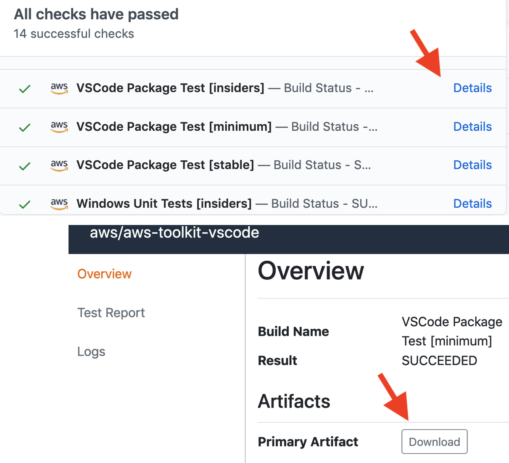

# Contributing to AWS Toolkit for VS Code

Thanks for taking the time to help improve the AWS Toolkit! We greatly value
feedback and contributions from the community.

Reviewing this document will maximize your success in working with the
codebase and sending pull requests.

## Getting Started

### Find things to do

If you're looking for ideas about where to contribute, consider
[_good first issue_](https://github.com/aws/aws-toolkit-vscode/labels/good%20first%20issue)
issues.

### Setup

To develop this project, install these dependencies:

-   [Visual Studio Code](https://code.visualstudio.com/Download)
-   [NodeJS and NPM](https://nodejs.org/) (latest version of both)
-   [Typescript](https://www.typescriptlang.org/)
-   [Git](https://git-scm.com/downloads)
    -   (optional) Set `git blame` to ignore noise-commits: `git config blame.ignoreRevsFile .git-blame-ignore-revs`
-   [AWS `git secrets`](https://github.com/awslabs/git-secrets)
-   (optional) [AWS SAM CLI](https://docs.aws.amazon.com/serverless-application-model/latest/developerguide/serverless-sam-cli-install.html)
-   (optional) [Docker](https://docs.docker.com/get-docker/)

Then clone the repository and install NPM packages:

    git clone git@github.com:aws/aws-toolkit-vscode.git
    cd aws-toolkit-vscode
    npm install

### Run

To run the extension from VSCode as a Node.js app:

1. Select the Run panel from the sidebar.
2. From the dropdown at the top of the Run pane, choose `Extension`.
3. Press `F5` to launch a new instance of VSCode with the extension installed and the debugger attached.

To run the extension from VSCode in "web mode" (a browser app, or "PWA"):

1. Select the Run panel from the sidebar.
2. From the dropdown at the top of the Run pane, choose `Extension (web)`.
3. Press `F5` to launch a new instance of VSCode (web mode) with the extension installed and the debugger attached.

### Build

When you launch the extension or run tests from VSCode, it will automatically build the extension and watch for changes.

You can also use these NPM tasks (see `npm run` for the full list):

-   To build once:
    ```
    npm run compile
    ```
-   To build and watch for file changes:
    ```
    npm run watch
    ```
-   To build a release artifact (VSIX):
    ```
    npm run package
    ```
    -   This uses webpack which may exhaust the default Node heap size on Linux.
        To fix this set `--max-old-space-size`:
        ```
        export NODE_OPTIONS=--max-old-space-size=8192
        ```
-   To build a "debug" VSIX artifact (faster and does not minify):
    ```
    npm run package -- --debug
    ```

## Develop

### Guidelines

-   Project patterns and practices: [CODE_GUIDELINES.md](./docs/CODE_GUIDELINES.md)
-   [VS Code Extension Guidelines](https://code.visualstudio.com/api/references/extension-guidelines)
-   [VS Code API Documentation](https://code.visualstudio.com/api/references/vscode-api)
-   [VS Code Extension Capabilities](https://code.visualstudio.com/api/extension-capabilities/common-capabilities)

### Technical notes

-   VSCode extensions have a [100MB](https://github.com/Microsoft/vscode-vsce/issues/179) file size limit.
-   `src/testFixtures/` is excluded in `.vscode/settings.json`, to prevent VSCode
    from treating its files as project files.
-   The codebase provides [globals](https://github.com/aws/aws-toolkit-vscode/blob/c6ad8ecd602fab64b563519dc2a455ee0b252dde/src/shared/extensionGlobals.ts#L55),
    which must be used instead of some common javascript globals. In particular, clock-related things like `Date` and `setTimeout`
    must not be used directly, instead use `globals.clock.Date` and `globals.clock.setTimeout`. [#2343](https://github.com/aws/aws-toolkit-vscode/pull/2343)
-   VSCode extension examples: <https://github.com/microsoft/vscode-extension-samples>
-   Tests
    -   Use `function ()` and `async function ()` syntax for `describe()` and `it()` callbacks [instead of arrow functions.](https://mochajs.org/#arrow-functions)
    -   Do NOT include any `await` functions in `describe()` blocks directly (usage in `before`, `beforeEach`, `after`, `afterEach`, and `it` blocks is fine).
        -   `await` in `describe()` causes the framework to always evaluate the `describe` block and can cause issues with either tests not running or always running (if other tests are marked with `.only`)
        -   Tests that require a premade value from a Promise should initialize the value as a `let` and make the `await`ed assignment in `before()`.
-   How to debug unresolved promise rejections:

    1. Declare a global unhandledRejection handler.
        ```ts
        process.on('unhandledRejection', e => {
            getLogger('channel').error(
                localize(
                    'AWS.channel.aws.toolkit.activation.error',
                    'Error Activating {0} Toolkit: {1}',
                    getIdeProperties().company,
                    (e as Error).message
                )
            )
            if (e !== undefined) {
                throw e
            }
        })
        ```
    2. Put a breakpoint on it.
    3. Run all tests.

---

### Browser

The AWS Toolkit VSCode extension has a support (with limited functionality) for running in the browser, eg [vscode.dev](https://vscode.dev).

See [browser.md](./docs/browser.md) for working with the browser implementation of the extension.

---

### Test

See [TESTPLAN.md](./docs/TESTPLAN.md) to understand the project's test
structure, mechanics and philosophy.

You can run tests directly from VSCode:

1. Select `View > Debug`, or select the Debug pane from the sidebar.
2. From the dropdown at the top of the Debug pane, select the `Extension Tests` configuration.
3. Press `F5` to run tests with the debugger attached.

You can also run tests from the command line:

    npm run test
    npm run testInteg

Tests will write logs to `./.test-reports/testLog.log`.

#### Run a specific test

To run a single test in VSCode, do any one of:

-   Run the _Extension Tests (current file)_ launch-config.
-   Use Mocha's [it.only()](https://mochajs.org/#exclusive-tests) or `describe.only()`.
-   Run in your terminal:

    -   Unix/macOS/POSIX shell:
        ```
        TEST_FILE=src/test/foo.test npm run test
        ```
    -   Powershell:
        ```
        $Env:TEST_FILE = "src/test/foo.test"; npm run test
        ```

-   To run all tests in a particular subdirectory, you can edit
    `src/test/index.ts:rootTestsPath` to point to a subdirectory:
    ```
    rootTestsPath: __dirname + '/shared/sam/debugger/'
    ```

### Debug failing integration tests

-   Check for recent changes in each of these projects:
    -   https://github.com/microsoft/vscode-python (releases)
    -   https://github.com/aws/aws-sam-cli/releases
    -   https://github.com/aws/aws-sam-cli-app-templates/ (`master` branch, not releases!)

### Browser Support

Running the extension in the browser (eg: [vscode.dev](https://vscode.dev/)).

[See documentation here](./src/browser/README.md).

### Coverage report

You can find the coverage report at `./coverage/index.html` after running the tests. Tests ran from the workspace launch config won't generate a coverage report automatically because it can break file watching. A few manual steps are needed instead:

-   Run the command `Tasks: Run Build Task` if not already active
-   Instrument built code with `npm run instrument`
-   Exercise the code (`Extension Tests`, `Integration Tests`, etc.)
-   Generate a report with `npm run report`

### Prerelease artifacts

-   CI automatically publishes GitHub [prereleases](https://github.com/aws/aws-toolkit-vscode/releases)
    for `master` and `feature/x` branches, including `.vsix` artifacts which can
    be used to test the latest build for that branch. Each prerelease and its
    artifact are continually updated from the HEAD of its branch.
-   PR artifacts: each pull request is processed by an AWS CodeBuild job which
    runs all tests and provides the build result via the _Details_ link as shown
    below.
    -   

### CodeCatalyst Blueprints

You can find documentation to create VSCode IDE settings for CodeCatalyst blueprints at [docs/vscode-config.md](./docs/vscode-config.md).

## Pull Requests

Before sending a pull request:

1. Check that you are working against the latest source on the `master` branch.
2. Check existing open, and recently merged, pull requests to make sure someone else hasn't addressed the problem already.
3. Open an issue to discuss any significant work.

To send a pull request:

1. [Fork the repository](https://help.github.com/articles/fork-a-repo/).
2. Modify the source; focus on the specific change you are contributing. If you also reformat all the code, it will be hard for us to focus on your change.
    - Read the [project guidelines](#guidelines), this is very important for non-trivial changes.
3. Commit to your fork [using clear commit messages](#commit-messages).
4. Update the changelog by running `npm run newChange`.
    - Note: the main purpose of the `newChange` task is to avoid merge conflicts.
5. [Create a pull request](https://help.github.com/articles/creating-a-pull-request/).
6. Pay attention to any CI failures reported in the pull request.

### Commit messages

Generally your PR description should be a copy-paste of your commit message(s).
If your PR description provides insight and context, that also should exist in
the commit message. Source control (Git) is our source-of-truth, not GitHub.

Follow these [commit message guidelines](https://cbea.ms/git-commit/):

-   Subject: single line up to 50-72 characters
    -   Imperative voice ("Fix bug", not "Fixed"/"Fixes"/"Fixing").
-   Body: for non-trivial or uncommon changes, explain your motivation for the
    change and contrast your implementation with previous behavior.

    -   Often you can save a _lot_ of words by using this simple template:
        ```
        Problem: …
        Solution: …
        ```

A [good commit message](https://git-scm.com/book/en/v2/Distributed-Git-Contributing-to-a-Project)
has a short subject line and unlimited detail in the body.
[Good explanations](https://nav.al/explanations) are acts of creativity. The
"tiny subject line" constraint reminds you to clarify the essence of the
commit, and makes the log easy for humans to scan. The commit log is an
artifact that will outlive most code.

Prefix the subject with `type(topic):` ([conventional
commits](https://www.conventionalcommits.org/) format): this again helps humans
(and scripts) scan and omit ranges of the history at a glance.

## Tooling

Besides the typical develop/test/run cycle describe above, there are
some tools for special cases such as build tasks, generating telemetry,
generating SDKs, etc.

### Toolkit developer settings (`aws.dev.*`)

The [DevSettngs](https://github.com/aws/aws-toolkit-vscode/blob/479b9d45b5f5ad30fc10567e649b59801053aeba/src/shared/settings.ts#L553) class defines various developer-only settings that change the behavior of the
Toolkit for testing and development purposes. To use a setting just add it to
your `settings.json`. At runtime, if the Toolkit reads any of these settings,
the "AWS" statusbar item will [change its color](https://github.com/aws/aws-toolkit-vscode/blob/479b9d45b5f5ad30fc10567e649b59801053aeba/src/credentials/awsCredentialsStatusBarItem.ts#L45).

The setting `aws.dev.forceDevMode` will take precedence over all dev settings and enable dev mode on `"aws.dev.forceDevMode": true` or disable on `"aws.dev.forceDevMode": false`.

### Logging

The `aws.dev.logfile` setting allows you to set the path of the logfile. This makes it easy to
follow and filter the logfile using shell tools like `tail` and `grep`. For example in
settings.json,

    "aws.dev.logfile": "~/awstoolkit.log",

then following the log with:

    tail -F ~/awstoolkit.log

### Telemetry

See [docs/telemetry.md](./docs/telemetry.md) for notes on emitting telemetry in this project.

### Service Endpoints

Endpoint overrides can be set per-service using the `aws.dev.endpoints` settings. This is a JSON object where each key is the service ID (case-insensitive) and each value is the endpoint. Refer to the SDK [API models](https://github.com/aws/aws-sdk-js/tree/master/apis) to find relevant service IDs.

Example:

```json
"aws.dev.endpoints": {
    "s3": "http://example.com"
}
```

### SAM/CFN ("goformation") JSON schema

See [docs/cfn-schema-support.md](./docs/cfn-schema-support.md) for how to fix
and improve the JSON schema that provides auto-completion and syntax checking
of SAM and CloudFormation `template.yaml` files.

### AWS SDK generator

When the AWS SDK does not (yet) support a service but you have an API
model file (`*.api.json`), use `generateServiceClient.ts` to generate
a TypeScript `*.d.ts` file and pass that to the AWS JS SDK to create
requests just from the model/types.

1. Add an entry to the list in `generateServiceClient.ts`:
    ```diff
     diff --git a/src/scripts/build/generateServiceClient.ts b/src/scripts/build/generateServiceClient.ts
     index 8bb278972d29..6c6914ec8812 100644
     --- a/src/scripts/build/generateServiceClient.ts
     +++ b/src/scripts/build/generateServiceClient.ts
     @@ -199,6 +199,10 @@ ${fileContents}
      ;(async () => {
          const serviceClientDefinitions: ServiceClientDefinition[] = [
     +        {
     +            serviceJsonPath: 'src/shared/foo.api.json',
     +            serviceName: 'ClientFoo'
     +        },
              {
                  serviceJsonPath: 'src/shared/telemetry/service-2.json',
                  serviceName: 'ClientTelemetry',
    ```
2. Run the script:
    ```
    npm run generateClients
    ```
3. The script produces a `*.d.ts` file (used only for IDE
   code-completion, not required to actually make requests):
    ```
    src/shared/foo.d.ts
    ```
4. To make requests with the SDK, pass the `*.api.json` service model to
   `globals.sdkClientBuilder.createAndConfigureServiceClient` as a generic
   `Service` with `apiConfig=require('foo.api.json')`.

    ```ts
    // Import the `*.d.ts` file for code-completion convenience.
    import * as ClientFoo from '../shared/clientfoo'
    // The AWS JS SDK uses this to dynamically build service requests.
    import apiConfig = require('../shared/foo.api.json')

    ...

    const c = await globals.sdkClientBuilder.createAwsService(
        opts => new Service(opts),
        {
            apiConfig: apiConfig,
            region: 'us-west-2',
            credentials: credentials,
            correctClockSkew: true,
            endpoint: 'foo-beta.aws.dev',
        }) as ClientFoo
    const req = c.getThing({ id: 'asdf' })
    req.send(function (err, data) { ... });
    ```

### Webview dev-server

Webviews can be hot-reloaded (updated without restarting the extension) by running a developer server provided by webpack. This server is started automatically when running the `Extension` launch configuration. You can also start it by running `npm serve`. Note that only frontend components will be updated; if you change backend code you will still need to restart the development extension.

### Font generation

For extensions to contribute their own codicons, VSCode requires a font file as well as how that font maps to codicon IDs. The mapping is found in `package.json` under the `icons` contribution point. Icons located in `resources/icons` are stitched together at build-time into a single font, automatically adding mappings to `package.json`. More information can be found [here](docs/icons.md).

As a simple example, let's say I wanted to add a new icon for CloudWatch log streams. I would do the following:

1. Place the icon in `resources/icons/aws/cloudwatch`. I'l name the icon `log-stream.svg`.
1. Use `npm run generatePackage` to update `package.json`. Commit this change with the new icon.
1. You can now use the icon in the Toolkit:

    ```ts
    getIcon('aws-cloudwatch-log-stream')
    ```

### VSCode Marketplace

The [marketplace page](https://marketplace.visualstudio.com/itemdetails?itemName=AmazonWebServices.aws-toolkit-vscode)
is defined in `README.quickstart.vscode.md` (which replaces `README.md` during
the release automation). The `vsce` package tool always [replaces relative image paths](https://github.com/microsoft/vscode-vsce/blob/9478dbd11ea2e7adb23ec72923e889c7bb215263/src/package.ts#L885)
with URLs pointing to `HEAD` on GitHub (`https://github.com/aws/aws-toolkit-vscode/raw/HEAD/…/foo.gif`).

Note therefore:

1. Don't delete images from `docs/marketplace/` unless the _current published_
   AWS Toolkit release doesn't depend on them.
2. `HEAD` implies that the URL depends on the current _default branch_ (i.e.
   `master`). Changes to other branches won't affect the marketplace page.

### Importing icons from other projects

If you are contribuing visual assets from other open source repos, the source repo must have a compatible license (such as MIT), and we need to document the source of the images. Follow these steps ([example: #227](https://github.com/aws/aws-toolkit-vscode/pull/227)):

1. Use a separate location in this repo for every repo/organization where images are sourced from. See `resources/icons/vscode` as an example.
1. Copy the source repo's licence into this destination location's LICENSE.txt file
1. Create a README.md in the destination location, and type in a copyright attribution:

    ```text
    The AWS Toolkit for VS Code includes the following third-party software/licensing:

    Icons contained in this folder and subfolders are from <SOURCE_REPO_NAME>: <SOURCE_REPO_URL>

    <PASTE_SOURCE_LICENSE_HERE>
    ```

1. Add an entry [here](docs/icons.md#third-party) summarizing the new destination location, where the assets were sourced from, and a brief rationale.

## Using new vscode APIs

The minimum required vscode version specified in [package.json](https://github.com/aws/aws-toolkit-vscode/blob/07119655109bb06105a3f53bbcd86b812b32cdbe/package.json#L16)
is decided by the version of vscode running in Cloud9 and other vscode-compatible targets.

But you can still use the latest vscode APIs, by checking the current running vscode version. For example, to use a vscode 1.64 API:

1. Check the vscode version: `semver.gte(vscode.version, '1.64.0')`
2. Disable the feature if is too old. That could mean just skipping the code entirely, or showing a different UI.

Full example: https://github.com/aws/aws-toolkit-vscode/blob/7cb97a2ef0a765862d21842693967070b0dcdd49/src/shared/credentials/defaultCredentialSelectionDataProvider.ts#L54-L76

## Preview Releases and Experiments

There are several ways to make pre-production changes available on a "preview" or "experimental" basis:

-   **Experimental features:** settings defined in [aws.experiments](https://github.com/aws/aws-toolkit-vscode/blob/4dcee33931693380739eaa5d44e92fa4545a9666/package.json#L228-L241)
    are available in the vscode settings UI so that customers **can discover and enable them.**
    This mechanism is intended for non-production features which are ready for
    early access / preview feedback from interested customers.
-   **Developer-only features:** the `aws.dev.forceDevMode` setting can be used as
    a condition to enable features only for users who have
    `"aws.dev.forceDevMode": true` in their settings. These features are intended
    to be part of the mainline branch, but are _not_ presented to customers in the
    VSCode settings UI. Example: [EC2 commands were gated on `aws.isDevMode`](https://github.com/aws/aws-toolkit-vscode/blob/4dcee33931693380739eaa5d44e92fa4545a9666/package.json#L1115-L1126)
    so the functionality could be merged to mainline while it was under development.
-   **Beta artifacts:** For a "private beta" launch, `src/dev/beta.ts` contains
    logic to check a hardcoded, stable URL serving the latest `.vsix` build for
    the private beta. The hardcoded URL defined in [`dev/config.ts:betaUrl`](https://github.com/aws/aws-toolkit-vscode/blob/d9c27234c0732b021d07e184a865213d6efde8ec/src/dev/config.ts#L9)
    also forces the Toolkit to declare version `1.999.0` (since "private beta"
    has no semver and would conflict with the VSCode marketplace version,
    causing unwanted auto-updating by VSCode). Beta builds of the Toolkit
    automatically query the URL once per session per day.

## Code of Conduct

This project has adopted the [Amazon Open Source Code of Conduct](https://aws.github.io/code-of-conduct).
For more information see the [Code of Conduct FAQ](https://aws.github.io/code-of-conduct-faq) or contact
opensource-codeofconduct@amazon.com with any additional questions or comments.

## Security issues

If you discover a potential security issue in this project we ask that you
notify AWS/Amazon Security via the [vulnerability reporting
page](http://aws.amazon.com/security/vulnerability-reporting/). Please do
**not** create a public issue.

## Licensing

See the [LICENSE](https://github.com/aws/aws-vscode-toolkit/blob/master/LICENSE) file for our project's licensing. We will ask you to confirm the licensing of your contribution.

We may ask you to sign a [Contributor License Agreement (CLA)](http://en.wikipedia.org/wiki/Contributor_License_Agreement) for larger changes.
