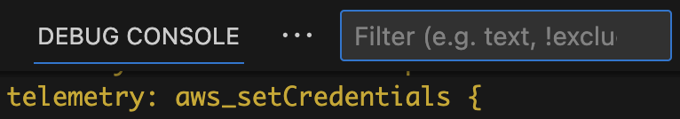

# Contributing to AWS Toolkit for VS Code

Thanks for taking the time to help improve the AWS Toolkit! We greatly value
feedback and contributions from the community.

Reviewing this document will maximize your success in working with the
codebase and sending pull requests.

## Getting Started

This project is set up as a typescript monorepo. The documentation throughout this project
is referring to the subprojects [`packages/toolkit/`](./packages/toolkit/) and [`packages/core/`](./packages/core/).
See [arch_develop.md](./docs/arch_develop.md#monorepo-structure) to understand the
structure of this package before contributing.

### Find things to do

If you're looking for ideas about where to contribute, consider
[_good first issue_](https://github.com/aws/aws-toolkit-vscode/labels/good%20first%20issue)
issues.

### Setup

To develop this project, install these dependencies:

-   [Visual Studio Code](https://code.visualstudio.com/Download)
-   [NodeJS and NPM](https://nodejs.org/) (latest version of both)
-   [Typescript](https://www.typescriptlang.org/)
-   [Git](https://git-scm.com/downloads)
    -   (optional) Set `git blame` to ignore noise-commits: `git config blame.ignoreRevsFile .git-blame-ignore-revs`
-   [AWS `git secrets`](https://github.com/awslabs/git-secrets)
-   [TypeScript + Webpack Problem Matcher](https://marketplace.visualstudio.com/items?itemName=amodio.tsl-problem-matcher)
    -   Not installing will result in the following error during building: `Error: Invalid problemMatcher reference: $ts-webpack-watch`
-   (optional) [AWS SAM CLI](https://docs.aws.amazon.com/serverless-application-model/latest/developerguide/serverless-sam-cli-install.html)
-   (optional) [Docker](https://docs.docker.com/get-docker/)

Then clone the repository and install NPM packages:

    git clone git@github.com:aws/aws-toolkit-vscode.git
    cd aws-toolkit-vscode
    npm install

### Run

Due to the monorepo structure of the project, you must have the `aws-toolkit-vscode/packages/toolkit` folder open as root folder in the workspace.
The easiest way to open the project: File > Open Workspace from File > choose `aws-toolkit-vscode/aws-toolkit-vscode.code-workspace`

To run the extension from VSCode as a Node.js app:

1. Select the Run panel from the sidebar.
2. From the dropdown at the top of the Run pane, choose `Extension`.
3. Press `F5` to launch a new instance of VSCode with the extension installed and the debugger attached.

To run the extension from VSCode in "web mode" (a browser app, or "PWA"):

1. Select the Run panel from the sidebar.
2. From the dropdown at the top of the Run pane, choose `Extension (web)`.
3. Press `F5` to launch a new instance of VSCode (web mode) with the extension installed and the debugger attached.

### Build

When you launch the extension or run tests from VSCode, it will automatically build the extension and watch for changes.

You can also use these NPM tasks (see `npm run` for the full list):

-   To build once:
    ```
    npm run compile
    ```
-   To build and watch for file changes:
    ```
    npm run watch
    ```
-   To build a release artifact (VSIX):
    ```
    npm run package
    ```
    -   This uses webpack which may exhaust the default Node heap size on Linux.
        To fix this set `--max-old-space-size`:
        ```
        export NODE_OPTIONS=--max-old-space-size=8192
        ```
-   To build a "debug" VSIX artifact (faster and does not minify):
    ```
    npm run package -- --debug
    ```

## Develop

### Guidelines

-   Architecture: [arch_overview.md](./docs/arch_overview.md)
-   Project patterns and practices: [CODE_GUIDELINES.md](./docs/CODE_GUIDELINES.md)
-   [VS Code Extension Guidelines](https://code.visualstudio.com/api/references/extension-guidelines)
    -   [Webview guidance](https://code.visualstudio.com/api/ux-guidelines/webviews)
-   [VS Code API Documentation](https://code.visualstudio.com/api/references/vscode-api)
-   [VS Code Extension Capabilities](https://code.visualstudio.com/api/extension-capabilities/common-capabilities)

### Prerelease artifacts

-   CI automatically publishes GitHub [prereleases](https://github.com/aws/aws-toolkit-vscode/releases)
    for `master` and `feature/x` branches, including `.vsix` artifacts which can
    be used to test the latest build for that branch. Each prerelease and its
    artifact are continually updated from the HEAD of its branch.
-   PR artifacts: each pull request is processed by an AWS CodeBuild job which
    runs all tests and provides the build result via the _Details_ link as shown
    below.
    -   

### Debug failing integration tests

-   Check for recent changes in each of these projects:
    -   https://github.com/microsoft/vscode-python (releases)
    -   https://github.com/aws/aws-sam-cli/releases
    -   https://github.com/aws/aws-sam-cli-app-templates/ (`master` branch, not releases!)

### Technical notes

-   VSCode extensions have a [100MB](https://github.com/Microsoft/vscode-vsce/issues/179) file size limit.
-   `src/testFixtures/` is excluded in `.vscode/settings.json`, to prevent VSCode
    from treating its files as project files.
-   The codebase provides [globals](https://github.com/aws/aws-toolkit-vscode/blob/c6ad8ecd602fab64b563519dc2a455ee0b252dde/src/shared/extensionGlobals.ts#L55),
    which must be used instead of some common javascript globals. In particular, clock-related things like `Date` and `setTimeout`
    must not be used directly, instead use `globals.clock.Date` and `globals.clock.setTimeout`. [#2343](https://github.com/aws/aws-toolkit-vscode/pull/2343)
-   VSCode extension examples: <https://github.com/microsoft/vscode-extension-samples>
-   Tests
    -   Use `function ()` and `async function ()` syntax for `describe()` and `it()` callbacks [instead of arrow functions.](https://mochajs.org/#arrow-functions)
    -   Do NOT include any `await` functions in `describe()` blocks directly (usage in `before`, `beforeEach`, `after`, `afterEach`, and `it` blocks is fine).
        -   `await` in `describe()` causes the framework to always evaluate the `describe` block and can cause issues with either tests not running or always running (if other tests are marked with `.only`)
        -   Tests that require a premade value from a Promise should initialize the value as a `let` and make the `await`ed assignment in `before()`.
-   How to debug unresolved promise rejections:

    1. Declare a global unhandledRejection handler.
        ```ts
        process.on('unhandledRejection', e => {
            getLogger('channel').error(
                localize(
                    'AWS.channel.aws.toolkit.activation.error',
                    'Error Activating {0} Toolkit: {1}',
                    getIdeProperties().company,
                    (e as Error).message
                )
            )
            if (e !== undefined) {
                throw e
            }
        })
        ```
    2. Put a breakpoint on it.
    3. Run all tests.

---

### Web Mode

The AWS Toolkit VSCode extension has a support (with limited functionality) for running in a web browser, eg [vscode.dev](https://vscode.dev).

See [web.md](./docs/web.md) for working with the web mode implementation of the extension.

---

### Test

See [TESTPLAN.md](./docs/TESTPLAN.md) to understand the project's test
structure, mechanics and philosophy.

You can run tests directly from VSCode. Due to the monorepo structure of the project, you must have the `aws-toolkit-vscode/packages/toolkit` folder open as root folder in the workspace.
The easiest way to open the project: File > Open Workspace from File > choose `aws-toolkit-vscode/aws-toolkit-vscode.code-workspace`

1. Select `View > Debug`, or select the Debug pane from the sidebar.
2. From the dropdown at the top of the Debug pane, select the `Extension Tests` configuration.
3. Press `F5` to run tests with the debugger attached.

You can also run tests from the command line:

    npm run test
    npm run testInteg

Tests will write logs to `./.test-reports/testLog.log`.

#### Run a specific test

To run a single test in VSCode, do any one of:

-   Run the _Extension Tests (current file)_ launch-config.
-   Use Mocha's [it.only()](https://mochajs.org/#exclusive-tests) or `describe.only()`.
-   Run in your terminal:

    -   Unix/macOS/POSIX shell:
        ```
        TEST_FILE=src/test/foo.test.ts npm run test
        ```
    -   Powershell:
        ```
        $Env:TEST_FILE = "src/test/foo.test.ts"; npm run test
        ```

-   To run all tests in a particular subdirectory, you can edit
    `src/test/index.ts:rootTestsPath` to point to a subdirectory:
    ```
    rootTestsPath: __dirname + '/shared/sam/debugger/'
    ```

#### Run all tests in a specific folder

To run tests against a specific folder in VSCode, do any one of:

-   Add the TEST_DIR environment variable to one of the testing launch configs and run it
-   Run in your terminal
    -   Unix/macOS/POSIX shell:
        ```
        TEST_DIR=src/test/foo npm run test
        ```
    -   Powershell:
        ```
        $Env:TEST_DIR = "src/test/foo"; npm run test
        ```

### Coverage report

You can find the coverage report at `./coverage/index.html` after running the tests. Tests ran from the workspace launch config won't generate a coverage report automatically because it can break file watching. A few manual steps are needed instead:

-   Run the command `Tasks: Run Build Task` if not already active
-   Instrument built code with `npm run instrument`
-   Exercise the code (`Extension Tests`, `Integration Tests`, etc.)
-   Generate a report with `npm run report`

### CodeCatalyst Blueprints

You can find documentation to create VSCode IDE settings for CodeCatalyst blueprints at [docs/vscode-config.md](./docs/vscode-config.md).

## Pull Requests

Before sending a pull request:

1. Check that you are working against the latest source on the `master` branch.
2. Check existing open, and recently merged, pull requests to make sure someone else hasn't addressed the problem already.
3. Open an issue to discuss any significant work.

To send a pull request:

1. [Fork the repository](https://help.github.com/articles/fork-a-repo/).
2. Modify the source; focus on the specific change you are contributing. If you also reformat all the code, it will be hard for us to focus on your change.
    - Read the [project guidelines](#guidelines), this is very important for non-trivial changes.
3. Commit to your fork [using clear commit messages](#commit-messages).
4. Update the [changelog](#changelog).
5. [Create a pull request](https://help.github.com/articles/creating-a-pull-request/).
6. Pay attention to any CI failures reported in the pull request.

### Changelog

Pull requests that change **customer-impacting behavior** must include a changelog item(s). Run this command:

    npm run newChange

> [!TIP]
>
> -   Describe the change in a way that is _meaningful to the customer_. If you can't describe the _customer impact_ then it probably shouldn't be in the changelog.
>     -   ❌ `Update telemetry definitions` (not customer-impacting)
>     -   ✅ `Faster startup after VSCode restarts`
>     -   ❌ `Remove the cache when the connection wizard is re-launched` (code internals are not relevant to customers)
>     -   ✅ `Connection wizard sometimes shows the old (stale) connection`
> -   "Bug Fix" changes should describe the _problem being fixed_. This tends to produce simpler,
>     more-intuitive descriptions. It's redundant to say "Fixed" in the description, because the
>     generated changelog will say that. Example:
>     -   ❌ `Fixed S3 bug which caused filenames to be uppercase`
>     -   ✅ `S3 filenames are always uppercase`
> -   To update an _existing_ changelog item, just edit its `.changes/next-release/….json` file, you don't need to re-run `npm run newChange`.
> -   If there are multiple unrelated changes, run `npm run newChange` for each change.
> -   Include the feature that the change affects, Q, CodeWhisperer, etc.

### Commit messages

Generally your PR description should be a copy-paste of your commit message(s).
If your PR description provides insight and context, that also should exist in
the commit message. Source control (Git) is our source-of-truth, not GitHub.

Follow these [commit message guidelines](https://cbea.ms/git-commit/):

-   Subject: single line up to 50-72 characters
    -   Imperative voice ("Fix bug", not "Fixed"/"Fixes"/"Fixing").
-   Body: for non-trivial or uncommon changes, explain your motivation for the
    change and contrast your implementation with previous behavior.
    -   Often you can save a _lot_ of words by using this simple template:
        ```
        Problem: …
        Solution: …
        ```

A [good commit message](https://git-scm.com/book/en/v2/Distributed-Git-Contributing-to-a-Project)
has a short subject line and unlimited detail in the body.
[Good explanations](https://nav.al/explanations) are acts of creativity. The
"tiny subject line" constraint reminds you to clarify the essence of the
commit, and makes the log easy for humans to scan. The commit log is an
artifact that will outlive most code.

Prefix the subject with `type(topic):` ([conventional
commits](https://www.conventionalcommits.org/) format): this again helps humans
(and scripts) scan and omit ranges of the history at a glance.

## Tooling

Besides the typical develop/test/run cycle describe above, there are
some tools for special cases such as build tasks, generating telemetry,
generating SDKs, etc.

### Toolkit developer settings (`aws.dev.*`)

The [DevSettings](https://github.com/aws/aws-toolkit-vscode/blob/479b9d45b5f5ad30fc10567e649b59801053aeba/src/shared/settings.ts#L553) class defines various developer-only settings that change the behavior of the
Toolkit for testing and development purposes. To use a setting just add it to
your `settings.json`. At runtime, if the Toolkit reads any of these settings,
the "AWS" statusbar item will [change its color](https://github.com/aws/aws-toolkit-vscode/blob/479b9d45b5f5ad30fc10567e649b59801053aeba/src/credentials/awsCredentialsStatusBarItem.ts#L45).

The `aws.dev.forceDevMode` setting enables or disables Toolkit "dev mode". Without this setting, the presence of any other `aws.dev.*` setting defined in `DevSettings` implicitly enables "dev mode".

### Logging

-   Use the `aws.dev.logfile` setting to set the logfile path to a fixed location, so you can easily
    follow and filter the logfile using shell tools like `tail` and `grep`. For example in
    settings.json,
    ```
    "aws.dev.logfile": "~/awstoolkit.log",
    ```
    then you can tail the logfile in your terminal:
    ```
    tail -F ~/awstoolkit.log
    ```
-   Use the `AWS (Developer): Watch Logs` command to watch and filter Toolkit logs (including
    telemetry) in VSCode.
    -   Only available if you enabled "dev mode" (`aws.dev.forceDevMode` setting, see above).
    -   Sets `aws.logLevel` to "debug".
    -   Enter text in the Debug Console filter box to show only log messages with that text. <br/>
        

### Telemetry

-   See [docs/telemetry.md](./docs/telemetry.md) for guidelines on developing telemetry in this project.
-   To watch Toolkit telemetry events, use the `AWS (Developer): Watch Logs` command (see [Logging](#logging) above) and enter "telemetry" in the Debug Console filter box.

### Service Endpoints

Endpoint overrides can be set per-service using the `aws.dev.endpoints` settings. This is a JSON object where each key is the service ID (case-insensitive) and each value is the endpoint. Refer to the SDK [API models](https://github.com/aws/aws-sdk-js/tree/master/apis) to find relevant service IDs.

Example:

```json
"aws.dev.endpoints": {
    "s3": "http://example.com"
}
```

<a name="codecatalyst-settings">Overrides specifically for CodeCatalyst can be set using the `aws.dev.codecatalystService` setting. This is a JSON object consisting of keys/values required to override API calls to CodeCatalyst: `region`, `endpoint`, `hostname`, and `gitHostname`. If this setting is present, then all keys need to be explicitly provided.</a>

Example:

```json
"aws.dev.codecatalystService": {
    "region": "us-west-2",
    "endpoint": "https://codecatalyst-gamma.example.com",
    "hostname": "integ.stage.example.com",
    "gitHostname": "git.gamma.source.example.com",
}
```

<a name="codewhisperer-settings">Overrides specifically for CodeWhisperer/Amazon Q can be set using the `aws.dev.codewhispererService` setting. This is a JSON object consisting of keys/values required to override API calls to CodeWhisperer/Amazon Q: `region` and `endpoint`. If this setting is present, then all keys need to be explicitly provided.</a>

Example:

```json
"aws.dev.codewhispererService": {
    "region": "us-west-2",
    "endpoint": "https://codewhisperer-gamma.example.com"
}
```

### Environment variables

Environment variables can be used to modify the behaviour of VSCode. The following are environment variables that can be used to configure the extension:

#### General AWS

-   `AWS_ACCESS_KEY_ID`: The AWS access key associated with an IAM account. If defined, this environment variable overrides the value for the profile setting aws_access_key_id. For more information see [environment variables to configure the AWS CLI](https://docs.aws.amazon.com/cli/latest/userguide/cli-configure-envvars.html)
-   `AWS_SECRET_ACCESS_KEY`: The secret key associated with the access key. This is essentially the "password" for the access key. If defined, this environment variable overrides the value for the profile setting aws_secret_access_key. For more information see [environment variables to configure the AWS CLI](https://docs.aws.amazon.com/cli/latest/userguide/cli-configure-envvars.html)
-   `AWS_REGION`: The AWS Region to send the request to. If defined, this environment variable overrides the values in the environment variable AWS_DEFAULT_REGION and the profile setting region. For more information see [environment variables to configure the AWS CLI](https://docs.aws.amazon.com/cli/latest/userguide/cli-configure-envvars.html)
-   `AWS_SDK_LOAD_CONFIG`: Controls how the AWS SDK for javascript loads it's configuration when initialized. If the AWS_SDK_LOAD_CONFIG environment variable has been set to a truthy value, the SDK for JavaScript automatically searches for a config file when it loads. For more information see [the shared config file documentation](https://docs.aws.amazon.com/sdk-for-javascript/v2/developer-guide/setting-region.html#setting-region-config-file)
-   `AWS_SHARED_CREDENTIALS_FILE`: The location of the file that the AWS CLI uses to store access keys. The default path is `~/.aws/credentials`
-   `AWS_CONFIG_FILE`: The location of the file that the AWS CLI uses to store configuration profiles. The default path is `~/.aws/config`

#### General OS

-   `HOME`: The home directory location for the current user in Linux and other Unix-like operating systems.
-   `SSH_AUTH_SOCK`: The location of a UNIX domain socket used by ssh-agent and SSH clients for agent-based authentication
-   `USERPROFILE`: The absolute path to the profile folder for the current user in Windows
-   `HOMEPATH`: The path to the home directory for the current user in Windows, without including the drive letter
-   `PROGRAMFILES/PROGRAMFILES(X86)`: The default installation directory for Windows
-   `WINDIR`: The location of the Windows installation directory
-   `PATH`: The set of directories where executable programs live

#### Codecatalyst

-   `__DEV_ENVIRONMENT_ID`: The ID of the running development environment. Automatically set when running the toolkit in Codecatalyst
-   `__DEV_ENVIRONMENT_PROJECT_NAME`: The project name associated with the running development environment. Automatically set when running the toolkit in Codecatalyst
-   `__DEV_ENVIRONMENT_SPACE_NAME`: The space name associated with the running development environment. Automatically set when running the toolkit in Codecatalyst
-   `__DEV_ENVIRONMENT_ORGANIZATION_NAME`: The organization name associated with the running development environment. Automatically set when running the toolkit in Codecatalyst

The following are environment variable versions of the user `settings.json` overrides mentioned [here](#codecatalyst-settings). These will always override the toolkit defaults and those defined in `settings.json`.
Unlike the user setting overrides, not all of these environment variables have to be set to make use of them.

-   `__CODECATALYST_REGION`: for aws.dev.codecatalystService.region
-   `__CODECATALYST_ENDPOINT`: for aws.dev.codecatalystService.endpoint
-   `__CODECATALYST_HOSTNAME`: for aws.dev.codecatalystService.hostname
-   `__CODECATALYST_GIT_HOSTNAME`: for aws.dev.codecatalystService.gitHostname

#### Codewhisperer/Amazon Q

The following are environment variable versions of the user `settings.json` overrides mentioned [here](#codewhisperer-settings). These will always override the toolkit defaults and those defined in `settings.json`.
Unlike the user setting overrides, not all of these environment variables have to be set to make use of them.

-   `__CODEWHISPERER_REGION`: for aws.dev.codewhispererService.region
-   `__CODEWHISPERER_ENDPOINT`: for aws.dev.codewhispererService.endpoint

#### Lambda

-   `AUTH_UTIL_LAMBDA_ARN`: The Auth Util Lambda is used to log into using Builder ID/IdC automatically when running e2e tests. This is the arn that points to the auth util lambda.

#### ECS

-   `AWS_CONTAINER_CREDENTIALS_RELATIVE_URI`: The relative HTTP URL endpoint for the SDK to use when making a request for credentials. The value is appended to the default Amazon ECS hostname of 169.254.170.2. For more information see [container credential provider](https://docs.aws.amazon.com/sdkref/latest/guide/feature-container-credentials.html)
-   `AWS_CONTAINER_CREDENTIALS_FULL_URI`: The full HTTP URL endpoint for the SDK to use when making a request for credentials. This includes both the scheme and the host. For more information see [container credential provider](https://docs.aws.amazon.com/sdkref/latest/guide/feature-container-credentials.html)

#### Step functions

-   `SSMDOCUMENT_LANGUAGESERVER_PORT`: The port the ssm document language server should start debugging on

#### CI/Testing

-   `GITHUB_ACTION`: The name of the current GitHub Action workflow step that is running
-   `CODEBUILD_BUILD_ID`: The unique ID of the current CodeBuild build that is executing
-   `AWS_TOOLKIT_AUTOMATION`: If tests are currently being ran
-   `TEST_SSO_STARTURL`: The start url you want to use on E2E tests
-   `TEST_SSO_REGION`: The region for the start url you want to use on E2E tests
-   `AWS_TOOLKIT_TEST_NO_COLOR`: If the tests should include colour in their output
-   `DEVELOPMENT_PATH`: The path to the aws toolkit vscode project
-   `TEST_DIR` - The directory where the test runner should find the tests

### SAM/CFN ("goformation") JSON schema

See [docs/cfn-schema-support.md](./docs/cfn-schema-support.md) for how to fix
and improve the JSON schema that provides auto-completion and syntax checking
of SAM and CloudFormation `template.yaml` files.

### Custom Lint Rules

The package.json 'devDependencies' includes `eslint-plugin-aws-toolkits`. This is a local eslint plugin where we define custom lint rules. Additional lint rules and tests for lint rules can be added to this plugin:

1. Define a new rule in `plugins/eslint-plugin-aws-toolkits/lib/rules`.
2. Create a test for your rule in `plugins/eslint-plugin-aws-toolkits/test/rules` and run with `npm run test` in the root directory of `eslint-plugin-aws-toolkits`.
3. Register your rule in `plugins/eslint-plugin-aws-toolkits/index.ts`.
4. Enable your rule in `.eslintrc`.

### AWS SDK generator

When the AWS SDK does not (yet) support a service but you have an API
model file (`*.api.json`), use `generateServiceClient.ts` to generate
a TypeScript `*.d.ts` file and pass that to the AWS JS SDK to create
requests just from the model/types.

1. Add an entry to the list in `generateServiceClient.ts`:
    ```diff
     diff --git a/src/scripts/build/generateServiceClient.ts b/src/scripts/build/generateServiceClient.ts
     index 8bb278972d29..6c6914ec8812 100644
     --- a/src/scripts/build/generateServiceClient.ts
     +++ b/src/scripts/build/generateServiceClient.ts
     @@ -199,6 +199,10 @@ ${fileContents}
      ;(async () => {
          const serviceClientDefinitions: ServiceClientDefinition[] = [
     +        {
     +            serviceJsonPath: 'src/shared/foo.api.json',
     +            serviceName: 'ClientFoo'
     +        },
              {
                  serviceJsonPath: 'src/shared/telemetry/service-2.json',
                  serviceName: 'ClientTelemetry',
    ```
2. Run the script:
    ```
    npm run generateClients
    ```
3. The script produces a `*.d.ts` file (used only for IDE
   code-completion, not required to actually make requests):
    ```
    src/shared/foo.d.ts
    ```
4. To make requests with the SDK, pass the `*.api.json` service model to
   `globals.sdkClientBuilder.createAndConfigureServiceClient` as a generic
   `Service` with `apiConfig=require('foo.api.json')`.

    ```ts
    // Import the `*.d.ts` file for code-completion convenience.
    import * as ClientFoo from '../shared/clientfoo'
    // The AWS JS SDK uses this to dynamically build service requests.
    import apiConfig = require('../shared/foo.api.json')

    ...

    const c = await globals.sdkClientBuilder.createAwsService(
        opts => new Service(opts),
        {
            apiConfig: apiConfig,
            region: 'us-west-2',
            credentials: credentials,
            correctClockSkew: true,
            endpoint: 'foo-beta.aws.dev',
        }) as ClientFoo
    const req = c.getThing({ id: 'asdf' })
    req.send(function (err, data) { ... });
    ```

### Webview dev-server

Webviews can be refreshed to show changes to `.vue` code when running in Debug mode. You do not have to
reload the Debug VS Code window.

-   Use `Command Palette` -> `Reload Webviews`
-   Only the frontend `.vue` changes will be reflected. If changing any backend code you must restart Debug mode.

This works by continuously building the final Vue webview files (`webpack watch`) and then serving them through a local server (`webpack serve`). Whenever a webview is loaded it will grab the latest build from the server.

### Font generation

For extensions to contribute their own codicons, VSCode requires a font file as well as how that font maps to codicon IDs. The mapping is found in `package.json` under the `icons` contribution point. Icons located in `resources/icons` are stitched together at build-time into a single font, automatically adding mappings to `package.json`. More information can be found [here](docs/icons.md).

As a simple example, let's say I wanted to add a new icon for CloudWatch log streams. I would do the following:

1. Place the icon in `resources/icons/aws/cloudwatch`. I'l name the icon `log-stream.svg`.
1. Use `npm run generatePackage` to update `package.json`. Commit this change with the new icon.
1. You can now use the icon in the Toolkit:

    ```ts
    getIcon('aws-cloudwatch-log-stream')
    ```

### VSCode Marketplace

The [marketplace page](https://marketplace.visualstudio.com/itemdetails?itemName=AmazonWebServices.aws-toolkit-vscode)
is defined in `packages/toolkit/README.md`. The `vsce` package tool always [replaces relative image paths](https://github.com/microsoft/vscode-vsce/blob/9478dbd11ea2e7adb23ec72923e889c7bb215263/src/package.ts#L885)
with URLs pointing to `HEAD` on GitHub (`https://github.com/aws/aws-toolkit-vscode/raw/HEAD/…/foo.gif`).

Note therefore:

1. Don't delete images from `docs/marketplace/` unless the _current published_
   AWS Toolkit release doesn't depend on them.
2. `HEAD` implies that the URL depends on the current _default branch_ (i.e.
   `master`). Changes to other branches won't affect the marketplace page.

### Importing icons from other projects

If you are contribuing visual assets from other open source repos, the source repo must have a compatible license (such as MIT), and we need to document the source of the images. Follow these steps ([example: #227](https://github.com/aws/aws-toolkit-vscode/pull/227)):

1. Use a separate location in this repo for every repo/organization where images are sourced from. See `resources/icons/vscode` as an example.
1. Copy the source repo's licence into this destination location's LICENSE.txt file
1. Create a README.md in the destination location, and type in a copyright attribution:

    ```text
    The AWS Toolkit for VS Code includes the following third-party software/licensing:

    Icons contained in this folder and subfolders are from <SOURCE_REPO_NAME>: <SOURCE_REPO_URL>

    <PASTE_SOURCE_LICENSE_HERE>
    ```

1. Add an entry [here](docs/icons.md#third-party) summarizing the new destination location, where the assets were sourced from, and a brief rationale.

## Using new vscode APIs

The minimum required vscode version specified in [package.json](https://github.com/aws/aws-toolkit-vscode/blob/07119655109bb06105a3f53bbcd86b812b32cdbe/package.json#L16)
is decided by the version of vscode running in Cloud9 and other vscode-compatible targets.

But you can still use the latest vscode APIs, by checking the current running vscode version. For example, to use a vscode 1.64 API:

1. Check the vscode version: `semver.gte(vscode.version, '1.64.0')`
2. Disable the feature if is too old. That could mean just skipping the code entirely, or showing a different UI.

Full example: https://github.com/aws/aws-toolkit-vscode/blob/7cb97a2ef0a765862d21842693967070b0dcdd49/src/shared/credentials/defaultCredentialSelectionDataProvider.ts#L54-L76

## Preview Releases and Experiments

There are several ways to make pre-production changes available on a "preview" or "experimental" basis:

-   **Experimental features:** settings defined in [aws.experiments](https://github.com/aws/aws-toolkit-vscode/blob/4dcee33931693380739eaa5d44e92fa4545a9666/package.json#L228-L241)
    are available in the vscode settings UI so that customers **can discover and enable them.**
    This mechanism is intended for non-production features which are ready for
    early access / preview feedback from interested customers.
-   **Developer-only features:** the `aws.dev.forceDevMode` setting can be used as
    a condition to enable features only for users who have
    `"aws.dev.forceDevMode": true` in their settings. These features are intended
    to be part of the mainline branch, but are _not_ presented to customers in the
    VSCode settings UI. Example: [EC2 commands were gated on `aws.isDevMode`](https://github.com/aws/aws-toolkit-vscode/blob/4dcee33931693380739eaa5d44e92fa4545a9666/package.json#L1115-L1126)
    so the functionality could be merged to mainline while it was under development.
-   **Beta artifacts:** For a "private beta" launch, `src/dev/beta.ts` contains
    logic to check a hardcoded, stable URL serving the latest `.vsix` build for
    the private beta. The hardcoded URL defined in [`dev/config.ts:betaUrl`](https://github.com/aws/aws-toolkit-vscode/blob/d9c27234c0732b021d07e184a865213d6efde8ec/src/dev/config.ts#L9)
    also forces the Toolkit to declare version `99.0` (since "private beta" has no semver and to
    avoid unwanted auto-updating from VSCode marketplace). Beta builds of the Toolkit automatically
    query the URL once per session per day.
    -   Beta users may want to run the `Extensions: Disable Auto Update for All Extensions` command
        [disable VSCode's auto-update feature](https://code.visualstudio.com/docs/editor/extension-marketplace#_extension-autoupdate),
        to avoid ovewriting the beta Toolkit with the marketplace release.

## Code of Conduct

This project has adopted the [Amazon Open Source Code of Conduct](https://aws.github.io/code-of-conduct).
For more information see the [Code of Conduct FAQ](https://aws.github.io/code-of-conduct-faq) or contact
opensource-codeofconduct@amazon.com with any additional questions or comments.

## Security issues

If you discover a potential security issue in this project we ask that you
notify AWS/Amazon Security via the [vulnerability reporting
page](http://aws.amazon.com/security/vulnerability-reporting/). Please do
**not** create a public issue.

## Licensing

See the [LICENSE](https://github.com/aws/aws-vscode-toolkit/blob/master/LICENSE) file for our project's licensing. We will ask you to confirm the licensing of your contribution.

We may ask you to sign a [Contributor License Agreement (CLA)](http://en.wikipedia.org/wiki/Contributor_License_Agreement) for larger changes.
