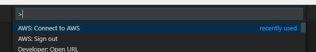
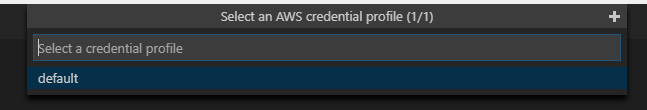

# AWS Toolkit for Visual Studio Code

[](https://travis-ci.org/aws/aws-toolkit-vscode)

[](https://codecov.io/gh/aws/aws-toolkit-vscode/branch/develop)

The AWS Toolkit for Visual Studio Code is an extension for working with AWS services such as AWS Lambda.

The toolkit is in preview and only available if built from source. This is pre-release software and we recommend against using it in a production environment.

This is an open source project because we want you to be involved. We love issues, feature requests, code reviews, pull requests or any positive contribution.

## Getting Started

### Install the AWS SAM CLI

Follow the instructions [here](https://docs.aws.amazon.com/serverless-application-model/latest/developerguide/serverless-sam-cli-install.html) to install the AWS SAM CLI.

### Install the toolkit

The toolkit has not been released to the marketplace, so in order to try it you must build and run from source:

> Note: [`git`](https://git-scm.com/downloads), [node](https://nodejs.org/) **Version 10.12.12 or higher**, and [`npm`](https://npmjs.org/) **version 6.4.1 or higher** are required to build from source.

1. Clone the repository

    ```shell
    git clone https://github.com/aws/aws-toolkit-vscode.git
    cd aws-toolkit-vscode
    ```

2. Build and package the toolkit

    ```shell
    npm install
    npm run package
    ```

    After packaging completes, the name of the vsix file is output. You'll need to know this filename in the next step.

    An example of the output is shown on the next line. In this case `aws-toolkit-vscode-0.0.1.vsix` is the filename of interest.

    ```text
    DONE  Packaged: c:\codebase\v3\aws-toolkit-vscode\aws-toolkit-vscode-0.0.1.vsix (8140 files, 23.14MB)
    ```

3. Install the toolkit

    Run the following command, replacing `<VSIX_FILENAME_HERE>` with the filename output in the previous step.

    ```shell
    code --install-extension <VSIX_FILENAME_HERE>
    ```

    For example: `code --install-extension aws-toolkit-vscode-0.0.1.vsix`

### Sign in to your AWS account

#### Create a profile

##### Method One: Create a profile using the AWS CLI

1. If you haven't already, sign up for AWS. You can create a free account [here](https://aws.amazon.com/free/).
2. Install the AWS CLI by following the instructions [here](https://aws.amazon.com/cli/).
3. Run the command `aws configure`, and follow the instructions in the command prompt.

##### Method Two: Create a profile using the AWS Tools for PowerShell

1. If you haven't already, sign up for AWS. You can create a free account [here](https://aws.amazon.com/free/).
2. Install the AWS Tools for PowerShell by following the instructions [here](https://aws.amazon.com/powershell/).
3. Run the command Set-AWSCredential to define an AWS credential:

    * On Mac or Linux:

    `Set-AWSCredential -AccessKey [access-key-value] -SecretKey [secret-key-value] -StoreAs [profile-name]`

    * On Windows:

    `Set-AWSCredential -AccessKey [access-key-value] -SecretKey [secret-key-value] -StoreAs [profile-name] -ProfileLocation $env:USERPROFILE\.aws\credentials`

##### Method Three: Manually create a profile

1. If you haven't already, sign up for AWS. You can create a free account [here](https://aws.amazon.com/free/).
2. Manually configure your configuration and credentials files as described [here](https://docs.aws.amazon.com/cli/latest/userguide/cli-config-files.html).

#### Select your profile in Visual Studio Code

1. Launch Visual Studio Code.
2. Select `View > Command Palette...` and search for `AWS`.
3. Select `AWS: Connect to AWS`

    

4. Select the profile that you created earlier.

    

## Creating a Debug Configuration

You can debug your Serverless Application's Lambda Function locally using the CodeLens links above the lambda handler. If you would like to use the Debug Panel to launch the debugger instead, use the following steps to configure your project's Debug Configuration.

These steps are relevant for javascript lambda functions, and assume you have a properly configured Serverless Application template file.

* Create a file that defines the payload that will be passed into your lambda function. Create a file next to your `template.yaml` called `event.json` and put an empty JSON object in the file:

    ```javascript
    {
    }
    ```

    After you have debugging set up, you can return to this file and change its contents to be the payload you want to debug with.

* Define a task responsible for running the lambda function locally using SAM CLI. From the **Command Palette**, select `Tasks: Configure Task`.

  * If your workspace does not have a `tasks.json` file, you will be prompted further. Select `Create tasks.json file from template`, then `Others`. Delete the echo task from the newly created file.
  * If your workspace does have a `tasks.json` file, select one of your existing task definitions, or select `Open tasks.json file` to open the file.

* You should be looking at a `tasks.json` file that looks similar to this:

    ```jsonc
    {
        "version": "2.0.0",
        "tasks": [

            <In here you may have 0 or more task entries>

        ]
    }
    ```

    Add the following task entry into the `tasks` array

    ```jsonc
    {
        "label": "launchLambdaFunction",
        "type": "shell",
        "command": "sam",
        "args": [
            "local",
            "invoke",
            "HelloWorldFunction", // Replace this with the resource name of your lambda function from your Serverless Application template.yaml file
            "--template",
            "${workspaceFolder}/template.yaml", // Replace this with the appropriate workspace-relative path to your Serverless Application template.yaml file
            "--event",
            "${workspaceFolder}/event.json", // Replace this with the appropriate workspace-relative path to your event.json file
            "-d",
            "5858"
        ],
        "isBackground": true,
        "problemMatcher": {
            "pattern": [
                {
                    // Use regex that never matches anything.
                    "regexp": "^(x)(\\b)(x)$",
                    "file": 1,
                    "location": 2,
                    "message": 3
                }
            ],
            "background": {
                // This is how the debugger knows when it can attach
                "activeOnStart": true,
                "beginsPattern": "^Fetching lambci.* Docker container image......$",
                "endsPattern": "^.* Mounting .* as .*:ro inside runtime container$"
            }
        }
    }
    ```

    Your `tasks.json` file should now look similar to this:

    ```jsonc
    {
        "version": "2.0.0",
        "tasks": [

            <In here you may have 0 or more additional task entries>

            {
                "label": "launchLambdaFunction",
                ... remainder of launchLambdaFunction entry would be here, omitted for brevity ...
            }
        ]
    }
    ```

  * Save the `tasks.json` file

* Define a Debug Configuration to attach to the task you just defined. From the **Command Palette**, select `Debug: Open launch.json`.

  * If you are asked to Select an Environment, select `Node.js`, and the file will be created for you. You can delete the `Launch Program` configuration entry that was initially created in the file.

* You should now see a `launch.json` file that looks similar to this:

    ```javascript
    {
        "version": "0.2.0",
        "configurations": [

            <There may be 0 or more launch cofigurations in here already>

        ]
    }
    ```

    Add the following configuration entry into the `configurations` array

    ```javascript
    {
        "type": "node",
        "request": "launch",
        "name": "Debug Local Lambda: <your function name here>",
        "preLaunchTask": "launchLambdaFunction",
        "address": "localhost",
        "port": 5858,
        "localRoot": "${workspaceFolder}/hello-world", // This is the workspace relative location of the folder referenced by your Serverless Application template resource's CodeUri
        "remoteRoot": "/var/task",
        "protocol": "inspector",
        "skipFiles": [
            "/var/runtime/node_modules/**/*.js",
            "<node_internals>/**/*.js"
        ]
    }
    ```

    Your `launch.json` file should now look similar to this:

    ```javascript
    {
        "version": "0.2.0",
        "configurations": [

            <There may be 0 or more launch cofigurations in here already>

            {
                "type": "node",
                "request": "launch",
                "name": "Debug Local Lambda: <your function name here>",
                "preLaunchTask": "launchLambdaFunction",
                .
                .
                .
            }
        ]
    }
    ```

* Save the `launch.json` file

You should now be able to switch to the Debug Pane in VS Code, and select your configuration from the dropdown menu. Pressing play or `F5` will launch and debug the lambda function you have just configured.

## Contributing

See [Contributing](./CONTRIBUTING.md).

## License

The **AWS Toolkit for Visual Studio Code** is distributed under the [Apache License, Version 2.0](https://www.apache.org/licenses/LICENSE-2.0).
