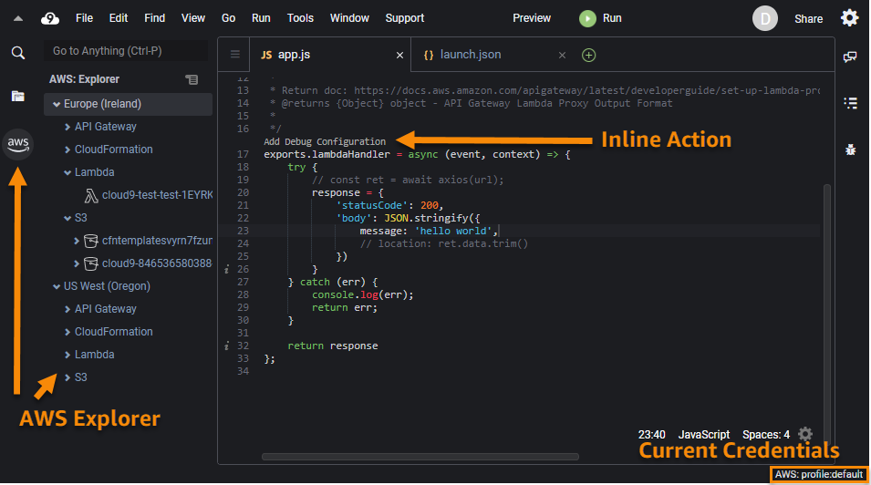
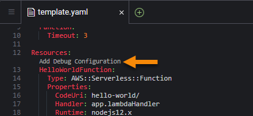
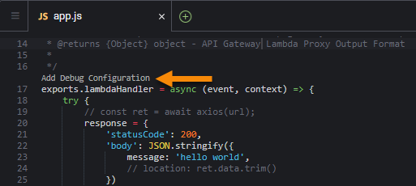
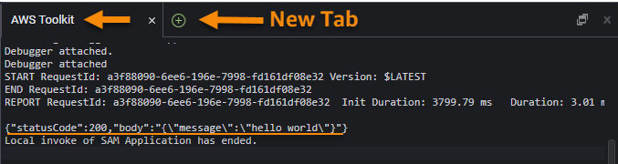
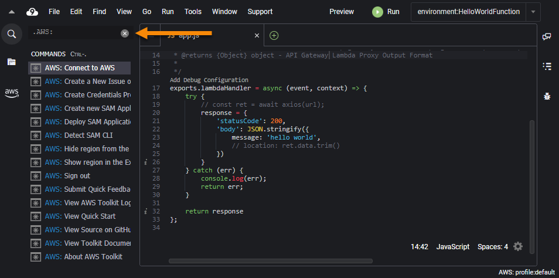

# AWS Toolkit

The AWS Toolkit extension for AWS Cloud9 that enables you to interact with [Amazon Web Services (AWS)](https://aws.amazon.com/what-is-aws/).
See the [user guide](https://docs.aws.amazon.com/cloud9/latest/user-guide/toolkit-welcome.html) for complete documentation.

Try the [AWS Code Sample Catalog](https://docs.aws.amazon.com/code-samples/latest/catalog/welcome.html) to start coding with the AWS SDK.

# Features

-   [AWS Explorer](#ui-components-aws-expl)
    -   API Gateway
    -   App Runner
    -   CloudFormation stacks
    -   [CloudWatch Logs](https://docs.aws.amazon.com/cloud9/latest/user-guide/cloudwatch-logs-toolkit.html)
    -   ECR
    -   [ECS](https://docs.aws.amazon.com/toolkit-for-vscode/latest/userguide/ecs-exec.html)
    -   IoT explorer
    -   Lambda functions
    -   S3 explorer
-   [Developer Tools](#ui-components-dev-tools)
    -   [CDK Explorer](#ui-components-cdk-expl)
    -   [CodeWhisperer](#codewhisperer)
-   [AWS Serverless Applications (SAM)](#sam-and-lambda)
-   [`AWS:` Commands](#aws-commands)

---

## AWS Explorer

The **AWS Explorer** provides access to the AWS services that you can work with when using the Toolkit. To see the **AWS Explorer**, choose the **AWS** icon in the **Activity bar**.

## 

## Developer Tools

The **Developer Tools** panel is a section for developer-focused tooling curated for working in an IDE. The **Developer Tools** panel can be found underneath the **AWS Explorer** when the **AWS icon** is selected in the **Activity bar**.

## { [Return to Top](#top) }

## CDK Explorer

The **AWS CDK Explorer** enables you to work with [AWS Cloud Development Kit (CDK)](https://aws.amazon.com/cdk/) applications. It shows a top-level view of your CDK applications that have been sythesized in your workspace.

With the CDK explorer, you can navigate the CDK application's infrastructure stacks, resources, and policies.

For full details see the [AWS CDK Explorer](https://docs.aws.amazon.com/toolkit-for-vscode/latest/userguide/cdk-explorer.html) in the user guide.

{ [Return to Top](#top) }

## Amazon CodeWhisperer

**Amazon CodeWhisperer** provides inline code suggestions using machine learning and natural language processing on the contents of your current file. Supported languages include: Java, Python and Javascript.

Once enabled, CodeWhisperer will provide code suggestions automatically and can also be requested manually using option+c (mac) / alt+c (PC). To accept a suggestion and add it to your file, press Tab, Enter or click on it. To dismiss a suggestion, press escape or keep typing.

For more information, see [Amazon CodeWhisperer](https://aws.amazon.com/codewhisperer) in our user guide.

## { [Return to Top](#top) }

##  AWS Serverless Applications

The AWS Toolkit enables you to develop [AWS serverless applications](https://aws.amazon.com/serverless/) locally. It also provides _Inline Actions_ in Cloud9 to do the following:

-   Use SAM (serverless application model) templates to build and debug your locally developed AWS serverless applications.
-   Run selected [AWS Lambda](https://aws.amazon.com/lambda/) functions.

To start debugging with a SAM template, click the `Add Debug Configuration` _Inline Action_ in the template file.

###### The _Inline Action_ indicator in the SAM template allows you to add a debug configuration for the serverless application.</h6>

Alternatively, you can run and debug just the AWS Lambda function and exclude other resources defined by the SAM template. Again, use an _Inline Action_ indicator for an AWS Lambda-function handler. (A _handler_ is a function that Lambda calls to start execution of a Lambda function.)

###### The _Inline Action_ indicator in the application file lets you add a debug configuration for a selected AWS Lambda function.

When you run a debug session, the status and results are shown in the **AWS Toolkit** output channel. If the toolkit does not have an open **AWS Toolkit** output channel, one can be created with the New Tab button.

###### After a local run is complete, the output appears in the **OUTPUT** tab.

When you're satisfied with performance, you can [deploy your serverless application](https://docs.aws.amazon.com/cloud9/latest/user-guide/deploy-serverless-app.html). The SAM template is converted to a CloudFormation template, which is then used to deploy all the application's assets to the AWS Cloud.

### Supported runtimes

The Toolkit _local SAM debugging_ feature supports these runtimes:

-   JavaScript (Node.js 14.x, 16.x)
-   Python (3.7, 3.8, 3.9, 3.10, 3.11, 3.12)

For more information see [Working with AWS Serverless Applications](https://docs.aws.amazon.com/cloud9/latest/user-guide/serverless-apps-toolkit.html) in the user guide.

{ [Return to Top](#top) }

---

## `AWS:` Commands

The Toolkit provides commands (prefixed with `AWS:`) to the AWS Cloud9 _Go to Anything panel_, available by clicking the search bar and typing "." or via hotkey.

| OS      | Hotkey   |
| :------ | :------- |
| Windows | `CTRL-.` |
| macOS   | `CMD-.`  |

| AWS Command                               | Description                                                                                                                                                                                                                                |
| :---------------------------------------- | :----------------------------------------------------------------------------------------------------------------------------------------------------------------------------------------------------------------------------------------- |
| `AWS: About Toolkit`                      | Displays information about the AWS Toolkit.                                                                                                                                                                                                |
| `AWS: Add SAM Debug Configuration`        | Creates an `aws-sam` Debug Configuration from a function in the given source file                                                                                                                                                          |
| `AWS: Connect to AWS`                     | Select or create a connection to AWS.                                                                                                                                                                                                      |
| `AWS: Create a new Issue on Github`       | Opens the AWS Toolkit's [New Issue page on Github](https://github.com/aws/aws-toolkit-vscode/issues/new/choose).                                                                                                                           |
| `AWS: Create Credentials Profile`         | Creates an AWS credentials profile.                                                                                                                                                                                                        |
| `AWS: Create Lambda SAM Application`      | Generates code files for a new AWS serverless Lambda application. For more information, see [Creating a Serverless Application](https://docs.aws.amazon.com/cloud9/latest/user-guide/latest/user-guide/create-sam.html) in the user guide. |
| `AWS: Create new CloudFormation Template` | Creates a new starter Cloudformation Template                                                                                                                                                                                              |
| `AWS: Create new SAM Template`            | Creates a new starter SAM Template                                                                                                                                                                                                         |
| `AWS: Deploy SAM Application`             | Deploys a local serverless application to an AWS account. For more information, see [Deploying a Serverless Application](https://docs.aws.amazon.com/cloud9/latest/user-guide/deploy-serverless-app.html) in the user guide.               |
| `AWS: Edit Credentials`                   | Opens the `~/.aws/credentials` or `~/.aws/config` file for editing.                                                                                                                                                                        |
| `AWS: Edit SAM Debug Configuration`       | Shows a tool that helps you create, edit, run, and debug a SAM _launch config_ (`type:aws-sam`).                                                                                                                                           |
| `AWS: Detect SAM CLI`                     | Checks whether the Toolkit can communicate correctly with the AWS SAM CLI that is installed.                                                                                                                                               |
| `AWS: Show or Hide Regions`               | Adds or removes AWS Regions in the **AWS Explorer**.                                                                                                                                                                                       |
| `AWS: Sign out`                           | Disconnect the Toolkit from the current AWS connection.                                                                                                                                                                                    |
| `AWS: Submit Quick Feedback...`           | Submit a private, one-way message and sentiment to the AWS Toolkit dev team. For larger issues that warrant conversations or bugfixes, please submit an issue in Github with the **AWS: Create a New Issue on Github** command.            |
| `AWS: Toggle SAM hints in source files`   | Toggles AWS SAM-related Inline Actions in source files                                                                                                                                                                                     |
| `AWS: View Toolkit Logs`                  | Displays log files that contain general Toolkit diagnostic information.                                                                                                                                                                    |
| `AWS: View Quick Start`                   | Open this quick-start guide.                                                                                                                                                                                                               |
| `AWS: View Toolkit Documentation`         | Opens the [user guide](https://docs.aws.amazon.com/cloud9/latest/user-guide/toolkit-welcome.html) for the Toolkit.                                                                                                                         |
| `AWS: View Source on GitHub`              | Opens the [GitHub repository](https://github.com/aws/aws-toolkit-vscode) for the Toolkit.                                                                                                                                                  |

{ [Return to Top](#top) }

---

# Get help

For additional details on how to use the AWS Toolkit, see the [user guide](https://docs.aws.amazon.com/cloud9/latest/user-guide/toolkit-welcome.html).

To report issues with the Toolkit or to propose Toolkit code changes, see the [aws/aws-toolkit-vscode](https://github.com/aws/aws-toolkit-vscode) repository on GitHub.

You can also [contact AWS](https://aws.amazon.com/contact-us/) directly.

{ [Return to Top](#top) }
