# AWS Toolkit

AWS Toolkit is an extension for Visual Studio Code that enables you to interact with [Amazon Web Services (AWS)](https://aws.amazon.com/what-is-aws/).
See the [AWS Toolkit for Visual Studio Code user guide](https://docs.aws.amazon.com/console/toolkit-for-vscode/welcome) for complete documentation.

See [Setup](#additional-setup-steps) for installation requirements, or [Get help](#get-help) for support.

# Features

-   [AWS Explorer](#ui-components-aws-expl)
    -   API Gateway
    -   CloudFormation stacks
    -   CloudWatch Logs
    -   ECR
    -   EventBridge schemas
    -   Lambda functions
    -   S3 explorer
    -   Step Functions
-   [CDK Explorer](#ui-components-cdk-expl)
-   [AWS Serverless Applications (SAM)](#sam-and-lambda)
-   [Amazon CloudWatch Logs](#cloudwatchlogs)
-   [Amazon EventBridge Schemas](#eventbridge)
-   [Amazon ECS task definition files](#ecs-files)
-   [AWS Step Functions](#sfn-files)
-   [AWS Systems Manager](#ssm-files)
-   [`AWS:` Commands](#aws-commands)

---

## AWS Explorer

The **AWS Explorer** provides access to the AWS services that you can work with when using the Toolkit. To see the **AWS Explorer**, choose the **AWS** icon in the **Activity bar**.

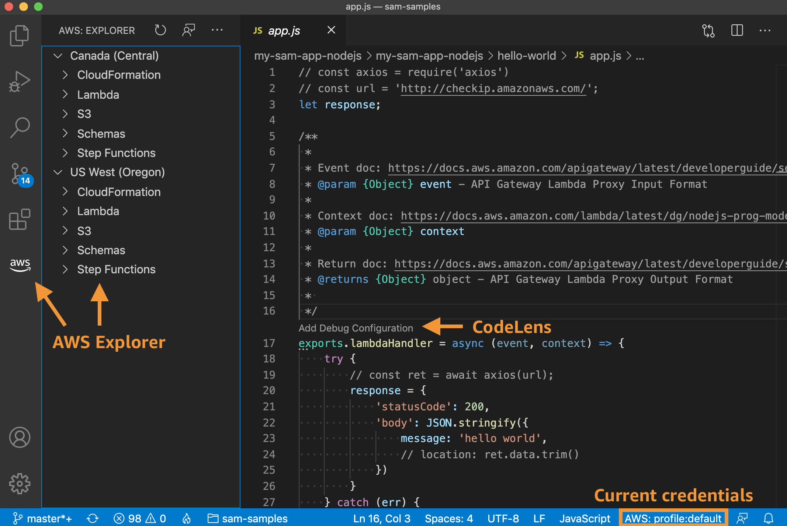

{ [Return to Top](#top) }

## CDK Explorer

The **AWS CDK Explorer** enables you to work with [AWS Cloud Development Kit (CDK)](https://aws.amazon.com/cdk/) applications. It shows a top-level view of your CDK applications that have been sythesized in your workspace.

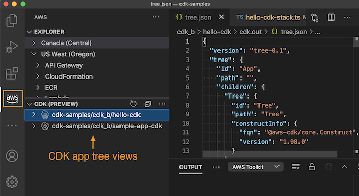

With the CDK explorer, you can navigate the CDK application's infrastructure stacks, resources, and policies.

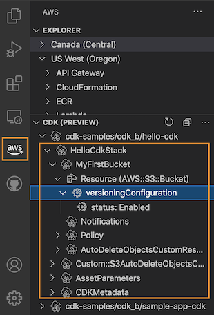

For full details see the [AWS CDK Explorer](https://docs.aws.amazon.com/toolkit-for-vscode/latest/userguide/cdk-explorer.html) in the user guide.

{ [Return to Top](#top) }

---

##  AWS Serverless Applications

The AWS Toolkit enables you to develop [AWS serverless applications](https://aws.amazon.com/serverless/) locally. It also provides _CodeLenses_ in VS Code to do the following:

-   Use SAM (serverless application model) templates to build and debug your locally developed AWS serverless applications.
-   Run selected [AWS Lambda](https://aws.amazon.com/lambda/) functions.

To start debugging with a SAM template, click the `Add Debug Configuration` _CodeLens_ in the template file.

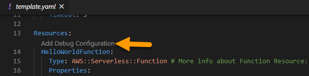

###### The _CodeLens_ indicator in the SAM template allows you to add a debug configuration for the serverless application.</h6>

Alternatively, you can run and debug just the AWS Lambda function and exclude other resources defined by the SAM template. Again, use a _CodeLens_ indicator for an AWS Lambda-function handler. (A _handler_ is a function that Lambda calls to start execution of a Lambda function.)

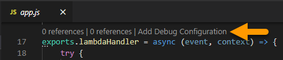

###### The _CodeLens_ indicator in the application file lets you add a debug configuration for a selected AWS Lambda function.

When you run a debug session, the status and results are shown in the **OUTPUT** panel when the **AWS Toolkit** output channel is selected.

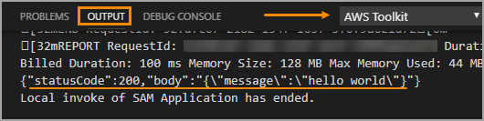

###### After a local run is complete, the output appears in the **OUTPUT** tab.

When you're satisfied with performance, you can [deploy your serverless application](https://docs.aws.amazon.com/console/toolkit-for-vscode/deploy-serverless-app). The SAM template is converted to a CloudFormation template, which is then used to deploy all the application's assets to the AWS Cloud.

### Launch config auto-completion ("IntelliSense")

The `Add Debug Configuration` _CodeLens_ creates launch configs of type
`aws-sam` in the VS Code `launch.json` file. You can also create these entries
by hand.

When editing `launch.json` configs, AWS Toolkit provides auto-completion and
contextual documentation, as shown below.

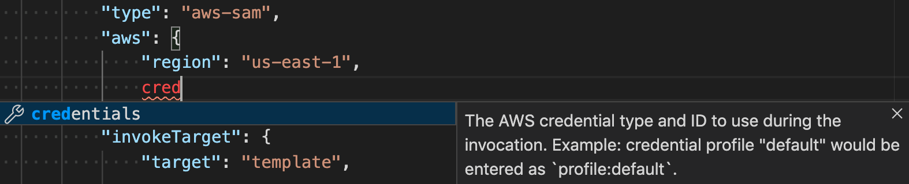

### Supported runtimes

The Toolkit _local SAM debugging_ feature supports these Lambda runtimes:

-   C# (.NET Core 2.1, 3.1; .NET 5.0)
-   Go (1.x)
-   Java (8, 8.al2, 11)
-   JavaScript/TypeScript (Node.js 10.x, 12.x, 14.x)
-   Python (2.7, 3.6, 3.7, 3.8)

For more information see [Working with AWS Serverless Applications](https://docs.aws.amazon.com/toolkit-for-vscode/latest/userguide/serverless-apps.html) in the user guide. To get setup for local debugging, see [Configuring your toolchain](https://docs.aws.amazon.com/toolkit-for-vscode/latest/userguide/setup-toolchain.html).

{ [Return to Top](#top) }

---

## Amazon CloudWatch Logs

The AWS Toolkit provides support for [Amazon CloudWatch Logs](https://aws.amazon.com/cloudwatch/). Using the [AWS Explorer](#ui-components-aws-expl) of the Toolkit, you can perform the following operations on Log Groups:

-   List CloudWatch Log Groups
-   View Log Streams for a Log Group

Viewing a Log Stream will immediately load the most recent 10,000 lines or 1 MB of data (whichever is smaller), and their timestamps. From this view, users can access the following actions:

-   Load older or newer log events
-   Save currently-loaded Log Stream to a log file
-   Copy Log Stream name

Example:

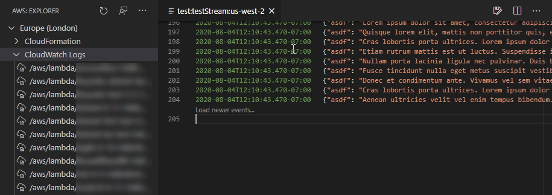

For full details, see [Working with CloudWatch Logs](https://docs.aws.amazon.com/console/toolkit-for-vscode/latest/userguide/cloudwatchlogs.html) in the Toolkit's user guide.

{ [Return to Top](#top) }

---

## Amazon EventBridge Schemas

The AWS Toolkit provides support for [Amazon EventBridge](https://aws.amazon.com/eventbridge) schemas. Using the [AWS Explorer](#ui-components-aws-expl) of the Toolkit, you can perform the following operations on these schemas:

-   View an available schema
-   Search for an available schema
-   Generate code for an available schema

Example:

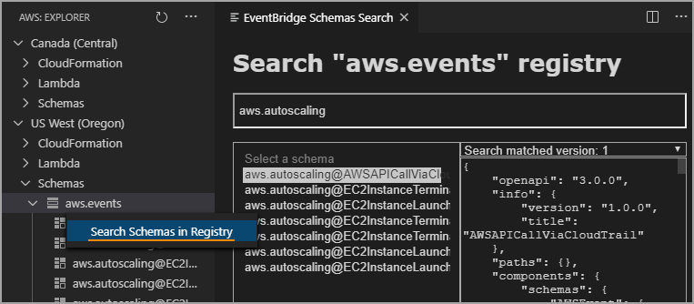

For full details, see [Working with Amazon EventBridge Schemas](https://docs.aws.amazon.com/console/toolkit-for-vscode/eventbridge-schemas) in the Toolkit's user guide.

{ [Return to Top](#top) }

---

## Amazon ECS task definition files

The AWS Toolkit provides support for [Amazon Elastic Container Service (Amazon ECS)](https://aws.amazon.com/ecs). With the Toolkit installed in VS Code, IntelliSense functionality is provided for Amazon ECS task-definition files that you are updating in the editor.

Example:

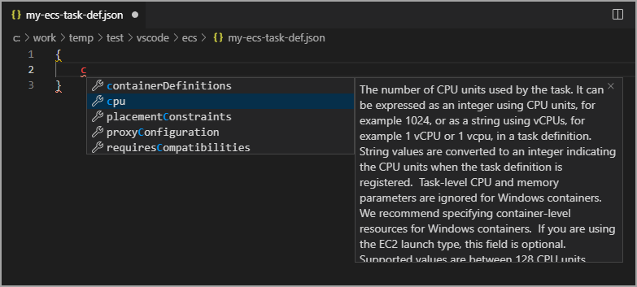

For full details, see [Working with Amazon Elastic Container Service](https://docs.aws.amazon.com/toolkit-for-vscode/latest/userguide/ecs.html) in the Toolkit's user guide.

{ [Return to Top](#top) }

---

## AWS Systems Manager Documents

The AWS Toolkit provides support for [AWS Systems Manager Documents](https://docs.aws.amazon.com/systems-manager/latest/userguide/automation-documents.html). With the Toolkit installed in VS Code, you have access to the following features when working on Automation Documents:

-   Download, edit, and publish your Automation documents
-   Code completion and validation for both formats of documents: YAML and JSON
-   Templates and code snippets to help kickstart your Automation document

Example:

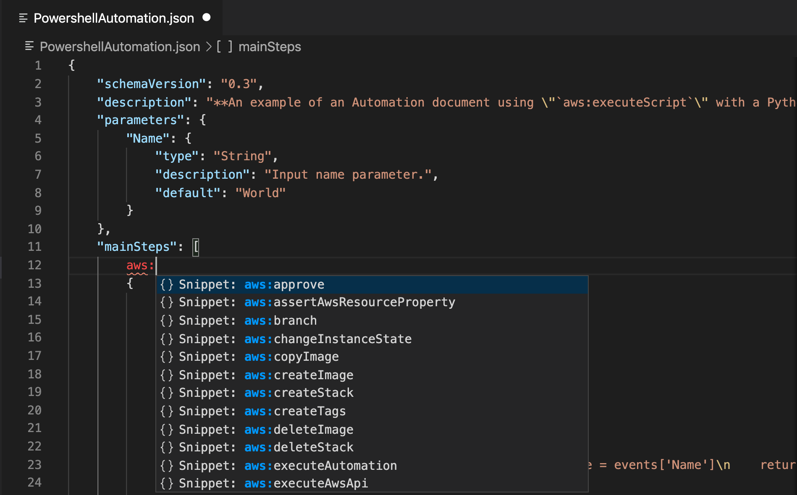

For full details, see [Working with AWS Systems Manager Documents](https://docs.aws.amazon.com/toolkit-for-vscode/latest/userguide/ssmDocuments.html) in the Toolkit's user guide.

{ [Return to Top](#top) }

---

## AWS Step Functions

The AWS Toolkit provides support for [AWS Step Functions](https://docs.aws.amazon.com/step-functions). With the Toolkit installed in VS Code, working with state machines is a more streamlined process.

-   Create, update, execute, and download state machines.
-   See live graph visualizations of your state machine.
-   Take advantage of features such as code completion and validation, and code snippets.

Example:

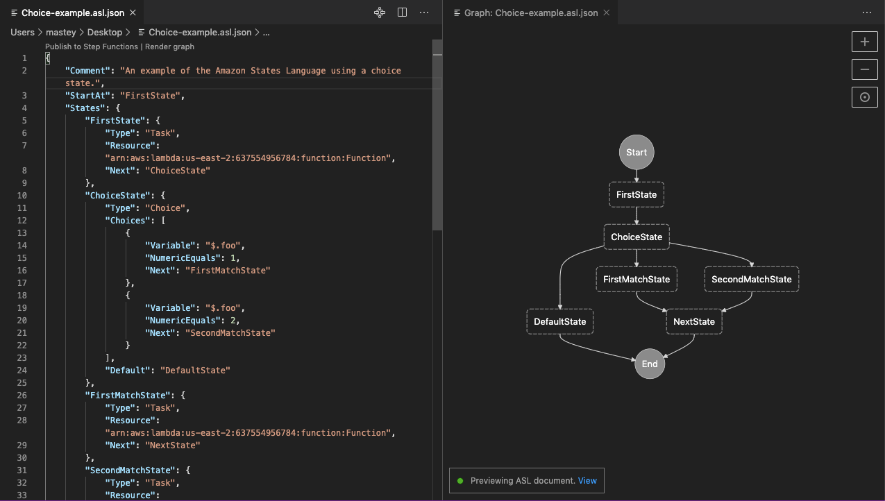

For full details, see [Working with AWS Step Functions](https://docs.aws.amazon.com/toolkit-for-vscode/latest/userguide/stepfunctions.html) in the Toolkit's user guide.

{ [Return to Top](#top) }

---

## `AWS:` Commands

The Toolkit provides commands (prefixed with `AWS:`) to the VS Code _command
palette_, available by selecting _View > Command Palette_ or by typing
`CTRL-SHIFT-p` (macOS: `CMD-SHIFT-p`).

| AWS Command                                          | Description                                                                                                                                                                                                                                                                                                    |
| :--------------------------------------------------- | :------------------------------------------------------------------------------------------------------------------------------------------------------------------------------------------------------------------------------------------------------------------------------------------------------------- |
| `AWS: About Toolkit`                             | Displays information about the AWS Toolkit.                                                                                                                                                                                                                                                                    |
| `AWS: Add SAM Debug Configuration`                   | Creates an `aws-sam` Debug Configuration from a function in the current source file                                                                                                                                                                                                                            |
| `AWS: Connect to AWS`                                | Connects the Toolkit to an AWS account. For more information, see [Connecting to AWS](https://docs.aws.amazon.com/console/toolkit-for-vscode/connect) in the user guide.                                                                                                                                       |
| `AWS: Copy Log Stream Name`                          | Copies the name of the active CloudWatch Log Stream                                                                                                                                                                                                                                                            |
| `AWS: Create a new Step Functions state machine`     | Generates a new Amazon States Language definition to use as the definition for a new Step Functions state machine. For more information, see [State Machine Templates](https://docs.aws.amazon.com//toolkit-for-vscode/latest/userguide/bulding-stepfunctions.html#templates-stepfunctions) in the user guide. |
| `AWS: Create a new Issue on Github`                  | Opens the AWS Toolkit's [New Issue page on Github](https://github.com/aws/aws-toolkit-vscode/issues/new/choose).                                                                                                                                                                                               |
| `AWS: Create a new Systems Manager Document locally` | Creates a new Systems Manager Document from a template in either YAML or JSON                                                                                                                                                                                                                                  |
| `AWS: Create Credentials Profile`                    | Creates an AWS credentials profile. For more information, see [Setting Up Your AWS Credentials](https://docs.aws.amazon.com/console/toolkit-for-vscode/setup-credentials) in the user guide.                                                                                                                   |
| `AWS: Create Lambda SAM Application`                 | Generates code files for a new AWS serverless Lambda application. For more information, see [Creating a Serverless Application](https://docs.aws.amazon.com/console/toolkit-for-vscode/create-sam) in the user guide.                                                                                          |
| `AWS: Deploy SAM Application`                        | Deploys a local serverless application to an AWS account. For more information, see [Deploying a Serverless Application](https://docs.aws.amazon.com/console/toolkit-for-vscode/deploy-serverless-app) in the user guide.                                                                                      |
| `AWS: Detect SAM CLI`                                | Checks whether the Toolkit can communicate correctly with the AWS SAM CLI that is installed.                                                                                                                                                                                                                   |
| `AWS: Focus on Explorer View`                        | Opens the **AWS** panel and focuses the [_Explorer_](#ui-components-aws-expl).                                                                                                                                                                                                                                 |
| `AWS: Hide region from the Explorer`                 | Hides an AWS Region from the **AWS Explorer**.                                                                                                                                                                                                                                                                 |
| `AWS: Publish state machine to Step Functions`       | Creates or updates a remote state machine using the local Amazon States Language definition file. For more information, see [Work With State Machines in VS Code](https://docs.aws.amazon.com/toolkit-for-vscode/latest/userguide/bulding-stepfunctions.html#starting-stepfunctions) in the user guide.        |
| `AWS: Publish a Systems Manager Document`            | Creates a new document or updates an existing document in your account using the currently open document.                                                                                                                                                                                                      |
| `AWS: Render state machine graph`                    | Renders the state machine definition into a graph visualization. For more information, see [State Machine Graph Visualization](https://docs.aws.amazon.com//toolkit-for-vscode/latest/userguide/bulding-stepfunctions.html#bulding-stepfunctions-visualizations) in the user guide.                            |
| `AWS: Report an Issue`                               | In the [GitHub repository](https://github.com/aws/aws-toolkit-vscode) for the Toolkit, opens the page to [create a new issue](https://github.com/aws/aws-toolkit-vscode/issues/new/choose).                                                                                                                    |
| `AWS: Save Current Log Content To File`              | Saves currently-loaded CloudWatch Log Stream data to a local `.log` file.                                                                                                                                                                                                                                      |
| `AWS: Show region in the Explorer`                   | Displays an AWS Region in the **AWS Explorer**.                                                                                                                                                                                                                                                                |
| `AWS: Sign out`                                      | Disconnects the Toolkit from the currently-connected AWS account.                                                                                                                                                                                                                                              |
| `AWS: Submit Quick Feedback...`                      | Submit a private, one-way message and sentiment to the AWS Toolkit dev team. For larger issues that warrant conversations or bugfixes, please submit an issue in Github with the **AWS: Create a New Issue on Github** command.                                                                                |
| `AWS: Toggle SAM hints in source files`              | Toggles AWS SAM-related Codelenses in source files                                                                                                                                                                                                                                                             |
| `AWS: View Toolkit Logs`                         | Displays log files that contain general Toolkit diagnostic information.                                                                                                                                                                                                                                        |
| `AWS: View Quick Start`                              | Open this quick-start guide.                                                                                                                                                                                                                                                                                   |
| `AWS: View CDK Documentation`                        | Opens the [user guide](https://docs.aws.amazon.com/console/toolkit-for-vscode/aws-cdk-apps) for the CDK portion of the Toolkit.                                                                                                                                                                                |
| `AWS: View Toolkit Documentation`                    | Opens the [user guide](https://docs.aws.amazon.com/console/toolkit-for-vscode/welcome) for the Toolkit.                                                                                                                                                                                                        |
| `AWS: View Source on GitHub`                         | Opens the [GitHub repository](https://github.com/aws/aws-toolkit-vscode) for the Toolkit.                                                                                                                                                                                                                      |
| `AWS: Focus on CDK (Preview) View`                   | Opens the **AWS** panel and focuses the **CDK** view.                                                                                                                                                                                                                                                          |

{ [Return to Top](#top) }

---

# Setup

To access most features of the AWS Toolkit, complete the [Setting Up](https://docs.aws.amazon.com/console/toolkit-for-vscode/getting-started) steps from the user guide.

1. [Create an AWS account](https://aws.amazon.com/premiumsupport/knowledge-center/create-and-activate-aws-account/) (see also [Prerequisites](https://docs.aws.amazon.com/console/toolkit-for-vscode/setup-toolkit#setup-prereq)).
1. [Create and configure](https://docs.aws.amazon.com/toolkit-for-vscode/latest/userguide/establish-credentials.html) your AWS credentials.
1. [Connect the Toolkit](https://docs.aws.amazon.com/console/toolkit-for-vscode/connect) to AWS with those credentials.

To develop [serverless applications](https://aws.amazon.com/serverless/) with the Toolkit, you must [set up your toolchain](https://docs.aws.amazon.com/console/toolkit-for-vscode/setup-toolchain) and do the following on the local machine where the Toolkit is installed:

1. Install the [AWS CLI](https://docs.aws.amazon.com/cli/latest/userguide/cli-chap-install.html) (Command Line Interface).
1. Install and start [Docker](https://docs.docker.com/install/).
1. Install the AWS [SAM CLI](https://docs.aws.amazon.com/serverless-application-model/latest/developerguide/serverless-sam-cli-install.html).

{ [Return to Top](#top) }

---

# Get help

For additional details on how to use the AWS Toolkit, see the [user guide](https://docs.aws.amazon.com/console/toolkit-for-vscode/welcome).

To report issues with the Toolkit or to propose Toolkit code changes, see the [aws/aws-toolkit-vscode](https://github.com/aws/aws-toolkit-vscode) repository on GitHub.

You can also [contact AWS](https://aws.amazon.com/contact-us/) directly.

{ [Return to Top](#top) }
