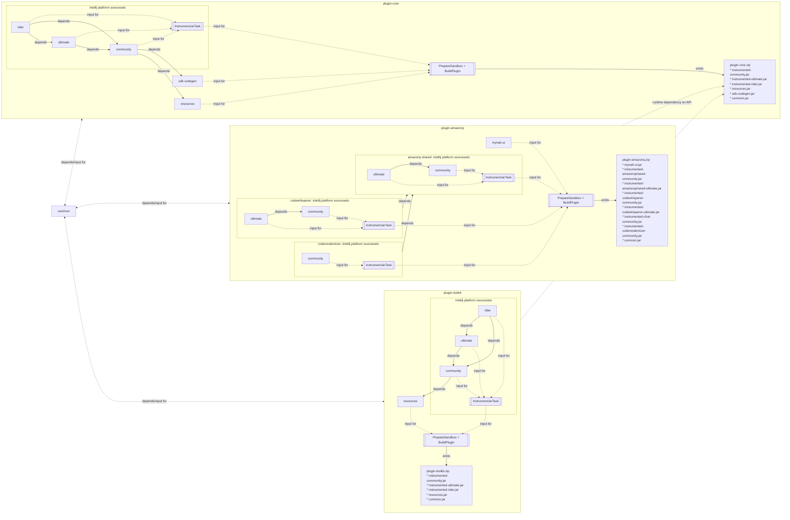

# Repository Layout
This repository is meant to be built as a [Gradle multi-project build](https://docs.gradle.org/current/userguide/intro_multi_project_builds.html) with approximately the following structure.
For simplicity, not every subproject will be detailed in this document.

```
aws-toolkit-jetbrains
├── buildSrc                                :buildSrc
│   ├── ⋮
│   └── build.gradle.kts 
│
├── detekt-rules                            :detekt-rules
│   ├── ⋮
│   └── build.gradle.kts 
│
├── ui-tests                                :ui-tests
│   ├── ⋮
│   └── build.gradle.kts 
│
├── common                                  :common
│   ├── ⋮
│   └── build.gradle.kts 
│
├── plugins
│   ├── core                                :plugin-core
│   │   ├── sdk-codegen                     :plugin-core:sdk-codegen
│   │   │   ├── ⋮
│   │   │   └── build.gradle.kts 
│   │   ├── community                       :plugin-core:community
│   │   │   ├── ⋮
│   │   │   └── build.gradle.kts
│   │   ├── ultimate                        :plugin-core:ultimate
│   │   │   ├── ⋮
│   │   │   └── build.gradle.kts
│   │   ├── rider                           :plugin-core:rider
│   │   │   ├── ⋮
│   │   │   └── build.gradle.kts
│   │   └── build.gradle.kts
│   │
│   ├── toolkit                             :plugin-toolkit
│   │   ├── community                       :plugin-toolkit:community
│   │   │   ├── ⋮
│   │   │   └── build.gradle.kts
│   │   ├── ultimate                        :plugin-toolkit:ultimate
│   │   │   ├── ⋮
│   │   │   └── build.gradle.kts
│   │   ├── rider                           :plugin-toolkit:rider
│   │   │   ├── ⋮
│   │   │   └── build.gradle.kts
│   │   ├── gateway                         :plugin-toolkit:gateway
│   │   │   ├── ⋮
│   │   │   └── build.gradle.kts
│   │   └── build.gradle.kts
│   │
│   ├── amazonq                              :plugin-amazonq
│   │   ├── codewhisperer                   :plugin-amazonq:codewhisperer
│   │   │   ├── community                   :plugin-amazonq:codewhisperer:community
│   │   │   │   ├── ⋮
│   │   │   │   └── build.gradle.kts
│   │   │   ├── ultimate                    :plugin-amazonq:codewhisperer:ultimate
│   │   │   │   ├── ⋮
│   │   │   │   └── build.gradle.kts
│   │   │   └── build.gradle.kts
│   │   ├── codemodernizer                  :plugin-amazonq:codemodernizer
│   │   │   ├── community                   :plugin-amazonq:codemodernizer:community
│   │   │   │   ├── ⋮
│   │   │   │   └── build.gradle.kts
│   │   │   └── build.gradle.kts
│   │   ├── ⋮
│   │   ├── mynah-ui                        :plugin-amazonq:mynah-ui  
│   │   │   ├── ⋮
│   │   │   └── build.gradle.kts
│   │   └── build.gradle.kts 
│   │
│   └── toolbox                             :plugin-toolbox
│       ├── ⋮
│       └── build.gradle.kts 
│
│
├── build.gradle.kts  
└── settings.gradle.kts  
```

The intent of the above directory structure is to support emitting multiple discrete release artifacts from a single monorepo.
Where practical, [CODEOWNERS](https://docs.github.com/en/repositories/managing-your-repositorys-settings-and-features/customizing-your-repository/about-code-owners) should be accurately defined to facilitate proper assignment of pull requests.
This layout also conveniently allows us to define [GitHub rulesets](https://docs.github.com/en/repositories/configuring-branches-and-merges-in-your-repository/managing-rulesets/about-rulesets) for specific reposistory subprojects.

## Subprojects
Sub-projects should naturally fall along natural, logical boundaries. For example:
* `:buildSrc`: The standard Gradle convention for [encapsulated build logic](https://docs.gradle.org/current/userguide/organizing_gradle_projects.html#sec:build_sources)
* `:detekt-rules`: [detekt](https://github.com/detekt/detekt) custom rules and configuration for the entire repository 
* `:common`: Common utilities shared across all release artifacts
* `:ui-tests`: UI tests for all release artifacts

However, sub-projects in `plugins/` are primary defined along feature and code ownership boundaries.
Instead of the standard `:plugins:<artifact>:<sub-sub-project>` structure, we reduce nesting by defining these projects as `:plugin-<artifact>:<sub-sub-project>`.

[Sourcesets](https://docs.gradle.org/current/userguide/building_java_projects.html#sec:java_source_sets) defined in each sub-project are utilized in the conventional manner for a Kotlin/JVM project.
Use of Java is discouraged in this project; all new code should be written in Kotlin with the standard [coding conventions](https://kotlinlang.org/docs/coding-conventions.html).

Since we have very little Java remaining and new code is exclusively Kotlin, we do not follow the standard Gradle directory configuration. Instead, we allow Kotlin and Java code to be rooted directly against the subproject root:
```
subproject
├── src
│   ├── file1.kt
│   ├── file2.kt
│   ├── ⋮
│   └── file.java
├── tst
│   ├── file3.kt
│   └── ⋮
├── resources
│   ├── META-INF
│   └── ⋮
├── ⋮
└── build.gradle.kts
```

Sourcesets referencing code in the IntelliJ Platform have additional layout conventions, partially due to restrictions on how [JetBrains' Gradle plugin](https://github.com/JetBrains/gradle-intellij-plugin) configures a given sub-project,
and partially to improve the developer experience by shifting runtime errors to compilation errors.

A (sub-)sub-project is further declared to segment code according to platform-level dependencies. For example, code residing in `community/` only references dependencies in the "community" IDEs (IntelliJ IDEA Community, PyCharm Community, etc).,
which code residing in `ultimate/` only references dependencies in the "ultimate" (paid) IDEs. The "ultimate" platform itself is a superset of "community", and so the "ultimate" sub-project takes a direct dependency on the "community" sub-project to support code-reuse.

An additional concern is supporting functionality across multiple IDE major versions where a dependent platform API changes signatures across major versions. We support this by conditionally including additional source files depending on the `ideProfileName` Gradle property (overridden in `gradle.properties` or at build time).
```
subproject
├── src             // always included
│   └── ⋮
├── src-231-232     // only included for 2023.1 to 2023.2 inclusive
│   └── ⋮
├── tst-231         // only included for the '2023.1' IDE major version
│   └── ⋮
├── resources-231+  // included for all builds >= 2023.1
│   └── ⋮
└── ⋮
```
Full documentation on the supported folder patterns can be found on the `findFolders` utility in `:buildSrc`.

For artifacts where major functional logic is developed by multiple independent teams, we optionally support another layer of subprojects to increase code locality during development 

Below is a sample of the layout and sourceset interactions for the given artifacts:
* `plugin-core.zip`
* `plugin-toolkit.zip`
* `plugin-amazonq.zip`


