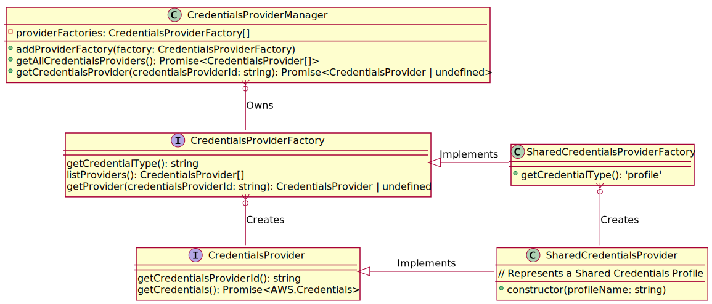

# Credentials Management

This outlines how the Toolkit produces and obtains credentials.

## Terminology

### Credentials

Credentials allow the Toolkit to interact with AWS on a user's behalf. Service clients require a [Credentials](https://docs.aws.amazon.com/AWSJavaScriptSDK/latest/AWS/Credentials.html) object, and the Toolkit obtains these objects through Credentials Providers.

### Credentials Provider

Credentials Providers are how the toolkit abstracts away different ways of obtaining a user's credentials, and produces Credentials objects. For example, a Shared Credentials Provider knows how to obtain credentials for a specific profile within [Shared Credentials Files](https://docs.aws.amazon.com/sdk-for-javascript/v2/developer-guide/loading-node-credentials-shared.html).

A Credentials Provider is produced by a Credentials Provider Factory

### Credentials Provider Factory

A factory is capable of producing one or more Credentials Providers for a single credentials type. For example, a Shared Credentials related factory produces Credentials Providers for each profile found within shared credentials files.

### Credentials Provider Id

All Credentials Provider instances are uniquely identified by a Credentials Provider Id. These consist of the following parts:

-   Credentials Type - a classification of the source data used to produce credentials. For example, the toolkit assigns Shared Credentials the type `profile`
-   Credentials Type Id - within a credentials type, this is a unique identifier for the source data used to produce credentials. Using Shared Credentials files as an example, each profile is used as the Id.

A formatted version of the Credentials Provider Id may be surfaced to users, however it is an internal identification construct.

## How it Works

When the user connects to AWS in the Toolkit, a Credentials Provider is requested, which is then used to obtain credentials. The toolkit requests a Credentials Provider by checking which credentials provider factories support the provider's credentials type. The factories of interest are queried to see which (if any) have the requested Credentials Provider.

At the time this document was written, Shared Credentials are the only supported Credentials. Additional credentials providers will reside at [/src/credentials/providers](/packages/toolkit/src/credentials/providers) as they are implemented.

### Shared Credentials Profiles

Profiles are retrieved from the user's shared credentials files. The profile is handled and validated differently based on which fields are present. Handling and validation logic can be found in [sharedCredentialsProvider.ts](/packages/toolkit/src/credentials/providers/sharedCredentialsProvider.ts).

Only profiles that are considered valid are provided to the toolkit. When validation issues are detected, they are written to the logs to help users understand why the toolkit is having difficulties with a profile. Users running the 'Connect to AWS' command will not see invalid profiles in the list of Credentials.

Examples of validation include:

-   missing fields that are expected to be paired with other fields
-   profiles referencing other profiles that do not exist
-   profiles referencing other profiles, resulting in a cycle

Supported keys:

-   aws_access_key_id
-   aws_secret_access_key
-   aws_session_token
-   role_arn
-   source_profile
-   credential_process
-   region

Credentials Providers for Shared Credentials are only ever refreshed when the user brings up the credential selection list. If a profile is considered to have changed since it was last used in the current toolkit session, Credentials are produced from the updated profile.

## Architecture

When the Toolkit is initialized, it sets up a `CredentialsProviderManager` instance to manage Credentials Providers for the Toolkit session. `CredentialsProviderFactory` objects (like `SharedCredentialsProviderFactory`) are added to it during setup.

When the toolkit wants to list available Credentials Providers, `CredentialsProviderManager` is queried using `getAllCredentialsProviders`. This in turn calls `listProviders` on every `CredentialsProviderFactory`. Implementations for `listProviders` determine what `CredentialsProvider` objects are available/valid and return them.

When the toolkit wants a specific Credentials Provider, `getCredentialsProvider` is called on `CredentialsProviderManager`. This in turn queries `getProvider` on its `CredentialsProviderFactory` objects until a provider is returned.

## Alternate Concepts

This section discusses alternative considerations that were not used in the current design.

### Immediately Updating the Toolkit whenever Shared Credentials are updated

File watchers could be created and maintained against shared credentials files. Whenever these files change, the toolkit's current collection of credentials providers is updated, and the current connection would get updated with new credentials if appropriate. If the current connection's credentials are updated, this needs to propagate throughout all of the toolkit's state (for example the AWS Explorer would need to be refreshed).

Credentials files are generally altered to add new credentials, or fix incorrect credentials. This low frequency doesn't seem to justify the additional complexities. We will prefer to evaluate functionality like this based on community input.
