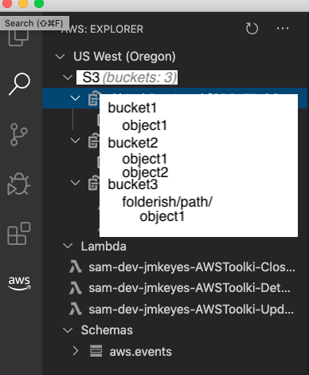

# UX: S3 explorer

* **Type**: UX Design
* **Status**: Proposal

## Overview

This document proposes a user experience for interacting with AWS S3 from the
AWS Toolkit ("the Toolkit") for Visual Studio Code ("VSCode").

Some of the features listed below are vague; they are implemented using VSCode
or platform conventions analogous to the AWS web console.

## Experience

Each region of the Toolkit explorer tree includes an S3 node (see mockup
below). The toolkit pulls a list of names and properties of S3 objects in the
currently active profile and presents this data as a tree in the toolkit
explorer. This is typical of existing toolkit features such as "Schemas" and
"CDK".

- When a region is expanded, make an eager request to get the count of S3
  buckets for that region.
- Show the count of buckets next to the S3 node.
- The S3 node is always present. If there are no buckets in the region, "grey
  out" the S3 node.
- When the current active profile changes, the tree is not refreshed, but is
  greyed-out to indicate that it is stale. It is not minimized.
- When a bucket or object is created or deleted, only that node is added or
  removed from the tree, _without disturbing the current layout of the tree_.

### Create and edit S3 buckets

- Root node context menu (right-click):
  - Create bucket
- Bucket node context menu (right-click):
  - Delete bucket
  - New folder...
  - Upload...
  - Copy name
  - Copy ARN

### Create and edit S3 objects

- S3 object node context menu (right-click):
  - Delete object
  - Copy name
  - Copy ARN
  - Copy URL
  - Upload...
  - Edit
    - Downloads the object to a temp folder and opens it in a new VSCode editor tab.
  - Download
    - Does _not_ present a chooser.
    - Downloads immediately to the OS default "Downloads" location (typically `~/Downloads`).
    - Download status is given as a toaster, which contains a "Choose location..." link.
      - User can change the download location via this link. This will be the
        default location for future downloads.
      - The default download location is also configurable as a global Toolkit
        option. This is not S3-specific, it is used for all "Download"
        experiences in the Toolkit.

### Drag-drop from client to server

- Drag a folder from the local system to the S3 tree:
  - onto a bucket uploads as a new top-level folder in the bucket
  - onto a folder uploads as a new subfolder
- Drag a file from the local system to the S3 tree:
  - onto a bucket uploads the file as a top-level object in the bucket
  - onto a folder uploads the file as an object in the folder

### Drag-drop server-side

- User can copy objects or folders from one folder to another by drag-drop.
- User can copy objects or folders _across regions_ by dragging from one region
  to another.

### S3 bucket properties

Surface popular bucket properties such as "public accessible" and "versioning
enabled" in a clear yet uncluttered manner.

- Show icon (same as AWS web console) next to bucket name indicating whether it
  is publicly accessible
- Show icon or sigil next to bucket name indicating whether versioning is enabled

### S3 object properties

S3 objects have properties like size, last-modified-date, and previous versions
(if versioning is enabled).

- If >=1 previous versions are available for an object, show the count of
  previous versions next to the object.
- If >=1 previous versions are available for an object, context menu
  (right-click) on the object exposes a "Show previous versions" menu item
  (otherwise greyed-out).
  - Previous versions are presented as children of the object.
- Double-clicking an object always performs the "Edit" action, even if the
  object has previous versions.

## Out of scope

Some features are out of scope for the phase 1 implementation.

* "Moving" objects or folders. To "move" an object, user must copy the object,
  then delete the original location.
* List/browser view.  VSCode is a text editor, so creating "inner platforms"
  should be avoided.  The tree/explorer in the left-column is the idiomatic way
  to explore data in VSCode. We should see how much leverage we can get out of
  that common interface before introducing bespoke UIs.
* Pinning ([ref](https://github.com/aws/aws-toolkit-jetbrains/issues/90)):
  ability to save AWS constructs to a "recent" or "favorites" area is useful,
  but requires a holistic treatment: it makes sense for any AWS object, not
  only S3.
* Drag-drop from S3 tree view to local system. This could present unpleasant
  edge-cases depending on the drop-target (e.g. Microsoft Outlook), so it is
  out of scope for this initial proposal.
  * The low-friction "Download" workflow described in the proposal addresses
    the common case, thus drag-drop is nice-to-have.

## Unknowns

* VSCode may offer a rich UI component framework in the future.
* Drag-drop to local system may be less problematic than anticipated.

## Terminology

* folder: S3 key/prefix which is treated like a folder in the AWS web console.
* object: any file in a bucket. Each object has a key, which is a prefix + filename.
* path: the full path to an object is bucket + prefix + filename.

## Comparison to other products

| Product                       | Difference    |
|-------------------------------|---------------|
| AWS Toolkit for Visual Studio | Supported |
| AWS Toolkit for JetBrains     | Supported |

The JetBrains AWS Toolkit S3 tab (see below) exposes Size and Date fields and
the list can be sorted on these columns. Implementing such a tab is a "phase 2"
priority for the VSCode S3 experience.

