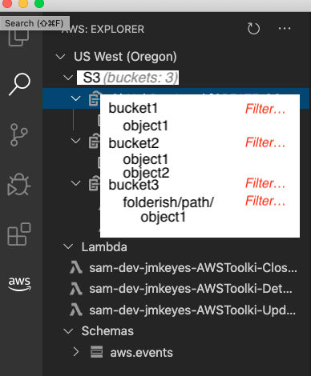
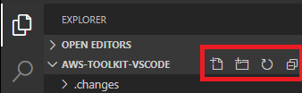
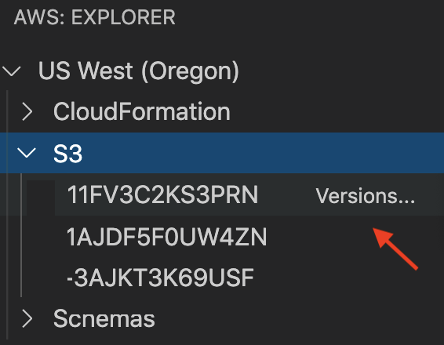
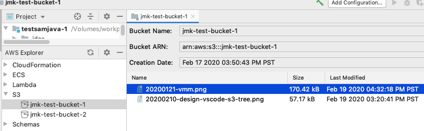

# UX: S3 explorer

-   **Type**: UX Design
-   **Status**: Proposal

## Overview

This document proposes a user experience for interacting with AWS S3 from the
AWS Toolkit ("the Toolkit") for Visual Studio Code ("VSCode").

Some of the described features are vague: in those cases the UX should draw
from (in order of preference, as applicable) VSCode, platform, or AWS web
console conventions.

VSCode is a text editor, so extensions should harmonize with text editor
concepts. Avoid creating _inner platforms_. For example, instead of a bespoke
"S3 browser application" presented as a webview, leverage the standard VSCode
"tree" panel. Limitations of VSCode idioms do not automatically demand an inner
platform: instead consider accepting the limitations as an opportunity to (1)
implement coverage for more AWS services, and (2) communicate with VSCode
upstream to understand current idioms and shape future direction.

From [the VSCode docs](https://code.visualstudio.com/api/extension-guides/webview):

> Webviews are pretty amazing, but they should also be used sparingly

## Legend

Some items are marked as follows. Items _not_ marked are implicitly "phase
zero" (P0), unless the item is a subitem of a marked item.

-   (IMPL): item describes potential implementation details
-   (P0,…,PN): "phase 0", …, "phase n", where "phase 0" is the minimum viable product and later phases are iterations following an initial release
-   (BLOCKED): item requires features not yet available in VSCode
-   ([OUT-OF-SCOPE](#out-of-scope)): item is deferred to a separate proposal

## Experience

Each region of the Toolkit explorer tree includes an S3 node (see mockup
below). The toolkit pulls a list of names and properties of S3 objects in the
currently active profile and presents this data as a tree in the toolkit
explorer, as is typical of existing toolkit features such as "Schemas" and
"Lambda".

-   When the current active profile changes, the tree is refreshed (per common
    Toolkit behavior), discarding the current, local state.
-   When a bucket or object is created or deleted, only that node is added or
    removed from the tree, _without disturbing the current layout of the tree_.
-   ([OUT-OF-SCOPE](#out-of-scope)) When a region is expanded, make an eager
    request to get the count of S3 buckets for that region.
    -   Show the count of buckets next to the S3 node.
    -   The goal is to avoid "frustrated clicks", where user must click on things
        only to discover that they're empty. (User _already_ expanded the Region
        node, why make them click on each service?)
    -   Alternative (less-expensive): don't show the count, but _do_ show
        a positive indication of "empty": remove the "expander" affordance, and/or
        "grey-out". Checking "non-empty" for all supported services is relatively
        cheap.
    -   (IMPL) Do not block UI thread during these pre-emptive fetches.

### Pagination

AWS buckets or folders may contain thousands of items, which strains the
usefulness of a human-computer interface. For resource efficiency, buckets and
folders in the S3 browser [request a page](https://docs.aws.amazon.com/AmazonS3/latest/dev/ListingKeysUsingAPIs.html)
of data, and the user must take some action to get more data. Toolkit paging
works like this:

-   (P0) `More...` action:
    -   Each node displaying a list of items includes a clickable `More...` node at
        the end of the list, if the initial list request indicated that more pages
        are available.
    -   The `More...` action appends the next page of items to the existing list
        (above the `More...` node, so it is always the last node in the list).
        -   Each `More...` node holds the current page, so if the user clicks it
            again, the next page is retrieved.
        -   (P1) If the "continuation key" expires, treat this as re-authentication
            (refresh entire S3 tree).
-   (P1) `Filter...` action:
    -   Users can _filter_ S3 folders. This uses the _server-side_ filter
        capabilties. (Note: S3 only supports prefix-filtering.)
    -   The `Filter...` action prompts user for a prefix string.
        -   Pre-populate the prompt with the current active filter pattern, if any.
    -   Store the current active filter per-folder.
    -   When user applies a filter, rebuild the entire subtree of the folder
        (discard old local state). This also applies to the `More...` action:
        clicking `More...` fetches the next _filtered_ page of results.
    -   Indicate the current active filter by showing an icon/sigil next to the folder.
        -   If user mouse-hovers the folder, show a tooltip like `Filter: "foo bar"`.
    -   Mouse-hover on a bucket/folder reveals [inline](https://code.visualstudio.com/api/extension-guides/tree-view#view-actions)
        `Filter...` button (so user does not need to dig into the context-menu).
    -   Context-menu includes `Filter...` menu item

### S3 root node

The S3 root node is the "meta node" which lists available buckets in the
current region.

-   Toolkit toolbar:
     
    -   (P0) When any S3 node (bucket/folder/object) is selected, Toolkit toolbar
        enables an `Upload...` button.
        -   If a non-folder object is selected, `Upload...` targets the object's parent folder.
-   S3 root node context-menu:
    -   (P0) `New bucket`
        -   Invokes the `AWS: New bucket` VSCode command which prompts for Bucket name.
        -   Public access is blocked by default. To enable public access, user must
            use the AWS web console.

### S3 buckets

Buckets are listed as children of the S3 root node.

-   Bucket node context-menu:
    -   (P0) `Copy ARN`
    -   (P0) `Copy name`
    -   (P0) `New folder...`
    -   (P0) `Upload...`
        -   Shows VSCode-standard "Open file..." dialog.
        -   Shows a progress dialog using VSCode conventions.
        -   When upload succeeds or fails, shows a toaster summarizing which uploads succeeded and failed.
        -   (P1) Allows multiple files and folders to be uploaded. Creates S3 folders
            as needed to match the hierarchy of uploaded folders.
        -   (P2) [Auto-detects Content Type ](https://github.com/aws/aws-toolkit-visual-studio/issues/64)
    -   (P0) `Upload to parent folder...`
        -   Works like `Upload...`, except targeting the parent of the current item.
            This allows the user to avoid needing to navigate to the parent folder.
    -   _Destructive operations (separator):_
        -   (P1) `Delete bucket`
            -   "Super confirm": similar to AWS web console, show a prompt which
                requires typing the word "Delete".

### S3 objects

S3 objects and folders are listed as children of their respective parent bucket/folder.

-   (P0) Clicking an object in the tree selects it, but does not perform any action.
-   (P1) Double-clicking an item downloads it and opens it in readonly mode (see `Edit` action).
    -   If item is 4MB+, prompt user to ask if download should begin.
-   (P2) User input activates standard VSCode local, as-you-type filtering.
-   S3 object node (files and folders) context-menu:
    -   (P0) `Copy ARN`
    -   (P0) `Copy URL`
    -   (P0) `Copy name`
    -   (P1) `Download`
        -   Does _not_ present a chooser.
        -   Downloads immediately to the OS default location (typically `~/Downloads`).
        -   Present download status as a toaster message containing this info, for all in-progress downloads:
            -   Path to the download folder (linkbutton).
                -   On click: navigate to the folder in the VSCode file explorer.
            -   Path to the downloaded file location (linkbutton).
                -   On click: If the download is complete, open the file in VSCode. Else
                    show an error message indicating that the download is not complete.
            -   `Choose location...` linkbutton.
                -   User can change the download location via this link. This changes the
                    default location for future downloads _and_ the current in-progress
                    downloads.
                -   Default download location is also configurable as a global Toolkit
                    option. This is not S3-specific, it is used for all `Download`
                    experiences in the Toolkit.
            -   (P1) Loading bar or updating percentage.
        -   (P1) Toolkit tracks current downloads so that they are cancellable.
            -   User can cancel all downloads by clicking a button in the Toolkit
                explorer toolbar, or by the `AWS: Cancel downloads` VSCode command.
        -   (P2) User can download multiple files/folders by selecting them in the S3
            tree and using the `Download` context-menu item.
    -   (P0) `Download as...`
        -   Presents the standard file-chooser dialog. Otherwise behaves like the `Download` action.
    -   (P2) `Edit`
        -   Downloads the object to a temp folder and opens it in a [readonly view](https://code.visualstudio.com/api/extension-guides/virtual-documents).
    -   (P0) Upload... (similar UX as [S3 buckets](#s3-buckets) `Upload...` item)
    -   _Destructive operations (separator):_
        -   (P1) `Delete`
            -   If versioning is enabled, do _not_ prompt to confirm deletion.
                -   Show a passive toaster message: _Deleted `foo.txt`. `Undo` from previous versions?_
                -   If user clicks `Undo` in the toaster message, restore the file from the previous versions list.
            -   If versioning is not enabled, show a prompt to confirm deletion :(
                -   Show a passive toaster message: _Deleted `foo.txt`. (Cannot undo because S3 bucket versioning is disabled.)_

### S3 bucket properties

Surface these important bucket properties in a conspicuous yet uncluttered manner:

-   (P1) _Public accessible_: show icon (same as AWS web console) next to bucket
    name indicating that it is publicly accessible.
-   (P1) _Versioning enabled_: show icon next to bucket name indicating that
    versioning is enabled.

### S3 object properties

S3 object properties _size_, _last modified date_, and _previous versions_ (if
versioning is enabled) are surfaced as follows:

-   (P0) _Size_ and _last modified date_ are exposed in a tooltip.
    -   Example: `42 kb, 2020-02-10 00:01:02 EST`
-   (P1) _Versions_: if versioning is enabled on the bucket and an object has previous versions:
    -   Mouse-hover on an item reveals an [inline](https://code.visualstudio.com/api/extension-guides/tree-view#view-actions) `Versions...` button
         
    -   Context-menu enables `Previous versions...` menu item
        -   (BLOCKED) grey-out or "disable" the menu item if bucket versioning is disabled or the item does not have previous versions available.
    -   Show an icon (count? ellipsis?) next to the object name, to indicate
        that previous versions are available. Example: `foo.txt (…)`
    -   Present versions as "children" of the object, but only when versions are explicitly requested by one of the above actions.

### ([BLOCKED](https://github.com/microsoft/vscode/issues/32592)) Drag-drop from client to server

-   Drag a folder from the local system to the S3 tree:
    -   onto a bucket uploads as a new top-level folder in the bucket
    -   onto a folder uploads as a new subfolder
-   Drag a file from the local system to the S3 tree:
    -   onto a bucket uploads the file as a top-level object in the bucket
    -   onto a folder uploads the file as an object in the folder
-   Drag a VSCode editor tab to the S3 tree
    -   onto a bucket uploads the file as a top-level object in the bucket
    -   onto a folder uploads the file as an object in the folder

### ([BLOCKED](https://github.com/microsoft/vscode/issues/32592)) Drag-drop server-side

-   User can [copy objects](https://docs.aws.amazon.com/AmazonS3/latest/API/API_CopyObject.html) or folders from one folder to another by drag-drop.
-   User can [copy objects](https://docs.aws.amazon.com/AmazonS3/latest/API/API_CopyObject.html) or folders _across regions_ by dragging from one region
    to another.

## Out of scope

These concepts are out of scope in this proposal, but may be developed in later proposals:

-   Eager-load high-level properties such as "empty" or "count".
    -   This topic applies to all Toolkit service-integrations, so it is deferred
        to a separate proposal.
-   "Sort" items by name or other properties.
-   "Move" objects or folders. To "move" an object, user must copy the object,
    then delete the original location.
-   List/browser view. The tree/explorer in the left-column is the idiomatic way
    to explore data in VSCode. See how much leverage we can get out of that
    common interface before introducing bespoke UIs.
-   Edit permissions and other properties of S3 buckets/objects.
-   Passive sync (automatically sync local edits to S3)
    -   Potentially "surprising", large investment, limited audience.
    -   Local filewatcher to auto-upload S3 object when it is changed locally.
    -   VSCode "workspace" node for each S3 bucket.
    -   [fs overlay](https://code.visualstudio.com/api/extension-guides/virtual-documents#file-system-api)
-   Pinning ([ref](https://github.com/aws/aws-toolkit-jetbrains/issues/90)):
    ability to save AWS constructs to a "recent" or "favorites" area.
    -   This topic applies to all Toolkit service-integrations, so it is deferred
        to a separate proposal.

## Definitions

-   folder: S3 key/prefix which is treated like a folder in the AWS web console.
-   object: any file in a bucket. Each object has a key, which is a prefix + filename.
-   path: the full path to an object is bucket + prefix + filename.
-   context-menu: menu displayed on right-click

## Comparison to other products

| Product                       | Difference |
| ----------------------------- | ---------- |
| AWS Toolkit for Visual Studio | Supported  |
| AWS Toolkit for JetBrains     | Supported  |

The JetBrains AWS Toolkit S3 tab (see below) exposes Size and Date fields as
a table.

