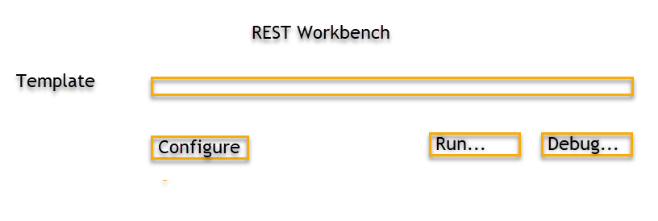
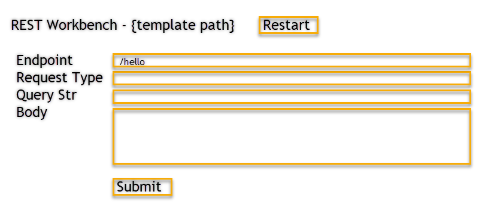

# Local Debugging Experience for SAM Applications

Current Status: Not Implemented

## Introduction

The AWS Toolkit enhances the SAM Application development experience by integrating local debug functionality into VS Code. This document outlines the available functionality.

While this document's main focus is on debugging capabilities in the toolkit, there are places where the experience around invoking without the debugger (aka "running") is also discussed.

Each programming language (and corresponding Lambda Runtimes) requires Toolkit support for debugging features to work. A limited selection of programming languages are supported in the Toolkit.

### Terminology

#### CodeLens

CodeLenses are visual decorators anchored to a document location. They are used to convey information and/or provide links that trigger an action. They are a presentation-only mechanic and do not reside within a file. Additional information and examples about CodeLenses can be found [on the VS Code blog](https://code.visualstudio.com/blogs/2017/02/12/code-lens-roundup).

#### Debug Configuration

Debug Configurations are JSON entries within the `.vscode/launch.json` file optionally located in the root of each VS Code workspace. These are user managed, and define what programs can be debugged. Pressing F5 (or the Debug button) starts a Debugging session for the currently selected Debug Configuration. VS Code extensions increase VS Code's debugging capablities by implementing Debug Configuration types.

More information about VS Code Debugging can be found [in the VS Code Documentation](https://code.visualstudio.com/docs/editor/debugging).

#### SAM Template

A SAM Template defines a Serverless Application's resources, and supporting code. This is used by the SAM CLI to build, run, package, and deploy the Application.

Additional information about SAM can be found at:

-   [SAM Homepage](https://aws.amazon.com/serverless/sam/)
-   [What Is the AWS Serverless Application Model (AWS SAM)?](https://docs.aws.amazon.com/serverless-application-model/latest/developerguide/what-is-sam.html)
-   [SAM CLI GitHub Repo](https://github.com/awslabs/aws-sam-cli)

## Overview

The toolkit supports the following scenarios for Locally Running and Debugging code using the Serverless Application Model:

-   invoking SAM Template resources that are Lambda functions
-   making API Gateway style requests against SAM Template resources that are Lambda functions
-   invoking standalone Lambda function handlers (these don't use SAM Templates, but the debugging functionality is supported by one behind the scenes)

Each scenario has one or more relevant user experiences. The different debugging functionalities are discussed first. Then, the various user experiences are discussed, along with which scenarios they apply to.

## What can be Debugged Locally

### <a id="sam-template-resource-local"></a> SAM Template Resources (Local Invoke)

SAM Template resources of type `AWS::Serverless::Function` represent Lambda functions. Lambda function code referenced by these resources can be locally Run or Debugged. The Toolkit uses SAM CLI to invoke the Lambda function, emulating how the function is run on AWS. A debugger can be attached to the invoked Lambda function code, and the event passed into the Lambda function can be customized.

### SAM Template Resources (API Gateway style Local Invoke)

SAM Template resources that contain an event of type [Api](https://docs.aws.amazon.com/serverless-application-model/latest/developerguide/sam-property-function-api.html), can be hosted in a web server for local development and iteration. A REST request triggers the Lambda handler as if it were called by API Gateway, and the Lambda function receives an API Gateway based event.

### Standalone Lambda Function Handlers

Lambda function handler code can be locally Run or Debugged, even if it does not belong to a SAM Application. The Toolkit produces a temporary SAM Application to contain the handler code. This temporary SAM Application is handled as mentioned [earlier](#sam-template-resource-local). At the end of the debug session, the temporary SAM Application is removed.

In this mode, any SAM Templates that reference a handler are ignored. This prevents confusion/errors introduced when trying to perform a reverse-lookup between code and SAM Template resources (examples include incorrectly determining a function's Lambda handler string, or situations where more than one resource references the same function).

The Toolkit does not provide support for locally running or debugging standalone Lambda function handlers as API Gateway calls. The code should be referenced from a SAM Template in order to use the API Gateway style debugging features mentioned in the earlier section.

## <a id="debug-config"></a> What can be configured for a Debug session?

The following parameters influence a debug session. These are user-configured, and are referenced by the various [debugging experiences](#debugging-experiences).

| Property                | Description                                                | Used by Standalone Lambda Handler | Used by SAM Template Resources |
| ----------------------- | ---------------------------------------------------------- | --------------------------------- | ------------------------------ |
| SAM Template            | Path to SAM Template file                                  |                                   | ✅                             |
| SAM Template Resource   | Name of lambda function-based resource within SAM Template |                                   | ✅                             |
| SAM Template Parameters | Values to use for SAM Template Parameters                  |                                   | ✅                             |
| Environment Variables   | Environment Variables exposed to the Lambda Function       | ✅                                | ✅                             |
| Input Event             | Payload passed to the invoked Lambda Function              | ✅                                | ✅                             |
| Runtime                 | Runtime of Lambda Function to invoke                       | ✅                                | obtained from SAM Template     |
| Handler                 | Lambda Function handler to invoke                          | ✅                                | obtained from SAM Template     |
| Timeout                 | Timeout threshold for Lambda function                      | ✅                                | obtained from SAM Template     |
| Memory                  | Memory provided to Lambda function                         | ✅                                | obtained from SAM Template     |

The following SAM CLI related arguments are relevant to debugging both standalone lambda function handlers and sam template resources. For reference see the [sam build](https://docs.aws.amazon.com/serverless-application-model/latest/developerguide/sam-cli-command-reference-sam-build.html) command.

| Property                                                         | Description                                                                                                                                                                                                                      | Default Value                    |
| ---------------------------------------------------------------- | -------------------------------------------------------------------------------------------------------------------------------------------------------------------------------------------------------------------------------- | -------------------------------- |
| Build SAM App in container                                       | Supports cases where dependencies have natively compiled dependencies (See [use-container](https://docs.aws.amazon.com/serverless-application-model/latest/developerguide/sam-cli-command-reference-sam-build.html))             | false                            |
| Skip new image check                                             | Skips checking/downloading the latest Lambda Runtime Docker images every invoke (See [skip-pull-image](https://docs.aws.amazon.com/serverless-application-model/latest/developerguide/sam-cli-command-reference-sam-build.html)) | false                            |
| use a docker network                                             | Connects invoked SAM App to a Docker network (See [docker-network](https://docs.aws.amazon.com/serverless-application-model/latest/developerguide/sam-cli-command-reference-sam-build.html))                                     | empty string (no docker network) |
| additional build args (passed along to `sam build` calls)        |                                                                                                                                                                                                                                  | empty string                     |
| additional local invoke args (passed along to `sam local` calls) |                                                                                                                                                                                                                                  | empty string                     |

The following AWS related arguments are relevant to debugging both standalone lambda function handlers and sam template resources. When provided, they are injected into the local Lambda containers running the invoked SAM Application. This is useful in scenarios where the Lambda running locally is accessing other AWS resources.

-   Credentials - Set this to the Credentials ID as shown in the Credentials selection list (example: `profile:default`). If this is omitted, the Toolkit's active credentials are used.
-   Region - Set this to the region code (eg: `us-east-1`)

## <a id="debugging-experiences"></a> Local Debugging Experiences

### Debug Configurations

Debug Configurations are the idiomatic approach to running and debugging software in VS Code. They are also a reusable component - the Toolkit is able to internally produce and execute these configurations on the fly (for example as a part of the [CodeLenses](#codelenses) functionality). This is the Toolkit's main experience for debugging SAM Template resources.

The Toolkit implements a Debug Configuration type `aws-sam`. Users can author and maintain these configuration entries, then launch them by pressing F5. When launched, this configuration type:

-   validates debug configuration inputs (see [Debug Configuration Validations](#debug-configuration-validation))
-   uses SAM CLI to build a SAM Application
-   uses SAM CLI to invoke a SAM Template resource
-   attaches a debugger to the SAM invocation
-   if the debug configuration is for a local api gateway invoke, the debugger is detached after the http request is made, but SAM CLI remains active. The debug configuration implementation terminates the SAM CLI session to prevent a proliferation of CLI processes.

In the most basic form, the debug configuration references a SAM Template file location, and a resource within that file. Other execution parameters can be configured, but are optional.

Debugging local lambda invokes and local api gateway invokes each require slightly different inputs. The `aws-sam` Debug Configuration uses different request types to accommodate these variations.

These debug configurations are authored in a json file. The following Toolkit assistance is provided:

-   autocompletion with descriptions is provided for `aws-sam` related fields
    -   There is no autocompletion available for specific values in a configuration. For example, if a user types in the location of a SAM Template file, there is no filesystem-based autocompletion. The Debug Configuration validates the configuration and notifies of errant values when it is run.
-   snippets to produce typical (or starter) `aws-sam` debug configurations
-   when no launch.json file is present in a workspace, VS Code exposes functionality that allows users to request auto-generated Debug Configurations. In this situation, the toolkit generates an `aws-sam` Debug Configuration for all `AWS::Serverless::Function` resources detected within all SAM Templates located in the workspace.

Example Debug Configuration entries can be found in the [Appendix](#sample-debug-configurations)

Standalone Lambda function handlers are not supported through Debug Configurations.

### <a id="codelenses"></a> CodeLenses

#### CodeLenses in SAM Template files

The following CodeLenses appear above every template resource of type `AWS::Serverless::Function`:

-   Run Locally - See below for details
-   Debug Locally - See below for details
-   Configure - allows the user to configure a limited set of arguments that are used with the Run and Debug CodeLenses
    -   Anything that can be defined by the SAM Template would not be configurable in here
    -   This covers aspects like input event, and SAM CLI related arguments
-   Add Debug Configuration - This is a utility feature to produce a pre-filled Debug Configuration in `launch.json` based on the associated template resource

When clicked, the Run and Debug CodeLenses locally invoke their associated Template resource. The following takes place:

-   The SAM Application is built
-   The associated SAM Template resource is invoked, using configurations set with the Configure CodeLens
-   (If the Debug CodeLens was clicked) The VS Code debugger is attached to the invoked resource

When clicked, the Configure CodeLens opens a (JSON) configuration file that resides in the workspace and is read by the Toolkit. The configuration file is used for each SAM Template resource within the workspace. Users have autocompletion support in this file. A rich UI for configuration is not considered at this time, but the door remains open to adding a visual editor in the future based on user feedback.

The Run and Debug CodeLenses perform a regular local invoke on a SAM Template resource. These CodeLenses do not perform API Gateway style invokes.

#### CodeLenses in Code files

CodeLenses in code files provide support for debugging Standalone Lambda function handlers.

The following CodeLenses appear over any function that appears to be an eligible Lambda handler:

-   Run Locally - See below for details
-   Debug Locally - See below for details
-   Configure - allows the user to configure arguments that are used with the Run and Debug CodeLenses (see [What can be configured for a Debug session?](#debug-config))

When clicked, the Run and Debug CodeLenses locally invoke the Lambda handler function they represent. These Lambda handlers are invoked independent of SAM Templates that exist in the users workspace. The following takes place:

-   A temporary SAM Template is produced, which contains one resource that references the Lambda handler
-   The temporary SAM Application is built
-   The resource in the temporary SAM Template is invoked, using configurations set with the Configure CodeLens
-   (If the Debug CodeLens was clicked) The VS Code debugger is attached to the invoked resource

When clicked, the Configure CodeLens opens a (JSON) configuration file that resides in the workspace and is managed by the Toolkit. All standalone handlers within a workspace will have their configurations stored in this file. Users have autocompletion support in this file. A rich UI for configuration is not considered at this time, but the door remains open to adding a visual editor in the future based on user feedback.

These CodeLenses do not support API Gateway style invokes.

Some users may find CodeLenses within code files distracting, particularly if they are using the Toolkit for features not related to local debugging. Toolkit settings can be used to enable and disable CodeLenses. CodeLenses only appear for languages/runtimes that the Toolkit has implemented Debug support for.

### Graphical User Interface

SAM Template resources invoked by API Gateway can be locally tested with a REST Workbench.

The REST Workbench is accessed with the command "Open Local REST Workbench for SAM Applications", opens a webview document.

In the REST Workbench, users select a SAM Application Template, build and launch the application (with or without debug mode), and proceed to make a series of REST requests against the running application.



Users start by selecting the SAM Application they would like to work with. A dropdown lists all SAM Template files detected within the workspace. Next, they launch the application (Run or Debug), which builds and launches the local web server host. At this point, the SAM Application can no longer be changed (users can open a new workbench in order to operate against a different SAM Application).



The running instance of the application is used for all REST queries made by the user. Users define REST parameters (endpoint, request type (GET, POST, etc), a query string, and an optional request body), and press Submit. If the application is run in Debug mode, the Toolkit will attach a debugger after sending the request. The following information is sent to the Toolkit's Output Channel with each REST request:

-   request
-   response
-   response code
-   SAM CLI output

After making code changes, users can click Restart to rebuild the application and start it again.

Closing a REST Workbench tab closes the invoked SAM Application if one is running.

## Appendix

### Differences from v1.0.0 of AWS Toolkit

The debug capabilities initially released in the Toolkit were not well rounded. CodeLenses provided the only means of local debugging, and without a way to directly debug SAM Template resources these CodeLenses tried to compensate, leading to scenarios with undefined behaviors. Many of the issues are referenced from https://github.com/aws/aws-toolkit-vscode/issues/758

Here is an outline of the differences between this design and version 1.0.0 of the AWS Toolkit:

-   Changed functionality
    -   CodeLenses on code files invoke the function in isolation, and no longer attempt to associate the function with a SAM Template
    -   CodeLens configurations have a new location and structure
-   New functionality
    -   `aws-sam` Debug Configurations provide a new way to launch debug sessions against SAM Template resources
    -   CodeLenses on SAM Template files
    -   API Gateway related debugging (Debug Configuration support and REST Workbench UI)
-   Removed functionality
    -   None

### <a id="sample-debug-configurations"></a> Sample Debug Configurations

Here is an example Debug Configuration to debug a SAM Template resource called "HelloWorldResource".
The only required fields are: type, request, samTemplate.path, samTemplate.resource

```jsonc
{
    "configurations": [
        {
            "name": "Debug HelloWorldResource",
            "type": "aws-sam",
            "request": "template-invoke", // This is the "aws-sam" variation for debugging SAM Template resources
            "samTemplate": {
                "path": "path to template yaml file",
                "resource": "HelloWorldResource", // Name of Template resource to debug
                // SAM Template Parameter substitutions
                "parameters": {
                    "param1": "somevalue"
                }
            },
            // Environment Variables accessible by Lambda handler
            "environmentVariables": {
                "envvar1": "somevalue",
                "envvar2": "..."
            },
            // The event passed to the Lambda handler (defaults to an empty JSON object)
            "event": {
                // path or json, not both
                "path": "somepath", // Path to event data
                "json": {
                    // event data
                }
            },
            // SAM CLI related arguments
            "sam": {
                "containerBuild": false,
                "skipNewImageCheck": false,
                "dockerNetwork": "aaaaa",
                "buildArguments": "--foo",
                "localArguments": "--foo"
            },
            // AWS related arguments
            "aws": {
                "credentials": "profile:default",
                "region": "us-west-2"
            }
        }
    ]
}
```

Here is an example Debug Configuration to debug an API Gateway invoked SAM Template resource called "HelloWorldResource".
The variation is defined by the `request` field, and the only difference is in the event field.
The only required fields are: type, request, samTemplate.path, samTemplate.resource

```jsonc
{
    "configurations": [
        {
            "name": "a2",
            "type": "aws-sam",
            "request": "template-api", // This is the "aws-sam" variation for debugging API Gateway invoked SAM Template resources
            "samTemplate": {
                "path": "some path",
                "resource": "HelloWorldResource",
                "parameters": {
                    "param1": "somevalue"
                }
            },
            "environmentVariables": {
                "envvar1": "somevalue",
                "envvar2": "..."
            },
            // The API call made to the handler once invoked
            "event": {
                "api": {
                    "path": "/bee",
                    "method": "get",
                    "query": "aaa=1&bbb=2",
                    "body": "text - can we do this?"
                }
            },
            "sam": {
                "containerBuild": false,
                "skipNewImageCheck": false,
                "dockerNetwork": "aaaaa",
                "buildArguments": "--foo",
                "localArguments": "--foo"
            },
            "aws": {
                "credentials": "profile:default",
                "region": "us-west-2"
            }
        }
    ]
}
```

### <a id="debug-configuration-validation"></a> Debug Configuration Validations

The following validation checks are performed when running an `aws-sam` Debug Configuration

-   does the referenced SAM template file exist
-   does the referneced SAM Template resource exist
-   is the referneced SAM Template resource a supported type (for example, a Lambda function)
-   is the lambda function runtime supported by the Toolkit
