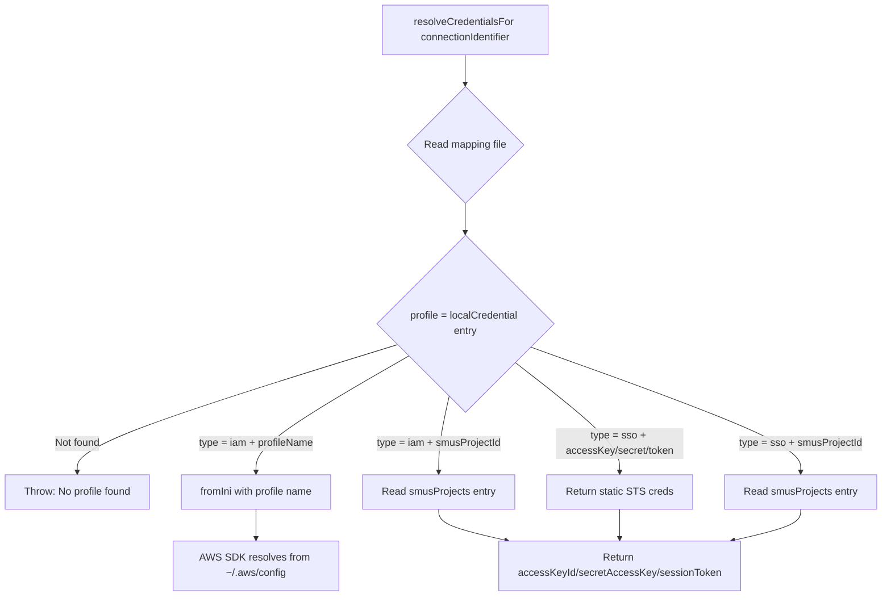
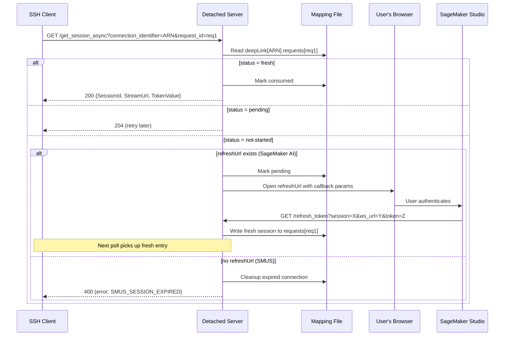

# Detached Server Credential Resolution in aws-toolkit-vscode

## Executive Summary

The SageMaker detached server resolves credentials at reconnection time by reading a JSON mapping file at `~/.aws/.sagemaker-space-profiles`. There are **two completely separate credential paths**: `localCredential` (for SSO/IAM tree-based connections) and `deepLink` (for browser deep link connections). Deep links store **SSM session tokens** (not STS credentials), and their refresh happens via a browser redirect flow — there is no SDK-based credential refresh for deep links. SSO connections now have proactive credential refresh that writes fresh STS credentials to the mapping file before they expire.

---

## 1. Mapping File Schema

**File**: `~/.aws/.sagemaker-space-profiles`  
**Defined in**: `packages/core/src/awsService/sagemaker/types.ts` (L7–L30)

```typescript
export interface SpaceMappings {
    localCredential?: { [spaceName: string]: LocalCredentialProfile }
    deepLink?: { [spaceName: string]: DeeplinkSession }
    smusProjects?: { [smusProjectId: string]: { accessKey: string; secret: string; token: string } }
}

export type LocalCredentialProfile =
    | { type: 'iam'; profileName: string }
    | { type: 'sso'; accessKey: string; secret: string; token: string }
    | { type: 'sso' | 'iam'; smusProjectId: string }

export interface DeeplinkSession {
    requests: Record<string, SsmConnectionInfo>
    refreshUrl?: string
}

export interface SsmConnectionInfo {
    sessionId: string
    url: string       // SSM WebSocket URL
    token: string     // SSM bearer token
    status?: 'fresh' | 'consumed' | 'pending'
}
```

### Example mapping file structure

```json
{
  "localCredential": {
    "arn:aws:sagemaker:us-west-2:123456789012:space/d-abc/my-space": {
      "type": "sso",
      "accessKey": "AKIA...",
      "secret": "...",
      "token": "..."
    }
  },
  "deepLink": {
    "arn:aws:sagemaker:us-west-2:123456789012:space/d-abc/my-space": {
      "refreshUrl": "https://studio-d-abc.studio.us-west-2.sagemaker.aws/jupyterlab",
      "requests": {
        "initial-connection": {
          "sessionId": "sess-abc",
          "url": "wss://ssmmessages.us-west-2.amazonaws.com/...",
          "token": "bearer-token-value",
          "status": "fresh"
        }
      }
    }
  },
  "smusProjects": {
    "proj-123": {
      "accessKey": "AKIA...",
      "secret": "...",
      "token": "..."
    }
  }
}
```

---

## 2. Mapping File Read/Write

**File**: `packages/core/src/awsService/sagemaker/credentialMapping.ts`

### Reading (VS Code side)
- `loadMappings()` (L139–L150): Reads `~/.aws/.sagemaker-space-profiles`, returns `SpaceMappings` or `{}` if missing.

### Writing (VS Code side)
- `saveMappings(data)` (L152–L161): Writes JSON with `mode: 0o600` and `atomic: true`.
- `setSpaceIamProfile()` (L243–L248): Writes `{ type: 'iam', profileName }` to `localCredential[spaceArn]`.
- `setSpaceSsoProfile()` (L257–L264): Writes `{ type: 'sso', accessKey, secret, token }` to `localCredential[spaceArn]`.
- `setSmusSpaceProfile()` (L273–L280): Writes `{ type, smusProjectId }` to `localCredential[spaceArn]`.
- `setSpaceCredentials()` (L290–L305): Writes SSM session info to `deepLink[spaceArn]`.

### Reading (Detached server side)
- `readMapping()` in `detached-server/utils.ts` (L82–L90): Raw `fs.readFile` + `JSON.parse`. **Cannot import vscode modules.**

### Writing (Detached server side)
- `writeMapping()` in `detached-server/utils.ts` (L126–L145): Atomic write via temp file + rename, uses a `WriteQueue` to prevent races.

---

## 3. Detached Server Credential Resolution at Reconnection

**File**: `packages/core/src/awsService/sagemaker/detached-server/credentials.ts` (L18–L72)



### Key code path:

```typescript
// credentials.ts L18-72
export async function resolveCredentialsFor(connectionIdentifier: string): Promise<any> {
    const mapping = await readMapping()
    const profile = mapping.localCredential?.[connectionIdentifier]

    switch (profile.type) {
        case 'iam':
            if ('profileName' in profile) {
                const name = profile.profileName?.split(':')[1]  // e.g. "profile:my-profile" → "my-profile"
                return fromIni({ profile: name })  // Dynamic resolution from ~/.aws/config
            } else if ('smusProjectId' in profile) {
                return mapping.smusProjects?.[profile.smusProjectId]  // Static creds from mapping
            }
        case 'sso':
            if ('accessKey' in profile) {
                return { accessKeyId, secretAccessKey, sessionToken }  // Static creds from mapping
            } else if ('smusProjectId' in profile) {
                return mapping.smusProjects?.[profile.smusProjectId]  // Static creds from mapping
            }
    }
}
```

**Critical**: `resolveCredentialsFor()` only reads from `localCredential`. It does NOT handle `deepLink` entries. Deep link sessions use a completely different route (`/get_session_async`).

---

## 4. SSO vs Deep Link: What's in the Mapping File?

| Aspect | SSO (localCredential) | Deep Link (deepLink) |
|--------|----------------------|---------------------|
| **Stored data** | STS credentials (accessKey, secret, sessionToken) | SSM session tokens (sessionId, wsUrl, bearerToken) |
| **Written by** | `setSpaceSsoProfile()` | `setSpaceCredentials()` via `persistSSMConnection()` |
| **Read by** | `resolveCredentialsFor()` → `/get_session` route | `SessionStore.getFreshEntry()` → `/get_session_async` route |
| **Refresh mechanism** | `SsoCredentialRefresher` writes fresh STS creds to mapping file | Browser redirect to SageMaker Studio URL with callback to `/refresh_token` |
| **Refresh trigger** | Timer-based (every 60s check, 5min safety buffer) | Detached server opens browser URL when session is `not-started` |
| **Can refresh without user?** | ✅ Yes (uses in-memory credential cache) | ❌ No (requires browser interaction for SageMaker AI; impossible for SMUS) |

---

## 5. `fromIni` Usage in the Detached Server

**File**: `packages/core/src/awsService/sagemaker/detached-server/credentials.ts` (L1, L35–L40)

```typescript
import { fromIni } from '@aws-sdk/credential-providers'

// Only used for IAM profiles with profileName
case 'iam': {
    if ('profileName' in profile) {
        const name = profile.profileName?.split(':')[1]
        return fromIni({ profile: name })
    }
}
```

`fromIni` is **only used for IAM profile-based connections** (tree-based, not deep links). It resolves credentials dynamically from `~/.aws/config` and `~/.aws/credentials` at call time. This means IAM connections can self-refresh if the underlying profile has valid credentials (e.g., `credential_process`, `sso_session`).

`fromIni` is **never used for deep links**. Deep links don't have AWS profiles — they have SSM session tokens.

---

## 6. Deep Link Credential Refresh Flow

**File**: `packages/core/src/awsService/sagemaker/detached-server/routes/getSessionAsync.ts` (L14–L93)



### Key insight: Deep links store SSM session data, NOT AWS credentials

The `deepLink` section stores:
- `sessionId`: SSM session ID
- `url`: SSM WebSocket URL (wss://ssmmessages...)
- `token`: SSM bearer token

These are **not** AWS STS credentials. They are SSM session tokens that the SSH client uses directly to establish the tunnel. The detached server doesn't need to call `StartSession` for deep links — the session is already established by the browser.

---

## 7. `profileId` Format

| Connection Type | profileId Format | Example |
|----------------|-----------------|---------|
| IAM (tree) | `profile:PROFILE_NAME` | `profile:my-dev-account` |
| SSO (tree) | `sso:START_URL#ACCOUNT_ID#ROLE_NAME` | `sso:https://d-abc.awsapps.com/start#123456789012#AdministratorAccess` |
| SMUS | N/A (uses `smusProjectId`) | `proj-abc123` |
| Deep Link | N/A (no profileId) | Deep links don't use profileId — they use SSM session tokens |

The `profileId` is only relevant for `localCredential` entries. It's obtained via `Auth.instance.getCurrentProfileId()` in `persistLocalCredentials()` (credentialMapping.ts L180). The `sso:` prefix triggers SSO credential snapshotting; anything else triggers IAM profile name storage.

---

## 8. Credential Refresh Summary

| Connection Type | Refresh Mechanism | Where Fresh Creds Come From | Code Path |
|----------------|-------------------|---------------------------|-----------|
| **IAM (tree)** | `fromIni()` resolves dynamically | `~/.aws/config` + `~/.aws/credentials` | `credentials.ts` L35–40 |
| **SSO (tree)** | `SsoCredentialRefresher` timer | `getCredentialsFromStore()` → SSO GetRoleCredentials | `credentialMapping.ts` L42–130 |
| **SMUS** | `ProjectRoleCredentialsProvider.startProactiveCredentialRefresh()` | DataZone `GetEnvironmentCredentials` API | `projectRoleCredentialsProvider.ts` L195–220 |
| **Deep Link (SageMaker AI)** | Browser redirect to Studio URL | SageMaker Studio generates new SSM session | `getSessionAsync.ts` L68–82 |
| **Deep Link (SMUS)** | ❌ **No refresh possible** | N/A — returns error | `getSessionAsync.ts` L55–67 |

---

## 9. Key Answers

### For deeplinks, what's in the mapping file?
**SSM session tokens** — `sessionId`, WebSocket `url`, and bearer `token`. NOT STS credentials. These are written by `persistSSMConnection()` → `setSpaceCredentials()`.

### When the detached server needs fresh credentials, where does it get them?
- **`/get_session` route** (localCredential): Reads `localCredential` from mapping file. For IAM, uses `fromIni()` against `~/.aws/config`. For SSO/SMUS, reads static STS creds that are kept fresh by background refreshers in the VS Code extension process.
- **`/get_session_async` route** (deepLink): Reads `deepLink` from mapping file. If session is stale, opens browser to SageMaker Studio URL which calls back to `/refresh_token` with new SSM session tokens.

### Is there a code path that refreshes credentials for deeplinks?
**Yes, but only for SageMaker AI deep links** — via browser redirect. The detached server opens a URL like:
```
https://studio-{domain}.studio.{region}.sagemaker.aws/jupyterlab/{spaceName}?remote_access_token_refresh=true&reconnect_identifier={ARN}&reconnect_request_id={reqId}&reconnect_callback_url=http://localhost:{port}/refresh_token
```
**SMUS deep links cannot refresh** — they return a `SMUS_SESSION_EXPIRED` error.

### What is the `profileId` format for deeplinks vs SSO connections?
- **SSO**: `sso:https://d-xxx.awsapps.com/start#ACCOUNT_ID#ROLE_NAME` — triggers STS credential snapshotting
- **IAM**: `profile:PROFILE_NAME` — triggers `fromIni()` dynamic resolution
- **Deep links**: No `profileId` — deep links don't go through `persistLocalCredentials()` at all. They use `persistSSMConnection()` which writes SSM session tokens to the `deepLink` section.

---

## Source Files Reference

| File | Purpose |
|------|---------|
| `packages/core/src/awsService/sagemaker/types.ts` | Schema definitions (SpaceMappings, LocalCredentialProfile, DeeplinkSession, SsmConnectionInfo) |
| `packages/core/src/awsService/sagemaker/credentialMapping.ts` | VS Code-side mapping file read/write, SSO credential refresher |
| `packages/core/src/awsService/sagemaker/detached-server/credentials.ts` | Detached server credential resolution (localCredential only) |
| `packages/core/src/awsService/sagemaker/detached-server/utils.ts` | Detached server mapping file I/O, `readMapping()`, `writeMapping()` |
| `packages/core/src/awsService/sagemaker/detached-server/sessionStore.ts` | Deep link session state machine (fresh/consumed/pending) |
| `packages/core/src/awsService/sagemaker/detached-server/routes/getSession.ts` | `/get_session` route — uses `resolveCredentialsFor()` → `StartSession` |
| `packages/core/src/awsService/sagemaker/detached-server/routes/getSessionAsync.ts` | `/get_session_async` route — deep link session polling + browser refresh |
| `packages/core/src/awsService/sagemaker/detached-server/routes/refreshToken.ts` | `/refresh_token` route — callback from browser with fresh SSM session |
| `packages/core/src/awsService/sagemaker/detached-server/server.ts` | HTTP server setup, route registration |
| `packages/core/src/awsService/sagemaker/model.ts` | Connection flow orchestration (`prepareDevEnvConnection`) |
| `packages/core/src/sagemakerunifiedstudio/auth/providers/projectRoleCredentialsProvider.ts` | SMUS proactive credential refresh |
