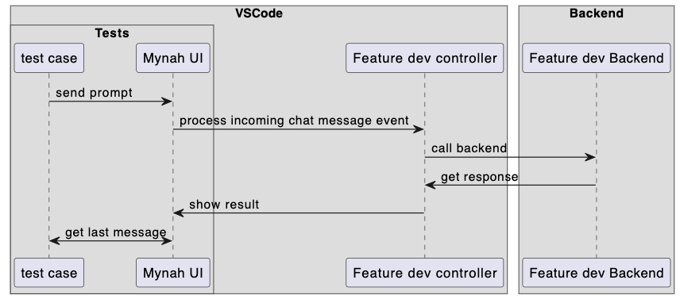
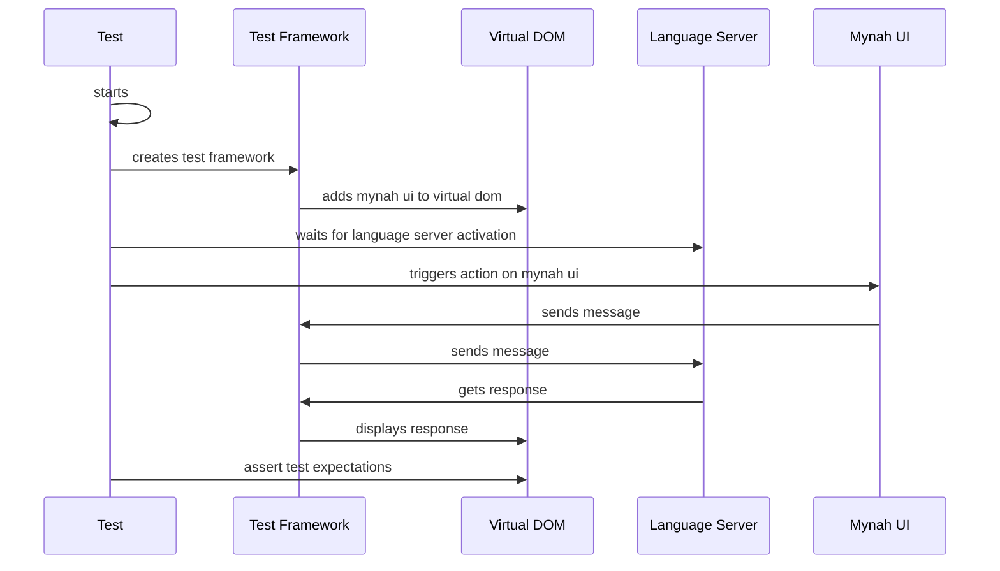

### Test E2E

This document describes the testing architecture specifically for more complicated E2E tests running the toolkits.

#### Amazon Q E2E Tests

Since VSCode does not have native support for writing E2E/UI tests for components occuring inside of a webview, we have taken a slightly different approach to write E2E tests for Amazon Q.

The E2E tests for Amazon Q follow the following flow: 

This means instead of running the E2E tests inside of the webview, we hoist the Mynah UI package into the test structure using JSDOM. This allows us to directly interface with Mynah UI allowing us to not rely on any DOM elements, making tests a lot easier to create and simple to maintain.

The downsides are that we technically aren't testing any of the actual contents of the webview to make sure things are behaving correctly. Instead, we are testing that when we programatically send a message to the UI that the Mynah UI <-> Amazon Q VSCode code interacts successfully.

With this approach, the follow things can be tested:

-   Whether or not certain features show/not show depending on the status of the users auth
-   Run requests directly against the backend and see if we get results back
-   Clicking any follow up buttons (including examples)

## Flare Chat E2E Test flow (Not implemented yet)

This is the new flow that should be introduced when we moved to Flare chat.

