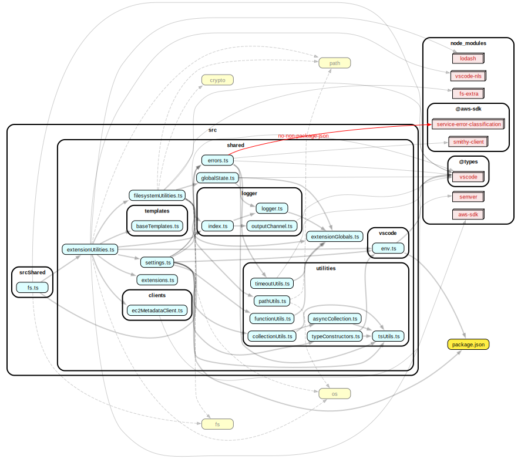
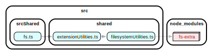

# Browser

This extension can run in the web browser (eg: [vscode.dev](https://vscode.dev)), but with limited functionality.

## Running the Browser implementation

You can run the browser implementation of the extension in the following ways.

### Running in VSCode

The following steps will result in a VSCode Extension window running
with the AWS Toolkit extension installed.
The difference from the regular
process is that in the background it is running as a browser environment
so certain things like Node.js modules will not be available.

1. In the terminal run: `npm run buildBrowser`

## Running in a Browser window

The following steps will result in a Chrome window running with VS Code
and the Browser version of the AWS Toolkit extension installed.

1. In the terminal run: `npm run runInBrowser`

##### (OPTIONAL) Disabling CORS

In the case you want to disable CORS in the browser for something like
contacting the telemetry api endpoint, do the following.

The script that starts the browser does not provide a way to disable security,
so we need to modify the code slightly to ensure the browser starts with CORS disabled.

1. Go to `./node_modules/@vscode/test-web/out/index.js`
2. Go to the function `openBrowser()`
3. Add the line `args.push('--disable-web-security')`

Now when you run the extension in the browser it will not do CORS checks.

#### Debugging in Browser window

Debugging in the Browser is more difficult than the Node.js/Desktop
version.

-   Breakpoints do not work, we cannot step through the code.

The best we can do (as far as I know) is to read logs.

To get to the VS Code logs go to:

1. The `Output` tab
2. In the top right drop-down select: `Extension Host (Worker)`

> The VS Code logs will show errors if we try to use modules that do not exist in the Browser.

To get to the AWS Toolkit logs:

1. Open Command Palette: `cmd/ctrl` + `shift` + `p`
2. Type: `AWS: View Toolkit Logs`

## Finding incompatible transitive dependencies

For example, if I have a Typescript module, `myFile.ts`, that imports a module, which imports another module (transitive dependency) such as `fs-extra`,
when I execute `myFile.ts` in the browser it will break due to `fs-extra` not being browser compatible.

It may be difficult to determine which module imported `fs-extra` due to a nested chain of transitive dependencies.

As a solution, we can use [`dependency-cruiser`](https://www.npmjs.com/package/dependency-cruiser) to generate a dependency diagram
to help us visualize the imports and determine which module is importing a certain module.

### How to use

1. Install the `graphiz` cli, this provides the `dot` cli command
    - Mac: `brew install graphiz`
    - Others: [See documentation](https://www.graphviz.org/download/)
2. Run `npx depcruise {RELATIVE_PATH_TO_FILE}  --output-type dot | dot -T svg > dependency-graph.svg`
    - For example, `npx depcruise src/srcShared/fs.ts  --output-type dot | dot -T svg > dependency-graph.svg` generates the following which shows `fs-extra` is imported by `fileSystemUtilities.ts`:
      
    - Additionally specify a certain dependency with `--reaches` , `npx depcruise src/srcShared/fs.ts --reaches "fs-extra" --output-type dot | dot -T svg > dependency-graph.svg`, to hide unrelated dependencies:
      

## Global Scoped Objects + Testing behavior

### Summary

-   **When in Browser mode**, state is not shared between the actual extension code and the unit test code. I.e you cannot modify a global variable in the extension code and see that change in the unit tests
-   State will need to be stored somewhere in `globalThis` to be accessible by tests. Any state not in `globalThis` will not be the same as the actual extension, they are separate.

With the introduction of Browser support, it was discovered that the context between the extension code and test code is not shared.
Though it is shared in the Node version of the extension.

Example:

```typescript
// extension.ts
export let myGlobal = 'A'

function activate() {
    // Change the global variable value
    myGlobal = 'B'
}
```

```typescript
// Browser unit test
import { myGlobal } from '../src/extension.ts'

describe('test', function () {
    it('test', function () {
        assert.strictEqual(myGlobal, 'B') // this fails only in Browser, it is actually 'A'
    })
})
```

### Web Worker

The assumption for the behavior is due to how Web Workers work. We (VS Code) use them run our extension and unit test code when in the Browser. Here scripts share global values differently from when run in a different environment such as Node.js.

-   [`WorkerGlobalScope`](https://developer.mozilla.org/en-US/docs/Web/API/WorkerGlobalScope)
    -   The context of the executing code is contained within itself and is not accessible to other scripts (eg: unit tests)
    -   VS Code uses Dedicated Workers since `globalThis` is indicated as a [`DedicatedWorkerGlobalScope`](https://developer.mozilla.org/en-US/docs/Web/API/DedicatedWorkerGlobalScope) when debugging
    -   `globalThis` is one object (that I could find so far) which **is shared** between our extension and test scripts. A guess to why is that the main script spawns another web worker (for unit tests) and passes the `DedicatedWorkerGlobalScope`. See [`"Workers can also spawn other workers"`](https://developer.mozilla.org/en-US/docs/Web/API/Web_Workers_API/Functions_and_classes_available_to_workers).
    -   `globalThis` returns `global` in Node.js, or a `WorkerGlobalScope` in the browser
