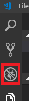
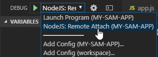

# Debugging Node.js Lambda Functions

You can debug your Serverless Application's AWS Lambda function locally using the CodeLens links above the lambda handler. If you would like to use the Debug Panel to launch the debugger instead, use the following steps to configure your project's Debug Configuration.

## Install and Configure Prerequisites

1. Install the [AWS Toolkit for Visual Studio Code (VS Code)](https://marketplace.visualstudio.com/items?itemName=AmazonWebServices.aws-toolkit-vscode) (also see the [user guide](https://docs.aws.amazon.com/console/toolkit-for-vscode/setup-toolkit)).
1. Re-launch VS Code if necessary and open a SAM application or [create a new one](https://docs.aws.amazon.com/console/toolkit-for-vscode/create-sam).
1. Open the folder that contains `template.yaml`.

## Configure Your Debugger

Throughout these instructions, replace the following:

| Name                    | Replace With                                                                          |
| ----------------------- | ------------------------------------------------------------------------------------- |
| `<sam app root>`        | The root of your SAM app (typically this is the directory containing `template.yaml`) |
| `<nodejs project root>` | The root of your Node.js source code (the directory containing `package.json`)        |
| `<protocol>`            | Either `inspector` (for Node.js 6.3+) or `legacy` (for prior versions of Node.js)       |

1. Open `<sam app root>/.vscode/launch.json` (create a new file if it does not already exist), and add the following contents.

    - Due to a bug in how VS Code handles path mappings, Windows users must provide an absolute path for `localRoot`. If you use a path relative to `${workspaceFolder}`, the path mappings will not work.
    - If desired, replace `5678` with the port that you wish to use for debugging.

    ```jsonc
    {
        "version": "0.2.0",
        "configurations": [
            {
                "name": "NodeJS: Remote Attach",
                "type": "node",
                "request": "attach",
                "port": 5678,
                "address": "localhost",
                "localRoot": "<nodejs project root>",
                "remoteRoot": "/var/task",
                "protocol": "<protocol>",
                "skipFiles": ["/var/runtime/node_modules/**/*.js", "<node_internals>/**/*.js"]
            }
        ]
    }
    ```

2. Launch Visual Studio Code and open `<sam app root>`.
3. Press `Ctrl+Shift+D` or click the `Debug` icon to open the debug viewlet:

    

4. Select `NodeJS: Remote Attach` from the drop-down menu at the top of the viewlet:

    

## Start Debugging

1. Set a breakpoint anywhere in your lambda handler.
2. Open a terminal in `<sam app root>`, and run the following commands. The SAM CLI will invoke your lambda handler, and wait for a debugger to attach to it. Replace `HelloWorldFunction` with the name of the function that you want to invoke, which can be found in `template.yaml` under `Resources`.

    ```bash
    sam build --use-container
    sam local invoke HelloWorldFunction -d 5678 --no-event
    ```

3. When you see the message starting with `Debugger listening on`, go back to Visual Studio Code and press F5 to attach the debugger to the handler that you invoked in the previous step.

## Optional: Automatically Start Debugging When Ready

With the above steps, you need to manually invoke SAM CLI from the command line, wait for it to be ready, then attach the debugger. We can automate the process of invoking SAM CLI and waiting for it to be ready by using a `preLaunchTask`.

1. Open `<sam app root>/.vscode/tasks.json` (create a new file if it does not already exist).
2. Add the following contents to `tasks.json`:

    ```jsonc
    {
        // See https://go.microsoft.com/fwlink/?LinkId=733558
        // for the documentation about the tasks.json format
        "version": "2.0.0",
        "tasks": [
            {
                "label": "Debug NodeJS Lambda Function",
                "type": "shell",
                "command": "sam",
                "args": [
                    "local",
                    "invoke",
                    "HelloWorldFunction", // Replace this with the resource name of your lambda function from your Serverless Application template.yaml file
                    "--template",
                    "${workspaceFolder}/.aws-sam/build/template.yaml", // Replace this with the appropriate workspace-relative path to your Serverless Application template.yaml file
                    "--no-event",
                    "-d",
                    "5678"
                ],
                "isBackground": true,
                "problemMatcher": {
                    "pattern": [
                        {
                            // Use regex that never matches anything.
                            "regexp": "^(x)(\\b)(x)$",
                            "file": 1,
                            "location": 2,
                            "message": 3
                        }
                    ],
                    "background": {
                        // This is how the debugger knows when it can attach
                        "activeOnStart": true,
                        "beginsPattern": "^Fetching lambci.* Docker container image......$",
                        "endsPattern": "^.* Mounting .* as .*:ro inside runtime container$"
                    }
                }
            }
        ]
    }
    ```

3. Open `<sam app root>/.vscode/launch.json`, and add the following property to the `NodeJS: Remote Attach` configuration that you created earlier, after `"request": "attach",`:

    ```jsonc
    "preLaunchTask": "Debug NodeJS Lambda Function",
    ```

Now you can just press `F5`, and Visual Studio Code will invoke SAM CLI and wait for the `Mounting .* as .*:ro inside runtime container` message before attaching the debugger.
