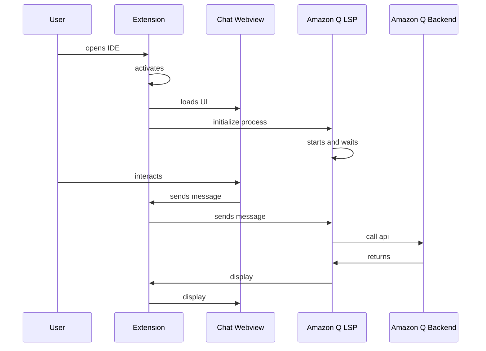

# Flare Language Server

## Chat Activation flow



## Language Server Debugging

If you want to connect a local version of language-servers to aws-toolkit-vscode, follow these steps:

1. Clone https://github.com/aws/language-servers.git and set it up in the same workspace as this project by cmd+shift+p and "add folder to workspace" and selecting the language-servers folder that you just cloned. Your VS code folder structure should look like below.

    ```
    /aws-toolkit-vscode
    /toolkit
    /core
    /amazonq
    /language-servers
    ```

2. Inside of the language-servers project run:
    ```
    npm install
    npm run compile
    npm run package
    ```
    to get the project setup
3. You need to open VScode user settings (Cmd+Shift+P and Search "Open User Settings (JSON)") and add the lines below at the bottom of the settings to enable the lsp experiment:
    ```
    "aws.experiments": {
      "amazonqLSP": true,
      "amazonqLSPInline": true, // optional: enables inline completion from flare
      "amazonqLSPChat": true // optional: enables chat from flare
    }
    ```
4. Uncomment the `__AMAZONQLSP_PATH` and `__AMAZONQLSP_UI` variables in the `amazonq/.vscode/launch.json` extension configuration
5. Use the `Launch LSP with Debugging` configuration and set breakpoints in VSCode or the language server, Once you run "Launch LSP with Debugging" a new window should start, wait for the plugin to show up there. Then go to the run menu again and run "Attach to Language Server (amazonq)" after this you should be able to add breakpoints in the LSP code.
6. (Optional): Enable `"amazonq.trace.server": "on"` or `"amazonq.trace.server": "verbose"` in your VSCode settings to view detailed log messages sent to/from the language server. These log messages will show up in the "Amazon Q Language Server" output channel

### Breakpoints Work-Around

If the breakpoints in your language-servers project remain greyed out and do not trigger when you run `Launch LSP with Debugging`, your debugger may be attaching to the language server before it has launched. You can follow the work-around below to avoid this problem. If anyone fixes this issue, please remove this section.

1. Set your breakpoints and click `Launch LSP with Debugging`
2. Once the debugging session has started, click `Launch LSP with Debugging` again, then `Cancel` on any pop-ups that appear
3. On the debug panel, click `Attach to Language Server (amazonq)` next to the red stop button
4. Click `Launch LSP with Debugging` again, then `Cancel` on any pop-ups that appear

## Language Server Runtimes Debugging

If you want to connect a local version of language-server-runtimes to aws-toolkit-vscode, follow these steps:

1. Clone https://github.com/aws/language-server-runtimes.git and set it up in the same workspace as this project by cmd+shift+p and "add folder to workspace" and selecting the language-server-runtimes folder that you just cloned. Your VS code folder structure should look like below.

    ```
    /aws-toolkit-vscode
    /toolkit
    /core
    /amazonq
    /language-server-runtimes
    ```

2. Inside of the language-server-runtimes project run:
    ```
    npm install
    npm run compile
    cd runtimes
    npm run prepub
    cd out
    npm link
    cd ../../types
    npm link
    ```
    If you get an error running `npm run prepub`, you can instead run `npm run prepub:copyFiles` to skip cleaning and testing.
3. Inside of aws-toolkit-vscode run:
    ```
    npm install
    npm link @aws/language-server-runtimes @aws/language-server-runtimes-types
    ```

## Amazon Q Inline Activation

-   In order to get inline completion working you must open a supported file type defined in CodewhispererInlineCompletionLanguages in `packages/amazonq/src/app/inline/completion.ts`
