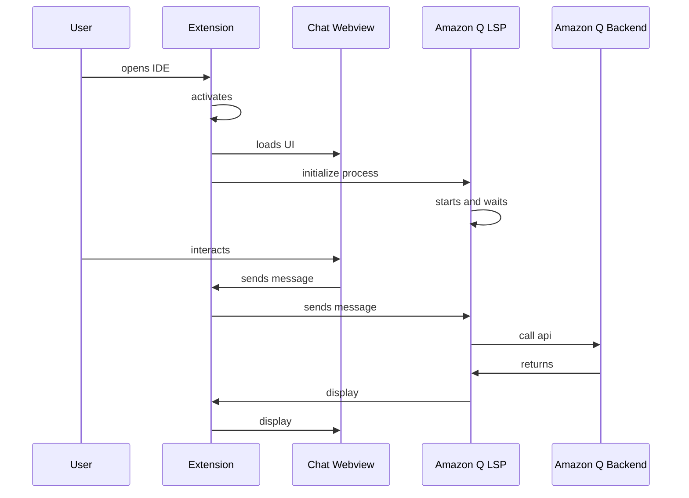

# Flare Language Server

## Chat Activation flow



## Language Server Debugging

1. Clone https://github.com/aws/language-servers.git and set it up in the same workspace as this project by cmd+shift+p and "add folder to workspace" and selecting the language-servers folder that you just cloned. Your VS code folder structure should look like below.

    ```
    /aws-toolkit-vscode
    /toolkit
    /core
    /amazonq
    /language-servers
    ```

2. Inside of the language-servers project run:
    ```
    npm install
    npm run compile
    npm run package
    ```
    to get the project setup
3. Enable the lsp experiment:
    ```
    "aws.experiments": {
      "amazonqLSP": true,
      "amazonqLSPInline": true, // optional: enables inline completion from flare
      "amazonqLSPChat": true // optional: enables chat from flare
    }
    ```
4. Uncomment the `__AMAZONQLSP_PATH` and `__AMAZONQLSP_UI` variables in the `amazonq/.vscode/launch.json` extension configuration
5. Use the `Launch LSP with Debugging` configuration and set breakpoints in VSCode or the language server
6. (Optional): To customize logging options, see [Language Server Logging](#language-server-logging)

## Language Server Logging

There are two settings that allow us to configure the language server logging.

-   `amazonq.lsp.logLevel`: the logging level the language server should use. Options include `'error'`, `'warn'`, `'info'`, `'log'`, and `'debug'`. The default level is info. See the [implementation](<(https://github.com/aws/language-server-runtimes/blob/main/runtimes/runtimes/util/loggingUtil.ts#L4-L10)>) on the lanaguage server side for more information.
-   `amazonq.lsp.traceChannel`: View detailed log messages sent to/from the language server in a seperate output channel named 'Amazon Q Language Server'. All language server logs will be routed to this output channel instead. (Requires reloading to take effect).

## Amazon Q Inline Activation

-   In order to get inline completion working you must open a supported file type defined in CodewhispererInlineCompletionLanguages in `packages/amazonq/src/app/inline/completion.ts`
