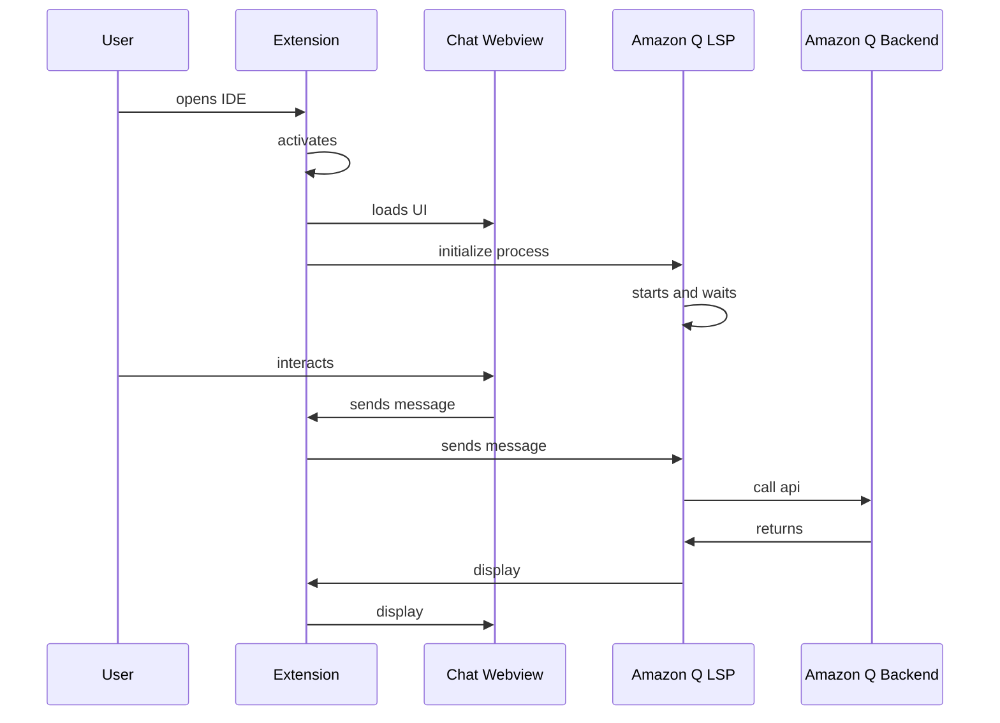

# Flare Language Server

## Chat Activation flow



## Language Server Debugging

1. Clone https://github.com/aws/language-servers.git and set it up in the same workspace as this project

    e.g.

    ```
    /aws-toolkit-vscode
    /toolkit
    /core
    /amazonq
    /language-servers
    ```

2. Inside of the language-servers project run:
    ```
    npm install
    npm run compile
    npm run package
    ```
    to get the project setup
3. Enable the lsp experiment:
    ```
    "aws.experiments": {
      "amazonqLSP": true,
      "amazonqLSPInline": true, // optional: enables inline completion from flare
      "amazonqLSPChat": true // optional: enables chat from flare
    }
    ```
4. Uncomment the `__AMAZONQLSP_PATH` variable in `amazonq/.vscode/launch.json` Extension configuration
    1. Uncomment the `__AMAZONQLSP_UI` variable in `amazonq/.vscode/launch.json` Extension configuration if you want to debug the flare chat-client as well
5. Use the `Launch LSP with Debugging` configuration and set breakpoints in VSCode or the language server

## Amazon Q Inline Activation

-   In order to get inline completion working you must open a supported file type defined in CodewhispererInlineCompletionLanguages in `packages/amazonq/src/app/inline/completion.ts`
