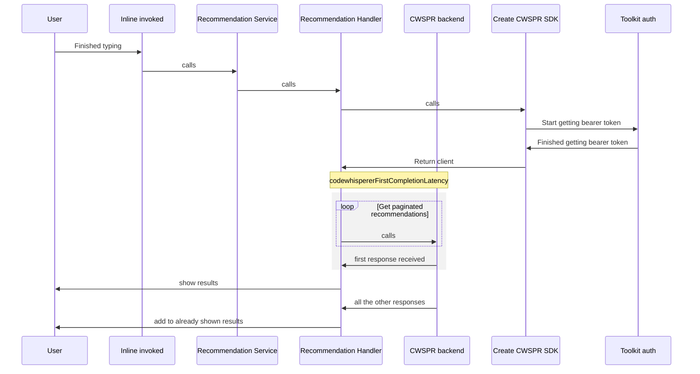
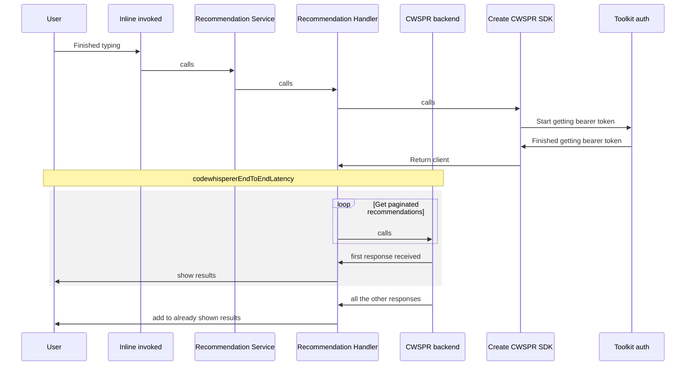
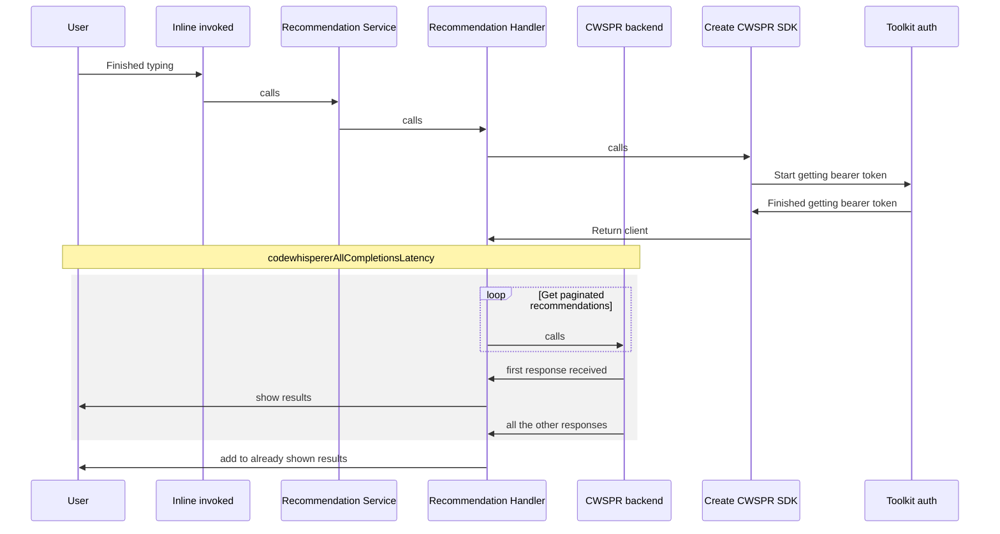
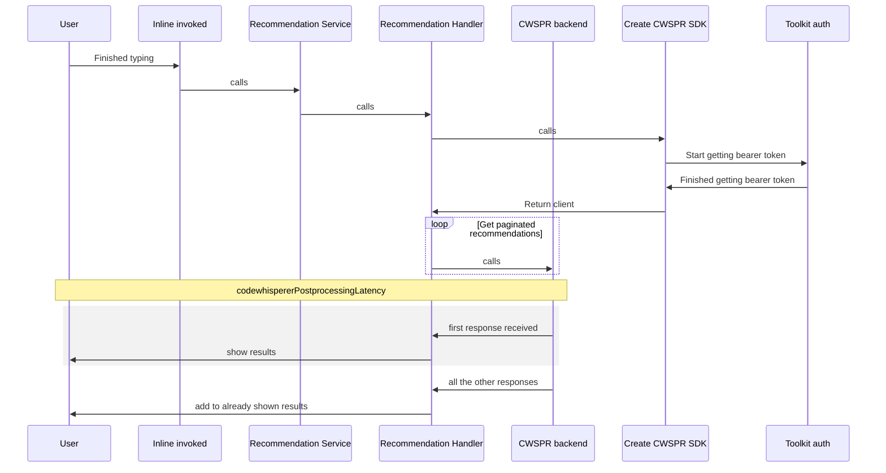
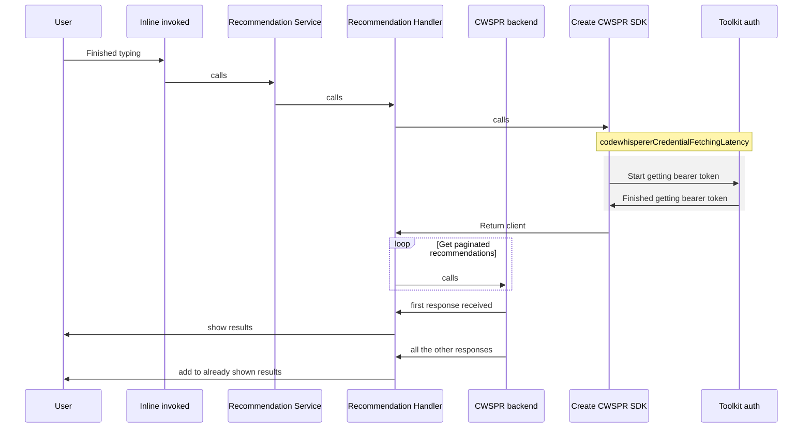
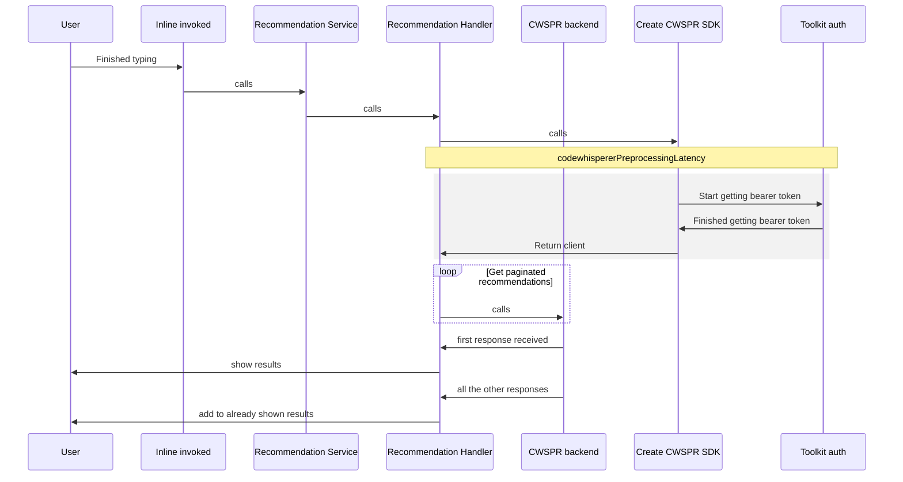
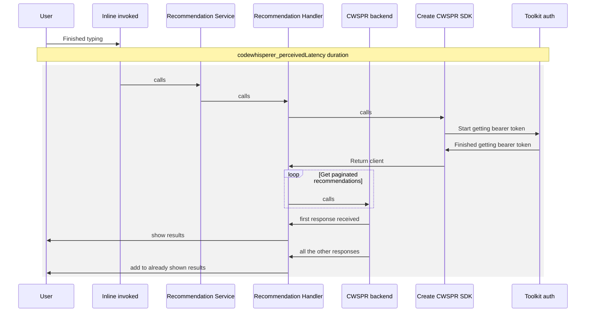

# Telemetry Performance Metrics

Visual representations of performance telemetry metrics

## Amazon Q Inline

### codewhispererFirstCompletionLatency

How long it took to receive the first suggestion after we started calling the getRecommendations API

### codewhispererEndToEndLatency

How long it took from when we started calling the getRecommendations API to when the first suggestion was shown

### codewhispererAllCompletionsLatency

How long it took to complete all paginated calls

### codewhispererPostprocessingLatency

How long it took to display the first suggestion after it received the first response from the API

### codewhispererCredentialFetchingLatency

How long it took to get the bearer token

### codewhispererPreprocessingLatency

How long it took to create the client and get ready to start sending getRecommendation API calls

### codewhisperer_perceivedLatency duration

How long it took from when the user stopped pressing a key to when they were shown a response

