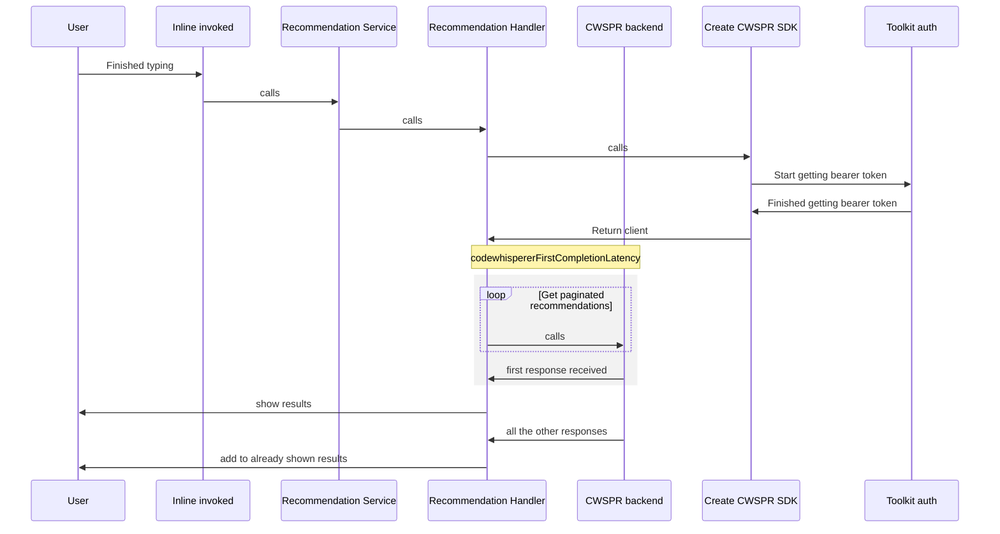
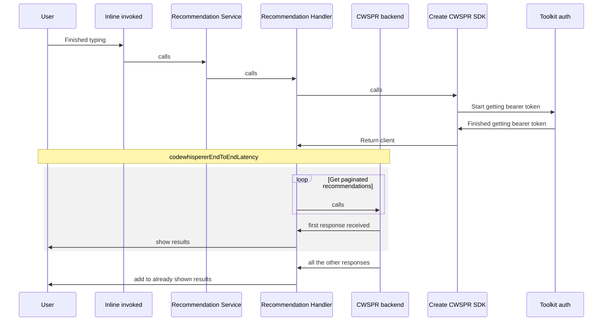
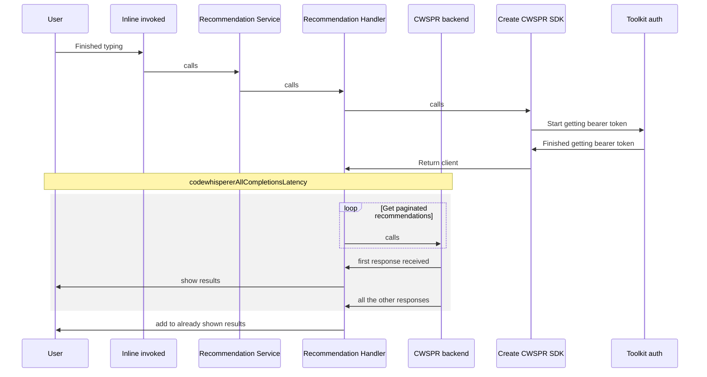
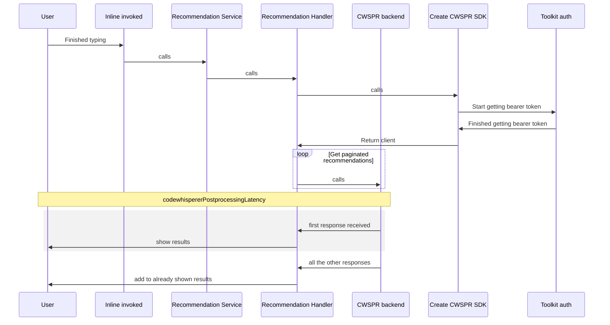
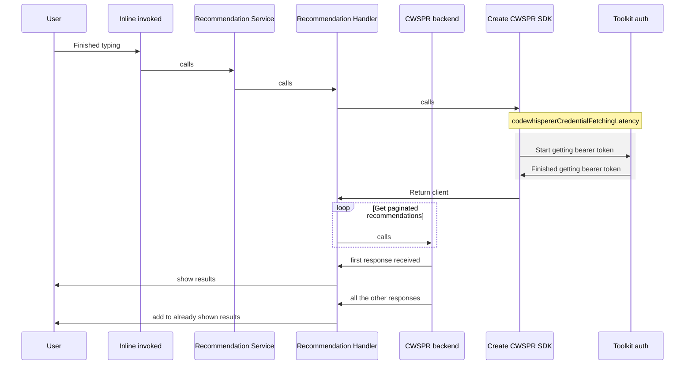
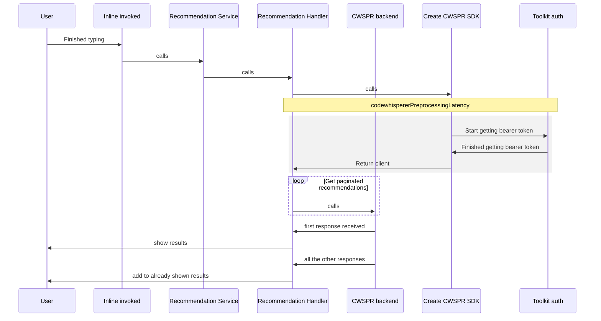
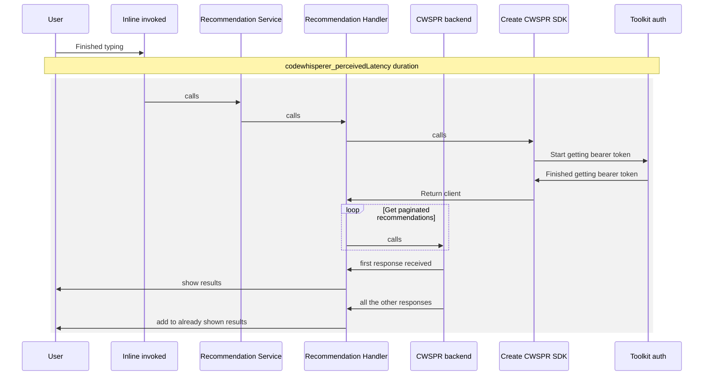
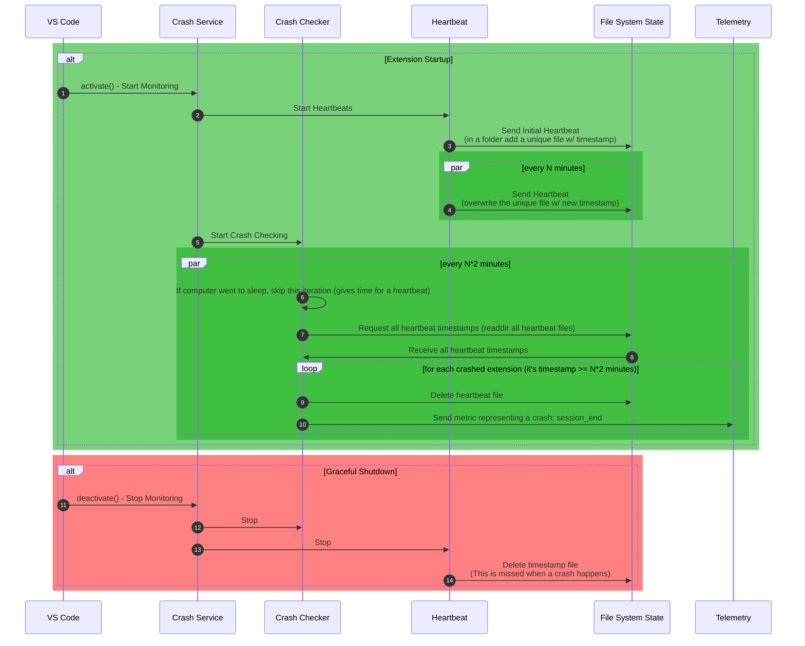

# Telemetry Performance Metrics

Visual representations of performance telemetry metrics

## Amazon Q Inline

### codewhispererFirstCompletionLatency

How long it took to receive the first suggestion after we started calling the getRecommendations API

### codewhispererEndToEndLatency

How long it took from when we started calling the getRecommendations API to when the first suggestion was shown

### codewhispererAllCompletionsLatency

How long it took to complete all paginated calls

### codewhispererPostprocessingLatency

How long it took to display the first suggestion after it received the first response from the API

### codewhispererCredentialFetchingLatency

How long it took to get the bearer token

### codewhispererPreprocessingLatency

How long it took to create the client and get ready to start sending getRecommendation API calls

### codewhisperer_perceivedLatency duration

How long it took from when the user stopped pressing a key to when they were shown a response

## Crash Monitoring

We make an attempt to gather information regarding when the IDE crashes, then report it to telemetry. This is the diagram of the steps that take place.

### Sequence Diagram

> Keep in mind that the entire sequence below is duplicated for each instance of our extension.
> They all work together to "crash check" on behalf of the other crashed extension instance.

`Crash Service`: The high level "service" that starts the heartbeats and crash checks

`Heartbeat`: Sends heartbeats which signal that the extension is still running and has not crashed

`Crash Checker`: Observes the heartbeats, reporting a telemetry event if a crash is detected

`File System State`: The user's file system where we store the heartbeat files from each extension instance

