# Telemetry Performance Metrics

Visual representations of performance telemetry metrics

## Amazon Q Inline

### codewhispererFirstCompletionLatency

How long it took to receive the first suggestion after we started calling the getRecommendations API

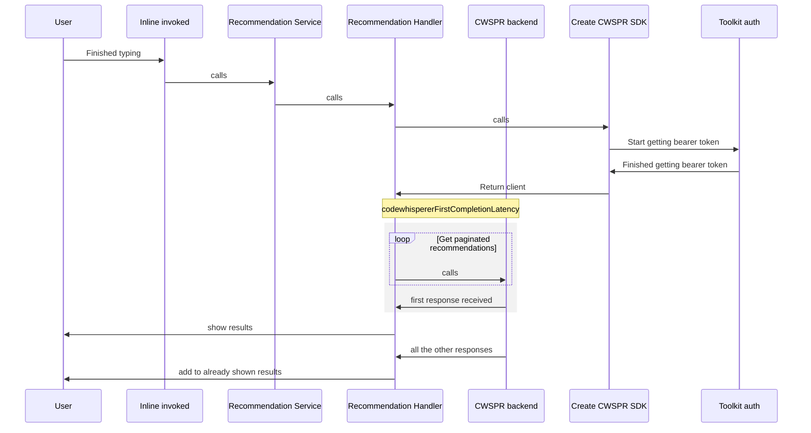
```mermaid
    sequenceDiagram
        participant User
        participant invoke as Inline invoked
        participant rService as Recommendation Service
        participant rHandler as Recommendation Handler
        participant backend as CWSPR backend
        participant sdk as Create CWSPR SDK
        participant token as Toolkit auth


        User->>invoke: Finished typing
        invoke->>rService: calls
        rService->>rHandler: calls
        rHandler->>sdk: calls

        sdk->>token: Start getting bearer token
        token->>sdk: Finished getting bearer token

        sdk->>rHandler: Return client
        note over rHandler, backend: codewhispererFirstCompletionLatency
        rect rgb(230, 230, 230, 0.5)
        loop Get paginated recommendations
            rHandler->>backend: calls
        end
        backend->>rHandler: first response received
        end
        rHandler->>User: show results
        backend->>rHandler: all the other responses
        rHandler->>User: add to already shown results
```

### codewhispererEndToEndLatency

How long it took from when we started calling the getRecommendations API to when the first suggestion was shown

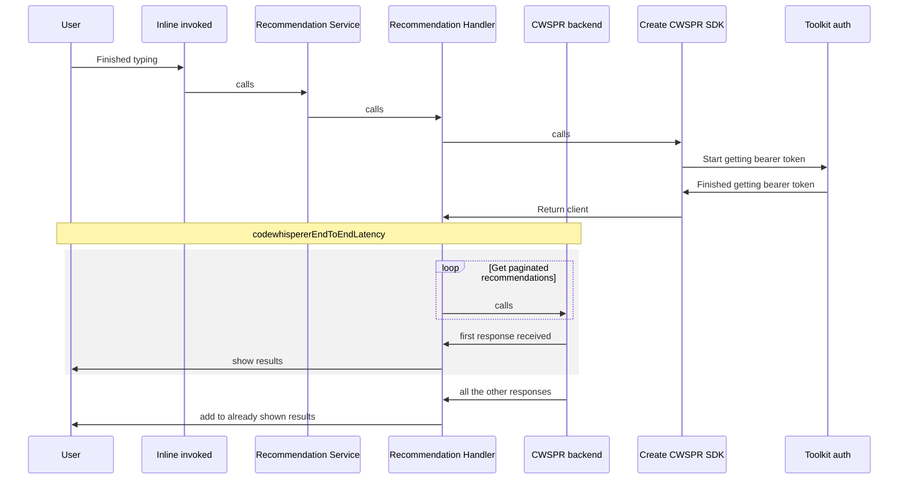
```mermaid
    sequenceDiagram
        participant User
        participant invoke as Inline invoked
        participant rService as Recommendation Service
        participant rHandler as Recommendation Handler
        participant backend as CWSPR backend
        participant sdk as Create CWSPR SDK
        participant token as Toolkit auth

        User->>invoke: Finished typing
        invoke->>rService: calls
        rService->>rHandler: calls
        rHandler->>sdk: calls

        sdk->>token: Start getting bearer token
        token->>sdk: Finished getting bearer token

        sdk->>rHandler: Return client
        note over User, backend: codewhispererEndToEndLatency
        rect rgb(230, 230, 230, 0.5)
            loop Get paginated recommendations
                rHandler->>backend: calls
            end
            backend->>rHandler: first response received
            rHandler->>User: show results
        end

        backend->>rHandler: all the other responses
        rHandler->>User: add to already shown results
```

### codewhispererAllCompletionsLatency

How long it took to complete all paginated calls

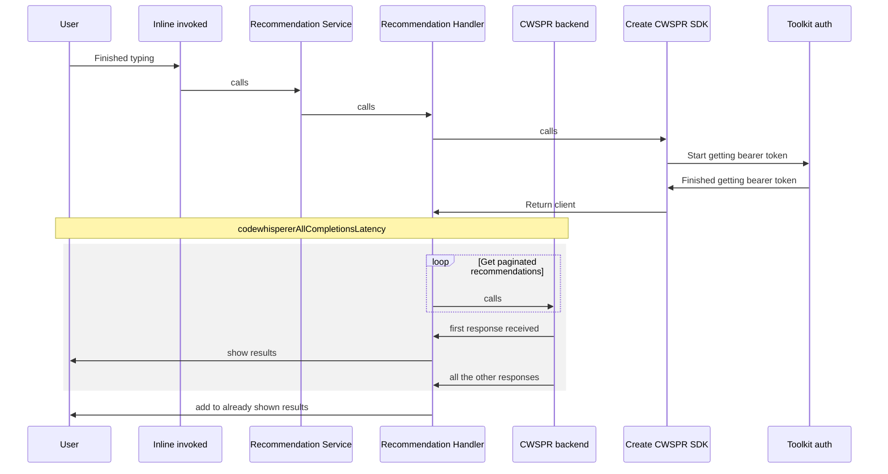
```mermaid
    sequenceDiagram
        participant User
        participant invoke as Inline invoked
        participant rService as Recommendation Service
        participant rHandler as Recommendation Handler
        participant backend as CWSPR backend
        participant sdk as Create CWSPR SDK
        participant token as Toolkit auth


        User->>invoke: Finished typing
        invoke->>rService: calls
        rService->>rHandler: calls
        rHandler->>sdk: calls

        sdk->>token: Start getting bearer token
        token->>sdk: Finished getting bearer token

        sdk->>rHandler: Return client
        note over User, backend: codewhispererAllCompletionsLatency
        rect rgb(230, 230, 230, 0.5)
            loop Get paginated recommendations
                rHandler->>backend: calls
            end
            backend->>rHandler: first response received
            rHandler->>User: show results
            backend->>rHandler: all the other responses
        end


        rHandler->>User: add to already shown results
```

### codewhispererPostprocessingLatency

How long it took to display the first suggestion after it received the first response from the API

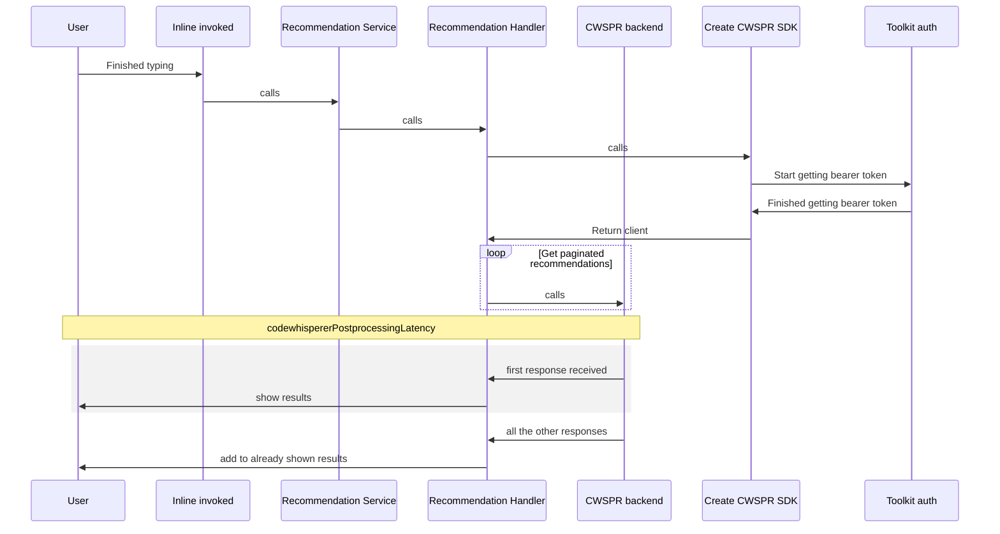
```mermaid
    sequenceDiagram
        participant User
        participant invoke as Inline invoked
        participant rService as Recommendation Service
        participant rHandler as Recommendation Handler
        participant backend as CWSPR backend
        participant sdk as Create CWSPR SDK
        participant token as Toolkit auth


        User->>invoke: Finished typing
        invoke->>rService: calls
        rService->>rHandler: calls
        rHandler->>sdk: calls

        sdk->>token: Start getting bearer token
        token->>sdk: Finished getting bearer token

        sdk->>rHandler: Return client
        loop Get paginated recommendations
            rHandler->>backend: calls
        end
        note over User, backend: codewhispererPostprocessingLatency
        rect rgb(230, 230, 230, 0.5)
            backend->>rHandler: first response received
            rHandler->>User: show results
        end

        backend->>rHandler: all the other responses
        rHandler->>User: add to already shown results
```

### codewhispererCredentialFetchingLatency

How long it took to get the bearer token

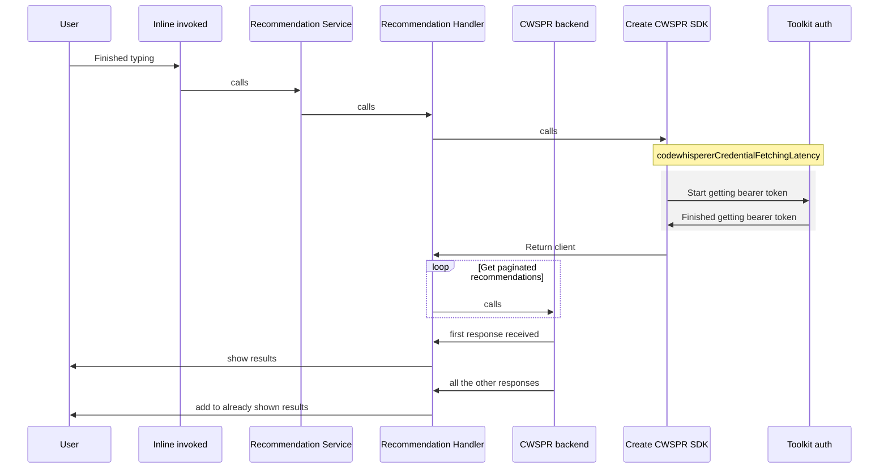
```mermaid
    sequenceDiagram
        participant User
        participant invoke as Inline invoked
        participant rService as Recommendation Service
        participant rHandler as Recommendation Handler
        participant backend as CWSPR backend
        participant sdk as Create CWSPR SDK
        participant token as Toolkit auth

        User->>invoke: Finished typing
        invoke->>rService: calls
        rService->>rHandler: calls
        rHandler->>sdk: calls

        note over sdk, token: codewhispererCredentialFetchingLatency
        rect rgb(230, 230, 230, 0.5)
            sdk->>token: Start getting bearer token
            token->>sdk: Finished getting bearer token
        end
        sdk->>rHandler: Return client
        loop Get paginated recommendations
            rHandler->>backend: calls
        end

        backend->>rHandler: first response received
        rHandler->>User: show results

        backend->>rHandler: all the other responses
        rHandler->>User: add to already shown results
```

### codewhispererPreprocessingLatency

How long it took to create the client and get ready to start sending getRecommendation API calls

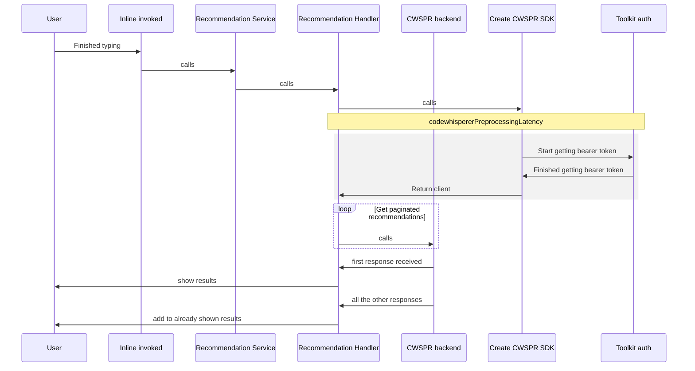
```mermaid
    sequenceDiagram
        participant User
        participant invoke as Inline invoked
        participant rService as Recommendation Service
        participant rHandler as Recommendation Handler
        participant backend as CWSPR backend
        participant sdk as Create CWSPR SDK
        participant token as Toolkit auth

        User->>invoke: Finished typing
        invoke->>rService: calls
        rService->>rHandler: calls
        rHandler->>sdk: calls

        note over rHandler, token: codewhispererPreprocessingLatency
        rect rgb(230, 230, 230, 0.5)
            sdk->>token: Start getting bearer token
            token->>sdk: Finished getting bearer token
            sdk->>rHandler: Return client
        end
        loop Get paginated recommendations
            rHandler->>backend: calls
        end

        backend->>rHandler: first response received
        rHandler->>User: show results

        backend->>rHandler: all the other responses
        rHandler->>User: add to already shown results
```

### codewhisperer_perceivedLatency duration

How long it took from when the user stopped pressing a key to when they were shown a response

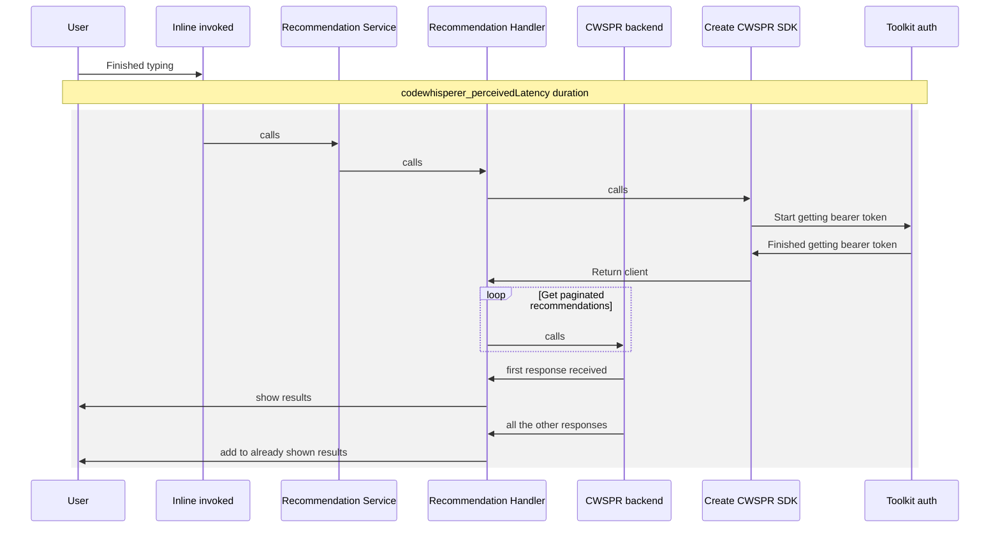
```mermaid
    sequenceDiagram
        participant User
        participant invoke as Inline invoked
        participant rService as Recommendation Service
        participant rHandler as Recommendation Handler
        participant backend as CWSPR backend
        participant sdk as Create CWSPR SDK
        participant token as Toolkit auth

        User->>invoke: Finished typing
        note over User, token: codewhisperer_perceivedLatency duration
        rect rgb(230, 230, 230, 0.5)
        invoke->>rService: calls
        rService->>rHandler: calls
        rHandler->>sdk: calls
            sdk->>token: Start getting bearer token
            token->>sdk: Finished getting bearer token
            sdk->>rHandler: Return client

        loop Get paginated recommendations
            rHandler->>backend: calls
        end

        backend->>rHandler: first response received
        rHandler->>User: show results

        backend->>rHandler: all the other responses
        rHandler->>User: add to already shown results
        end
```

## Amazon Q Chat

### amazonq_chatRoundTrip

Measures sequential response times in Q chat, from user input to message display. Tracks time intervals between key events: editor receiving the message, feature processing, and final message rendering

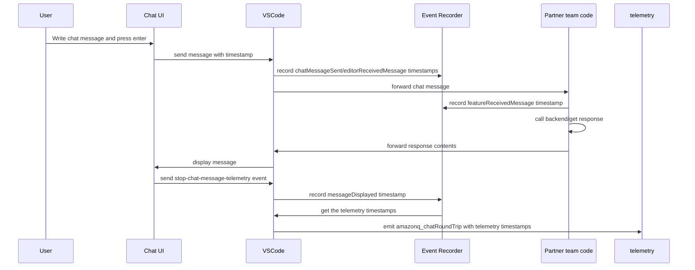
```mermaid
    sequenceDiagram
        participant User
        participant chat as Chat UI
        participant vscode as VSCode
        participant event as Event Recorder
        participant partner as Partner team code
        participant telemetry

        User->>chat: Write chat message and press enter
        chat->>vscode: send message with timestamp
        vscode->>event: record chatMessageSent/editorReceivedMessage timestamps
        vscode->>partner: forward chat message
        partner->>event: record featureReceivedMessage timestamp
        partner->>partner: call backend/get response
        partner->>vscode: forward response contents
        vscode->>chat: display message
        chat->>vscode: send stop-chat-message-telemetry event
        vscode->>event: record messageDisplayed timestamp
        event->>vscode: get the telemetry timestamps
        vscode->>telemetry: emit amazonq_chatRoundTrip with telemetry timestamps
```

### cwsprChatTimeToFirstChunk

The time between when the conversation stream is created and when we got back the first usable result

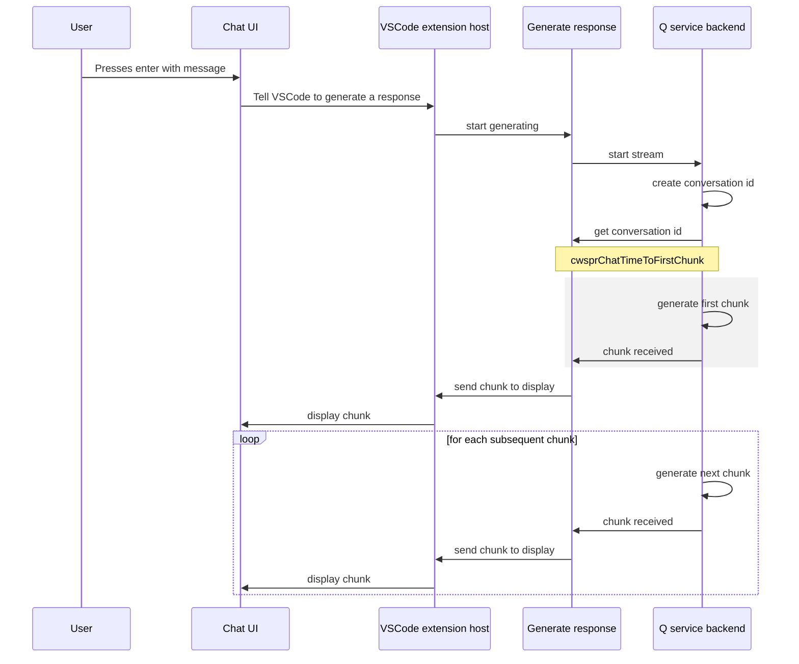
```mermaid
    sequenceDiagram
        participant user as User
        participant chat as Chat UI
        participant vscode as VSCode extension host
        participant generateResponse as Generate response
        participant backend as Q service backend

        user->>chat: Presses enter with message
        chat->>vscode: Tell VSCode to generate a response
        vscode->>generateResponse: start generating
        generateResponse->>backend: start stream
        backend->>backend: create conversation id
        backend->>generateResponse: get conversation id
        note over backend, generateResponse: cwsprChatTimeToFirstChunk
        rect rgb(230, 230, 230, 0.5)
            backend->>backend: generate first chunk
            backend->>generateResponse: chunk received
        end
        generateResponse->>vscode: send chunk to display
        vscode->>chat: display chunk
        loop for each subsequent chunk
            backend->>backend: generate next chunk
            backend->>generateResponse: chunk received
            generateResponse->>vscode: send chunk to display
            vscode->>chat: display chunk
        end
```

### cwsprChatTimeBetweenChunks

An array of time when successive pieces of data are received from the server

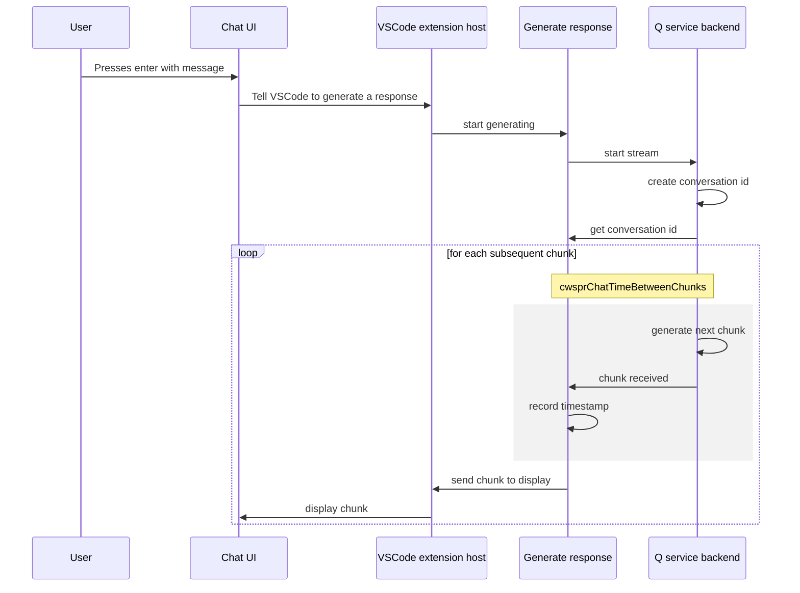
```mermaid
    sequenceDiagram
        participant user as User
        participant chat as Chat UI
        participant vscode as VSCode extension host
        participant generateResponse as Generate response
        participant backend as Q service backend

        user->>chat: Presses enter with message
        chat->>vscode: Tell VSCode to generate a response
        vscode->>generateResponse: start generating
        generateResponse->>backend: start stream
        backend->>backend: create conversation id
        backend->>generateResponse: get conversation id

        loop for each subsequent chunk
            note over backend, generateResponse: cwsprChatTimeBetweenChunks
            rect rgb(230, 230, 230, 0.5)
                backend->>backend: generate next chunk
                backend->>generateResponse: chunk received
                generateResponse->>generateResponse: record timestamp
            end

            generateResponse->>vscode: send chunk to display
            vscode->>chat: display chunk
        end
```

### cwsprChatFullResponseLatency

The time between when the conversation id was created and the final response from the server was received

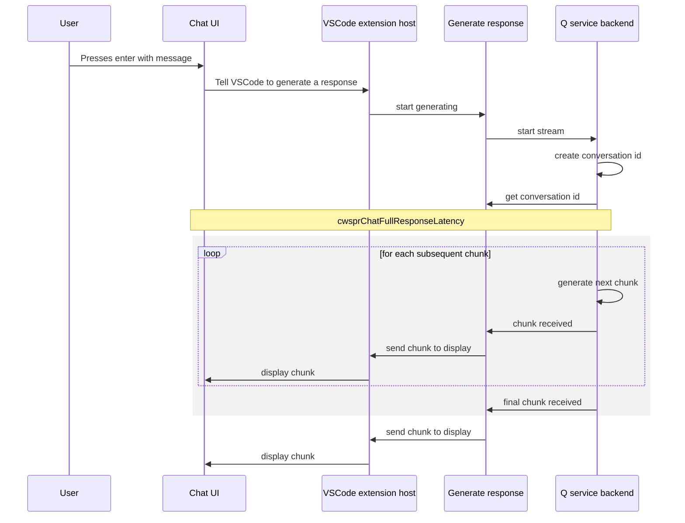
```mermaid
    sequenceDiagram
        participant user as User
        participant chat as Chat UI
        participant vscode as VSCode extension host
        participant generateResponse as Generate response
        participant backend as Q service backend

        user->>chat: Presses enter with message
        chat->>vscode: Tell VSCode to generate a response
        vscode->>generateResponse: start generating
        generateResponse->>backend: start stream
        backend->>backend: create conversation id
        backend->>generateResponse: get conversation id

        note over backend, chat: cwsprChatFullResponseLatency
        rect rgb(230, 230, 230, 0.5)
            loop for each subsequent chunk
                backend->>backend: generate next chunk
                backend->>generateResponse: chunk received
                generateResponse->>vscode: send chunk to display
                vscode->>chat: display chunk
            end
            backend->>generateResponse: final chunk received
        end
        generateResponse->>vscode: send chunk to display
        vscode->>chat: display chunk
```

### cwsprChatTimeToFirstUsableChunk

The time between the initial server request, including creating the conversation stream, and the first usable result

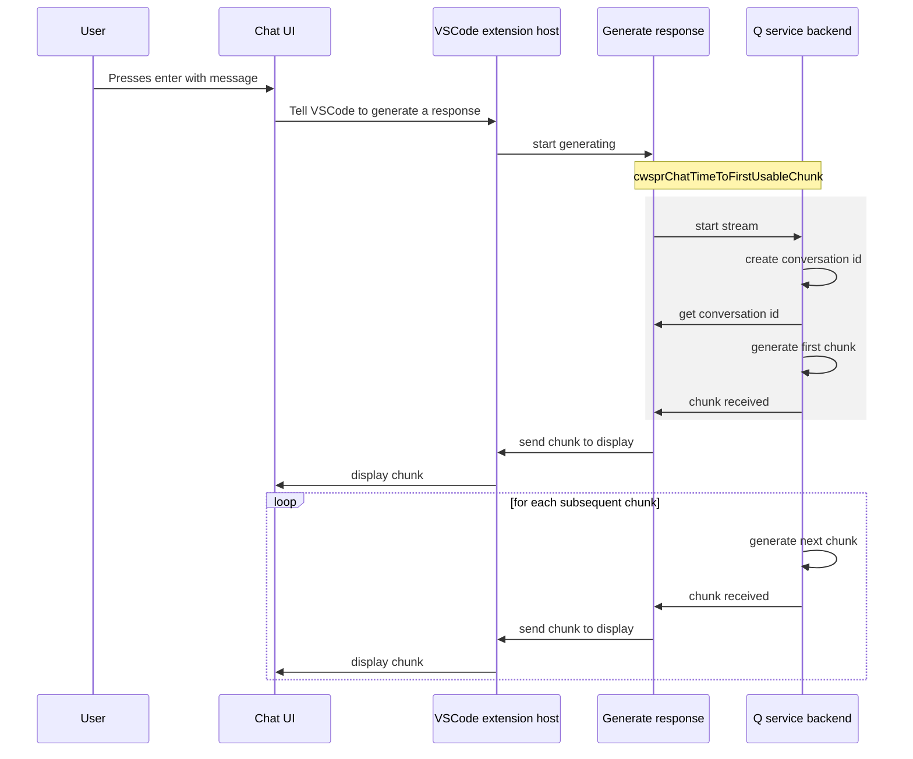
```mermaid
    sequenceDiagram
        participant user as User
        participant chat as Chat UI
        participant vscode as VSCode extension host
        participant generateResponse as Generate response
        participant backend as Q service backend

        user->>chat: Presses enter with message
        chat->>vscode: Tell VSCode to generate a response
        vscode->>generateResponse: start generating
        note over backend, generateResponse: cwsprChatTimeToFirstUsableChunk
        rect rgb(230, 230, 230, 0.5)
        generateResponse->>backend: start stream
            backend->>backend: create conversation id
            backend->>generateResponse: get conversation id
            backend->>backend: generate first chunk
            backend->>generateResponse: chunk received
        end
        generateResponse->>vscode: send chunk to display
        vscode->>chat: display chunk
        loop for each subsequent chunk
            backend->>backend: generate next chunk
            backend->>generateResponse: chunk received
            generateResponse->>vscode: send chunk to display
            vscode->>chat: display chunk
        end
```

### cwsprChatFullServerResponseLatency

The time between the initial server request, including creating the conversation stream, and the final response from the server

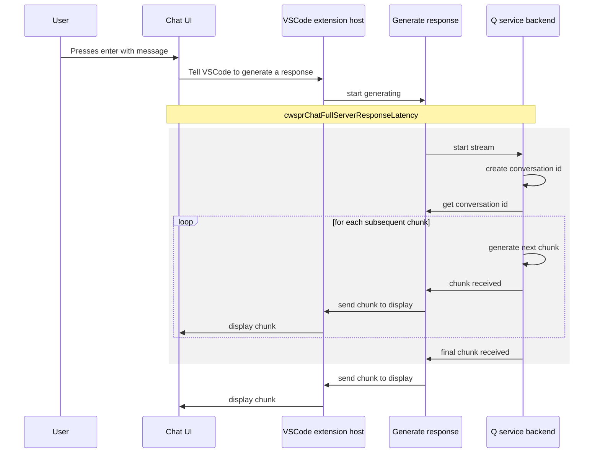
```mermaid
    sequenceDiagram
        participant user as User
        participant chat as Chat UI
        participant vscode as VSCode extension host
        participant generateResponse as Generate response
        participant backend as Q service backend

        user->>chat: Presses enter with message
        chat->>vscode: Tell VSCode to generate a response
        vscode->>generateResponse: start generating
        note over backend, chat: cwsprChatFullServerResponseLatency
        rect rgb(230, 230, 230, 0.5)
            generateResponse->>backend: start stream
            backend->>backend: create conversation id
            backend->>generateResponse: get conversation id
            loop for each subsequent chunk
                backend->>backend: generate next chunk
                backend->>generateResponse: chunk received
                generateResponse->>vscode: send chunk to display
                vscode->>chat: display chunk
            end
            backend->>generateResponse: final chunk received
        end
        generateResponse->>vscode: send chunk to display
        vscode->>chat: display chunk
```

### cwsprChatTimeToFirstDisplay

The time between the user pressing enter and when the first piece of data is displayed to the user

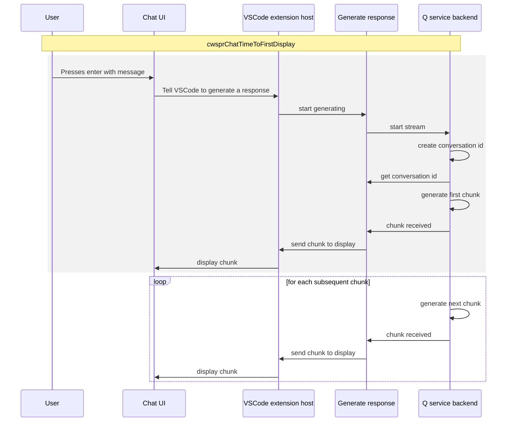
```mermaid
    sequenceDiagram
        participant user as User
        participant chat as Chat UI
        participant vscode as VSCode extension host
        participant generateResponse as Generate response
        participant backend as Q service backend
        note over backend, user: cwsprChatTimeToFirstDisplay
        rect rgb(230, 230, 230, 0.5)
            user->>chat: Presses enter with message
            chat->>vscode: Tell VSCode to generate a response
            vscode->>generateResponse: start generating
            generateResponse->>backend: start stream
            backend->>backend: create conversation id
            backend->>generateResponse: get conversation id
            backend->>backend: generate first chunk
            backend->>generateResponse: chunk received
            generateResponse->>vscode: send chunk to display
            vscode->>chat: display chunk
        end
        loop for each subsequent chunk
            backend->>backend: generate next chunk
            backend->>generateResponse: chunk received
            generateResponse->>vscode: send chunk to display
            vscode->>chat: display chunk
        end
```

### cwsprChatTimeBetweenDisplays

An array of time when successive pieces of server responses are displayed to the user

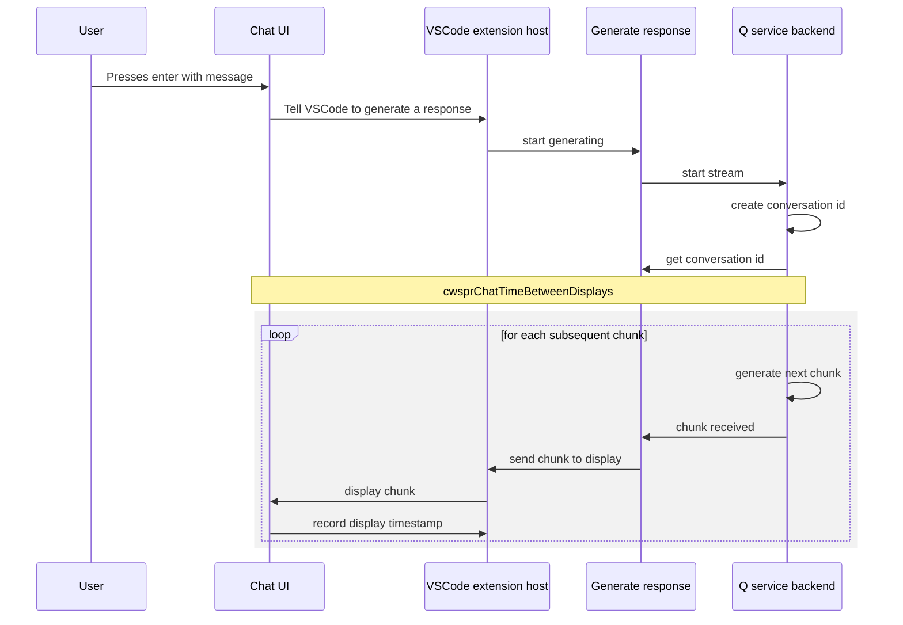
```mermaid
    sequenceDiagram
        participant user as User
        participant chat as Chat UI
        participant vscode as VSCode extension host
        participant generateResponse as Generate response
        participant backend as Q service backend

        user->>chat: Presses enter with message
        chat->>vscode: Tell VSCode to generate a response
        vscode->>generateResponse: start generating
        generateResponse->>backend: start stream
        backend->>backend: create conversation id
        backend->>generateResponse: get conversation id

        note over backend, chat: cwsprChatTimeBetweenDisplays
        rect rgb(230, 230, 230, 0.5)
            loop for each subsequent chunk
                backend->>backend: generate next chunk
                backend->>generateResponse: chunk received
                generateResponse->>vscode: send chunk to display
                vscode->>chat: display chunk
                chat->>vscode: record display timestamp
            end
        end
```

### cwsprChatFullDisplayLatency

The time between the user pressing enter and the entire response being rendered

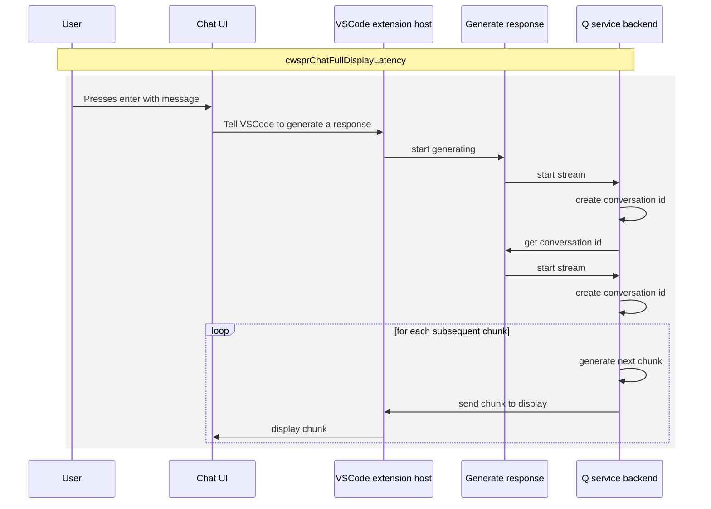
```mermaid
    sequenceDiagram
        participant user as User
        participant chat as Chat UI
        participant vscode as VSCode extension host
        participant generateResponse as Generate response
        participant backend as Q service backend

        note over backend, user: cwsprChatFullDisplayLatency
        rect rgb(230, 230, 230, 0.5)
            user->>chat: Presses enter with message
            chat->>vscode: Tell VSCode to generate a response
            vscode->>generateResponse: start generating
            generateResponse->>backend: start stream
            backend->>backend: create conversation id
            backend->>generateResponse: get conversation id
            generateResponse->>backend: start stream
            backend->>backend: create conversation id
            loop for each subsequent chunk
                backend->>backend: generate next chunk
                backend->>vscode: send chunk to display
                vscode->>chat: display chunk
            end
        end

```

## Crash Monitoring

We make an attempt to gather information regarding when the IDE crashes, then report it to telemetry. This is the diagram of the steps that take place.

### Sequence Diagram

> Keep in mind that the entire sequence below is duplicated for each instance of our extension.
> They all work together to "crash check" on behalf of the other crashed extension instance.

`Crash Service`: The high level "service" that starts the heartbeats and crash checks

`Heartbeat`: Sends heartbeats which signal that the extension is still running and has not crashed

`Crash Checker`: Observes the heartbeats, reporting a telemetry event if a crash is detected

`File System State`: The user's file system where we store the heartbeat files from each extension instance

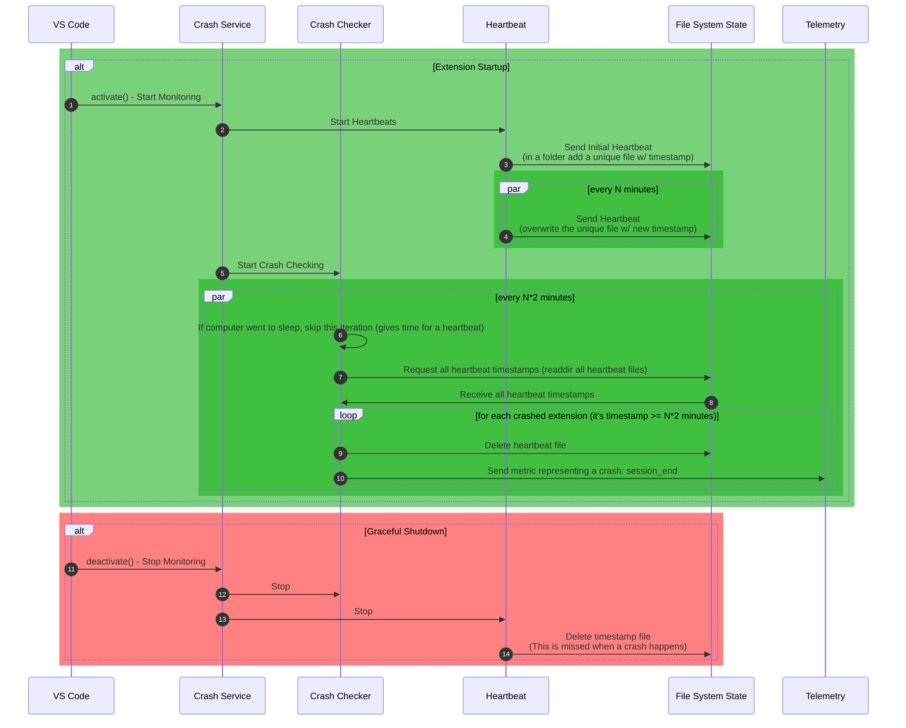
```mermaid
%%{init: {'theme':'default'}}%%
sequenceDiagram
  autonumber

  participant VSC as VS Code
  participant Service as Crash Service
  participant Checker as Crash Checker
  participant Heartbeat as Heartbeat
  participant State as File System State
  participant Telemetry as Telemetry

  rect rgb(121, 210, 121)
    alt Extension Startup
        VSC ->> Service: activate() - Start Monitoring

        Service ->> Heartbeat: Start Heartbeats
        Heartbeat ->> State: Send Initial Heartbeat <br/> (in a folder add a unique file w/ timestamp)
        rect rgb(64, 191, 64)
            par every N minutes
                Heartbeat ->> State: Send Heartbeat <br/> (overwrite the unique file w/ new timestamp)
            end
        end

        Service ->> Checker: Start Crash Checking
        rect rgb(64, 191, 64)
            par every N*2 minutes
                Checker ->> Checker: If computer went to sleep, skip this iteration (gives time for a heartbeat)
                Checker ->> State: Request all heartbeat timestamps (readdir all heartbeat files)
                State ->> Checker: Receive all heartbeat timestamps
                loop for each crashed extension (it's timestamp >= N*2 minutes)
                    Checker ->> State: Delete heartbeat file
                    Checker ->> Telemetry: Send metric representing a crash: session_end
                end
            end
        end
    end
  end

  rect rgb(255, 128, 128)
    alt Graceful Shutdown
        VSC ->> Service: deactivate() - Stop Monitoring
        Service ->> Checker: Stop
        Service ->> Heartbeat: Stop
        Heartbeat ->> State: Delete timestamp file <br/> (This is missed when a crash happens)
    end
  end

```
