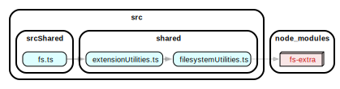

# Web Mode

This extension can run in a web browser (eg: [vscode.dev](https://vscode.dev)), but with limited functionality compared to
the desktop version.

## Running the Web mode implementation

You can run the Web mode implementation of the extension in the following ways.

## Pre-requisites

[See the CONTRIBUTING document.](../CONTRIBUTING.md#setup)

### General Notes

-   To see logs, using the Command Palette search: `Toggle Developer Tools`. Then go to the `Console` tab. In web mode VS Code seems to duplicate log messages, idk how to fix this.
-   The difference between web mode and Node.js/desktop is that in web mode everything runs in browser environment so certain things like Node.js modules will **not** be available.

## Running in an actual Browser

The following steps will result in a Chrome window running with VS Code
and the web version of the AWS Toolkit extension installed:

1. (Recommended) To have the Chrome window save your VS Code state after closing it, you need to modify the node module which executes the playwright method that opens it. In `node_modules/@vscode/test-web/out/index.js#openBrowser()` make the following change:

    Before:

    ```typescript
    const browser = await browserType.launch({ headless, args, devtools: options.devTools })
    const context = await browser.newContext({ viewport: null })
    ```

    After:

    ```typescript
    const tempContextDir = path.join(process.cwd(), '.vscode-test-web/aws-toolkit-user-dir')
    const browser = await browserType.launchPersistentContext(tempContextDir, {
        headless,
        args,
        devtools: options.devTools,
        viewport: null,
    })
    const context = browser
    ```

2. In the `Run & Debug` menu select the `Extension (Chrome)` option

> Note: To stop the debug session, you need to click the read `Disconnect` button multiple times

> Note: Setting breakpoints in VS Code works

#### (OPTIONAL) Enabling CORS

By default, we disable CORS in web mode since certain endpoints
such as telemetry or auth do not support CORS (at the moment of writing) for the VSCode origin.

In the case you want to enable CORS in the browser to test CORS compatibility
do the following:

-   In `package.json` find the `webRun` script
-   Temporarily remove `--browserOption=--disable-web-security`

Now when you run the extension in the browser it will do CORS checks.

## Testing in VSCode Web Mode

The following steps will result in a VSCode Extension window running
with the AWS Toolkit extension installed. While it looks the same as a typical
VS Code window, in the background it is running in a Browser context.

-   In the `Run & Debug` menu run: `Extension Tests (web)`

> NOTE: Tests do not spin up an actual browser window, but if we find a good reason to switch it will require some additional work. The current way does not require dowloading a separate browser like Chromium.

## Adding Web mode specific npm modules

If you need to manage npm modules required for Web mode, such as a [browserfied module](https://www.npmjs.com/package/os-browserify), see [the documentation here](../packages/core/src/web/README.md).

## Finding incompatible transitive dependencies

For example, if I have a Typescript module, `myFile.ts`, that imports a module which imports another module (transitive dependency) such as `fs-extra`,
when I execute `myFile.ts` in the browser it will break due to `fs-extra` not being browser compatible.

It may be difficult to determine which module imported `fs-extra` due to a nested chain of transitive dependencies.

As a solution, we can use [`dependency-cruiser`](https://www.npmjs.com/package/dependency-cruiser) to generate a dependency diagram
to help us visualize the imports and determine which module is importing a certain module.

### How to use

1. Install the `graphviz` cli, this provides the `dot` cli command
    - Mac: `brew install graphviz`
    - Others: [See documentation](https://www.graphviz.org/download/)
2. Run `npx depcruise {RELATIVE_PATH_TO_FILE}  --output-type dot | dot -T svg > dependency-graph.svg`
    - For example, `npx depcruise src/srcShared/fs.ts  --output-type dot | dot -T svg > dependency-graph.svg` generates the following which shows `fs-extra` is imported by `fileSystemUtilities.ts`:
      
    - Additionally specify a certain dependency with `--reaches` , `npx depcruise src/srcShared/fs.ts --reaches "fs-extra" --output-type dot | dot -T svg > dependency-graph.svg`, to hide unrelated dependencies:
      

## Behavior of module exports in tests

-   **In Web mode**, state is not shared between the actual extension code and the unit test code. I.e you cannot modify an exported module variable in the extension code and see that change from the tests.
-   However, state stored in `globalThis` is observable from the tests.

When running web tests, the context between the extension code and test code is not shared.
Though it is shared in the Node version of the extension.

-   Does NOT work in Web mode tests:
    -   Module code:
        ```typescript
        export let myGlobal = 'A'
        function activate() {
            // Change the exported module variable.
            myGlobal = 'B'
        }
        ```
    -   Test code:
        ```typescript
        // Web unit test
        import { myGlobal } from '../src/extension.ts'
        describe('test', function () {
            it('test', function () {
                assert.strictEqual(myGlobal, 'B') // Fails in Web (but not Node.js). The value is 'A'.
            })
        })
        ```
-   DOES work in Web mode tests:
    -   Module code:
        ```typescript
        ;(globalThis as any).myGlobal = 'A'
        function activate() {
            ;(globalThis as any).myGlobal = 'B'
        }
        ```
    -   Test code:
        ```typescript
        // Web unit test
        describe('test', function () {
            it('test', function () {
                assert.strictEqual((globalThis as any).myGlobal, 'B') // Passes in Web and Node.js.
            })
        })
        ```

### Web Worker

The assumption for the behavior is due to how Web Workers work. We (VS Code) use them to run our extension and test code in the browser. The scripts share module exports differently compared to a different environment such as Node.js.

-   [`WorkerGlobalScope`](https://developer.mozilla.org/en-US/docs/Web/API/WorkerGlobalScope)
    -   The context of the executing code is contained within itself and is not accessible to other scripts (tests).
    -   VS Code uses Dedicated Workers since `globalThis` is indicated as a [`DedicatedWorkerGlobalScope`](https://developer.mozilla.org/en-US/docs/Web/API/DedicatedWorkerGlobalScope) when debugging
    -   `globalThis` is one object (that I could find so far) which **is shared** between our extension and test scripts. A guess to why is that the main script spawns another web worker (for unit tests) and passes on the `DedicatedWorkerGlobalScope`. See [`"Workers can also spawn other workers"`](https://developer.mozilla.org/en-US/docs/Web/API/Web_Workers_API/Functions_and_classes_available_to_workers).
    -   `globalThis` returns `global` in Node.js, or a `WorkerGlobalScope` in the browser
