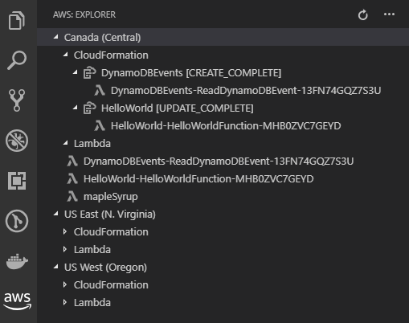
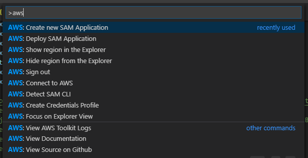
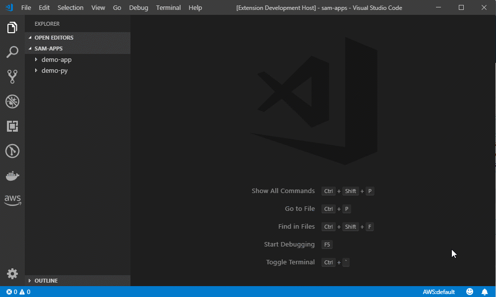

# AWS Toolkit for Visual Studio Code

The AWS Toolkit for Visual Studio Code is an extension that enables you to interact with [Amazon Web Services (AWS)](https://aws.amazon.com/what-is-aws/) from within Visual Studio Code.

## Contents

* [Features](#features)
* [Additional Setup Steps](#additional-setup-steps)
* [Usage](#usage)
* [Get Help](#get-help)

## Features

You can use the AWS Toolkit for Visual Studio Code to:

* [Manage supported AWS resources in an AWS account](#managing-aws-resources). For example, you can:
  
  * List available AWS CloudFormation stacks that contain AWS serverless applications.
  * List available AWS Lambda functions.
  * Invoke available Lambda functions.

  

* [Develop serverless applications locally, and then deploy them to an AWS account](#developing-serverless-applications).

[Return to Top](#top)

## Additional Setup Steps

After you install the AWS Toolkit for Visual Studio Code, you must complete these additional steps to access most of its features:

1. [Create an AWS account](https://aws.amazon.com/premiumsupport/knowledge-center/create-and-activate-aws-account/) and an [access key](https://aws.amazon.com/premiumsupport/knowledge-center/create-access-key/).
1. Connect the Toolkit to AWS by using [AWS credentials](#managing-aws-resources).

To use this Toolkit to develop [serverless applications with AWS](https://aws.amazon.com/serverless/), you must also do the following on the local machine where the Toolkit is installed:

1. Install the [AWS Command Line Interface (AWS CLI)](https://docs.aws.amazon.com/cli/latest/userguide/cli-chap-install.html).
1. Install and then run [Docker](https://docs.docker.com/install/).
1. Install the [AWS SAM CLI](https://docs.aws.amazon.com/serverless-application-model/latest/developerguide/serverless-sam-cli-install.html).

For complete setup instructions, see [Setting Up the AWS Toolkit for Visual Studio Code](https://docs.aws.amazon.com/toolkit-for-vscode/latest/userguide/getting-started.html) in the _AWS Toolkit for Visual Studio Code User Guide_.

[Return to Top](#top)

## Usage

* [Command Palette](#command-palette)
* [Managing AWS Resources](#managing-aws-resources)
* [Developing Serverless Applications](#developing-serverless-applications)

[Return to Top](#top)

### Command Palette

You can access many of the AWS Toolkit for Visual Studio Code features through **Command Palette**. To access the available commands, choose **View, Command Palette** on the menu bar, and then begin typing `AWS:`.

Available commands include:

* **AWS: Connect to AWS** - Connects the Toolkit to an AWS account. For more information, see "Step 2: Connect to an AWS Account" in [Managing AWS Resources](#managing-aws-resources).
* **AWS: Create Credentials Profile** - Creates an AWS credentials profile. For more information, see "Step 1: Create a Credentials Profile" in [Managing AWS Resources](#managing-aws-resources).
* **AWS: Create New SAM Application** - Generates a set of code files for a new AWS serverless application. For more information, see [Create a Serverless Application](#create-serverless-application).
* **AWS: Deploy SAM Application** - Deploys a local serverless application to an AWS account. For more information, see [Deploy a Serverless Application](#deploy-serverless-application).
* **AWS: Detect SAM CLI** - Checks whether the Toolkit can communicate correctly with the AWS SAM CLI that is installed. 
* **AWS: Focus on Explorer View** - Displays the **AWS: Explorer** Side Bar, if it isn't already displayed, and then moves the focus to it.
* **AWS: Hide region from the Explorer** - Hides the list of available AWS resources for the specified AWS Region from the **AWS: Explorer** Side Bar.
* **AWS: Show region in the Explorer** - Displays the list of available AWS resources for the specified AWS Region in the **AWS: Explorer** Side Bar.
* **AWS: Sign out** - Disconnects the Toolkit from the currently connected AWS account.
* **AWS: View AWS Toolkit Logs** - Displays log files that contain general Toolkit diagnosis information.

[Return to Top](#top)

### Managing AWS Resources

#### Step 1: Set Up a Credentials Profile

1. If you already have an AWS credentials profile, skip ahead to "Step 2: Connect to an AWS Account." (For additional information, see [Setting Up Your AWS Credentials](https://docs.aws.amazon.com/toolkit-for-vscode/latest/userguide/setup-credentials.html) in the _AWS Toolkit for Visual Studio Code User Guide_.)
1. On the menu bar, choose **View, Command Palette**.
1. Begin typing: `AWS: Create Credentials Profile`. When you see the **AWS: Create Credentials Profile** command, choose it.
1. Follow the on-screen instructions to add AWS credentials profile information. (For additional information, see [Setting Up Your AWS Credentials](https://docs.aws.amazon.com/toolkit-for-vscode/latest/userguide/setup-credentials.html) in the _AWS Toolkit for Visual Studio Code User Guide_.) 

#### Step 2: Connect to an AWS Account

1. On the menu bar, choose **View, Command Palette**.
1. Begin typing `AWS: Connect to AWS`. When you see the **AWS: Connect to AWS** command, choose it.
1. In the list of AWS credentials profiles that is displayed, choose the AWS credentials profile that you want to use. (For additional information, see [Setting Up Your AWS Credentials](https://docs.aws.amazon.com/toolkit-for-vscode/latest/userguide/setup-credentials.html) in the _AWS Toolkit for Visual Studio Code User Guide_.)

#### Step 3: Work with Available AWS Resources

1. If the **AWS: Explorer** Side Bar isn't displayed, display it by choosing the **AWS** icon in the Activity Bar. (To hide the **AWS: Explorer**, choose the **AWS** icon again.)
1. If you have existing resources in your AWS account but they aren't displayed in the **AWS: Explorer**, choose the **Refresh** icon in the **AWS: Explorer** to display them. 
1. Expand the AWS Region that contains the resource that you want to manage. (To hide or show AWS Region information, choose **View, Command Palette** on the menu bar, and then choose **AWS: Hide region from the Explorer** or **AWS: Show region in the Explorer**.)
1. Expand the AWS service that contains the resource that you want to manage. (Currently, the Toolkit doesn't support all available AWS services and resource types.)
1. If applicable, expand the parent resource that contains the child resource that you want to manage.
1. Right-click the resource to manage, and then choose one of the available actions in the context menu. (Currently, the Toolkit doesn't support all available resource actions.)

For more information, see the following in the _AWS Toolkit for Visual Studio Code User Guide_:

* [Setting Up Your AWS Credentials](https://docs.aws.amazon.com/toolkit-for-vscode/latest/userguide/setup-credentials.html)
* [Changing AWS Regions](https://docs.aws.amazon.com/toolkit-for-vscode/latest/userguide/setup-region.html)
* [Exploring AWS Explorer](https://docs.aws.amazon.com/toolkit-for-vscode/latest/userguide/aws-explorer.html)

[Return to Top](#top)

### Developing Serverless Applications

You can use the AWS Toolkit for Visual Studio Code to create, run, debug, and deploy serverless applications.

* [Create a Serverless Application](#create-serverless-application)
* [Run or Debug a Serverless Application](#run-debug-serverless-application)
* [Deploy a Serverless Application](#deploy-serverless-application)

[Return to Top](#top)

#### Create a Serverless Application

1. On the menu bar, choose **View, Command Palette**.
1. Begin typing: `AWS: Create new SAM Application`. When you see the **AWS: Create new SAM Application** command, choose it.
1. Follow the on-screen instructions to finish creating the SAM application.

The Toolkit produces the application code and files, adds them to the location you specified, and opens the program file in the editor.

For more information, see [Creating a Serverless Application](https://docs.aws.amazon.com/toolkit-for-vscode/latest/userguide/create-sam.html) in the _AWS Toolkit for Visual Studio Code User Guide_.

[Return to Top](#top)

#### Run or Debug a Serverless Application

(_Clip is time lapsed_)

After you choose the **AWS** icon in the Activity Bar, CodeLenses display within open serverless application code files above functions that use AWS Lambda function handler syntax. (A _handler_ is a function that Lambda calls to start execution of a Lambda function.) These CodeLenses enable you to run or debug the corresponding serverless application locally. CodeLens actions here include:

* **Configure**, for specifying function configurations such as an event payload and environment variables.
* **Run Locally**, for running the function without debugging.
* **Debug Locally**, for running the function with debugging.

(For general information about running and debugging in VS Code, see [Debugging](https://code.visualstudio.com/docs/editor/debugging) on the VS Code website.)

For information about how to work with remote versions of Lambda functions, see [Interacting with Remote Lambda Functions](https://docs.aws.amazon.com/toolkit-for-vscode/latest/userguide/remote-lambda.html) in the _AWS Toolkit for Visual Studio Code User Guide_.

[Return to Top](#top)

#### Deploy a Serverless Application

(_Clip is time lapsed_)

Before you start this procedure, you must have an Amazon S3 bucket in the AWS account. The AWS Toolkit for Visual Studio Code will use this bucket when packaging and deploying the application. (To create a bucket, see [How Do I Create an S3 Bucket](https://docs.aws.amazon.com/AmazonS3/latest/user-guide/create-bucket.html) in the _Amazon Simple Storage Service Console User Guide_.)  

1. On the menu bar, choose **View, Command Palette**.
1. Begin typing: `AWS: Deploy SAM Application`. When you see the **AWS: Deploy SAM Application** command, choose it.
1. Follow the on-screen instructions to finish deploying the serverless application, including:
    
   1. Choosing the SAM template file that corresponds with the serverless application you want to deploy.
   1. Choosing the AWS Region you want to deploy to.
   1. Specifying the name of an existing Amazon S3 bucket in the AWS account that the Toolkit will use for packaging and deploying the serverless application. (The Toolkit uses Amazon S3 as part of its process to deploy serverless applications.) The bucket must exist within the AWS Region that you chose earlier.

1. The serverless application is deployed to an AWS CloudFormation stack. (The Toolkit uses AWS CloudFormation as part of its process to deploy serverless applications.) If the stack already exists, it is updated; otherwise, a new stack is created. Within a few minutes, the Toolkit displays a deployment success or failure message.
1. To work with the corresponding stack that the Toolkit creates in AWS CloudFormation, in the **AWS: Explorer**, expand the AWS Region that contains the stack. Then expand **AWS CloudFormation**. Lastly, expand or right-click on the stack that you want to manage.

For more information, see [Deploying a Serverless Application](https://docs.aws.amazon.com/toolkit-for-vscode/latest/userguide/deploy-serverless-app.html) in the _AWS Toolkit for Visual Studio Code User Guide_. 

[Return to Top](#top)

### Get Help

To ask questions or get help from the AWS solutions development community, see the AWS Discussion Forums for [Java](https://forums.aws.amazon.com/forum.jspa?forumID=70), [JavaScript](https://forums.aws.amazon.com/forum.jspa?forumID=148) (for Node.js), [.NET](https://forums.aws.amazon.com/forum.jspa?forumID=61), [Python](https://forums.aws.amazon.com/forum.jspa?forumID=132), [Go](https://forums.aws.amazon.com/forum.jspa?forumID=293), [AWS Lambda](https://forums.aws.amazon.com/forum.jspa?forumID=186), or [AWS CloudFormation](https://forums.aws.amazon.com/forum.jspa?forumID=92). (When you enter these forums, AWS might require you to sign in.) 

To report issues with the AWS Toolkit for Visual Studio Code or to propose Toolkit code changes, see the [aws/aws-toolkit-vscode](https://github.com/aws/aws-toolkit-vscode) repository on GitHub.

You can also [contact AWS](https://aws.amazon.com/contact-us/) directly.

[Return to Top](#top)
