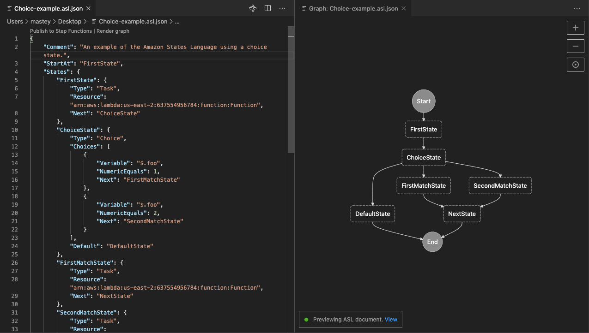

# AWS Toolkit

The _AWS Toolkit_, or simply the _Toolkit_, is an extension that enables you to interact with certain services of [Amazon Web Services (AWS)](https://aws.amazon.com/what-is-aws/) from within the VS Code editor.

The following screenshots show important parts of the Toolkit.

## Key UI components

### The AWS Explorer
The **AWS Explorer** provides access to the AWS services that you can work with when using the Toolkit. To see the **AWS Explorer**, choose the **AWS** icon in the **Activity bar**.   

### The AWS CDK Explorer

The **AWS CDK Explorer** enables you to work with AWS Cloud Development Kit (AWS CDK) applications. The tree view in the **AWS CDK Explorer (Preview)** pane offers a bird’s eye view of your applications, infrastructure stacks, resources, and policies. 

### AWS commands in the Command Palette

The Toolkit leverages Visual Studio Code's **Command Palette** to provide rapid access to [AWS-specific commands](#aws-commands).  

---

# Contents

-   [Feature overview](#feature-overview)
-   [Setup](#additional-setup-steps)
-   [Features](#features)
-   [Appendix A: AWS commands](#aws-commands)
-   [Appendix B: Get help](#get-help)

{ [Return to Top](#top) }

---

# Feature overview

You can use the AWS Toolkit to interact with several AWS resources in various ways.

These include the following:

-   AWS Serverless Applications

-   AWS Lambda functions

-   AWS CloudFormation stacks

-   AWS Cloud Development Kit (AWS CDK) applications

-   Amazon EventBridge schemas

-   Amazon Elastic Container Service (Amazon ECS) task definition files

-   AWS Step Functions state machines

See [Features](#features) below for high-level details, or jump right into the [_AWS Toolkit for Visual Studio Code User Guide_](https://docs.aws.amazon.com/console/toolkit-for-vscode/welcome).

{ [Return to Contents](#contents) } or { [Return to Top](#top) }

---

# Setup

To access most features of the AWS Toolkit, you must complete the steps defined in the [Setting Up](https://docs.aws.amazon.com/console/toolkit-for-vscode/getting-started) topic of the user guide.

These steps include the following:

1. Create an AWS account (see the [Prerequisites](https://docs.aws.amazon.com/console/toolkit-for-vscode/setup-toolkit#setup-prereq) in the user guide and also these [additional details](https://aws.amazon.com/premiumsupport/knowledge-center/create-and-activate-aws-account/))
1. Create and configure a set of AWS credentials (see [Establishing Credentials](https://docs.aws.amazon.com/toolkit-for-vscode/latest/userguide/establish-credentials.html) in the user guide)
1. Connect the Toolkit to AWS using those credentials (see [Connecting to AWS](https://docs.aws.amazon.com/console/toolkit-for-vscode/connect) in the user guide)

To use the Toolkit to develop [serverless applications with AWS](https://aws.amazon.com/serverless/), you must also [set up your toolchain](https://docs.aws.amazon.com/console/toolkit-for-vscode/setup-toolchain) and do the following on the local machine where the Toolkit is installed:

1. Install the AWS Command Line Interface (AWS CLI)
1. Install and start Docker (also see this general information about [Docker](https://docs.docker.com/install/))
1. Install the AWS SAM CLI

For complete setup instructions for these three components, see [Installing the AWS SAM CLI](https://docs.aws.amazon.com/serverless-application-model/latest/developerguide/serverless-sam-cli-install.html) in the _AWS Serverless Application Model (AWS SAM) Developer Guide_.

{ [Return to Contents](#contents) } or { [Return to Top](#top) }

---

# Features

-   [AWS Serverless Applications](#sam-and-lambda)
-   [AWS CDK applications](#cdk-apps)
-   [Amazon EventBridge schemas](#eventbridge)
-   [Amazon ECS task definition files](#ecs-files)
-   [AWS Step Functions](#sfn-files)

{ [Return to Contents](#contents) } or { [Return to Top](#top) }

---

##  AWS Serverless Applications 

The AWS Toolkit enables you to develop [AWS serverless applications](https://aws.amazon.com/serverless/) locally. It also allows you to use _CodeLens_&mdash;a Visual Studio Code feature&mdash;to do the following:
-   Use SAM (serverless application model) templates to build and debug your locally developed AWS serverless applications.
-   Run and debug specific [AWS Lambda](https://aws.amazon.com/lambda/) functions. 

After you've [created a serverless application](https://docs.aws.amazon.com/console/toolkit-for-vscode/create-sam), you can locally run and debug it using a SAM template. This YAML-formatted file describes resources such as functions, APIs, databases, and event-source mappings that make up a serverless application. 

To start debugging with a SAM template, choose `Add Debug Configuration` from the _CodeLens_ indicator in the template file.    

###### The _CodeLens_ indicator in the SAM template allows you to add a debug configuration for the serverless application.</h6>

Alternatively, you can run and debug just the AWS Lambda function and exclude other resources defined by the SAM template. Again, use a _CodeLens_ indicator for an AWS Lambda-function handler. (A _handler_ is a function that Lambda calls to start execution of a Lambda function.) 

###### The _CodeLens_ indicator in the application file lets you add a debug configuration for a selected AWS Lambda function.

When you run a debug session, the status and results are displayed in the **OUTPUT** panel when the **AWS Toolkit** output channel is selected.

###### After a local run is complete, the output appears in the **OUTPUT** tab.

When you're satisfied with performance, you can [deploy your serverless application](https://docs.aws.amazon.com/console/toolkit-for-vscode/deploy-serverless-app). During deployment, the SAM template is converted to a CloudFormation template, which is then used to configure all your application's resources in the AWS Cloud. 

### Additional information about CodeLenses 

The AWS Toolkit for Visual Studio Code supports _CodeLens_-enabled debugging for the following languages and runtimes: 

* C# (.NET Core 2.1)
* JavaScript (Node.js 10.x, 12.x)
* Python (2.7, 3.6, 3.7, 3.8)

For more information, see the [AWS Explorer](https://docs.aws.amazon.com/toolkit-for-vscode/latest/userguide/aws-explorer.html) in the Toolkit's user guide.

{ [Return to Features](#features) } or { [Return to Top](#top) }

---

## AWS CDK applications

The AWS Toolkit enables you to work with [AWS Cloud Development Kit (AWS CDK)](https://aws.amazon.com/cdk/) applications. Using the [AWS CDK Explorer](#ui-components-cdk-expl) on the Toolkit, you can view CDK applications within your Workspace that have been synthesized.

Example:

For full details, see the [AWS CDK Explorer](https://docs.aws.amazon.com/toolkit-for-vscode/latest/userguide/cdk-explorer.html) in the Toolkit's user guide.

{ [Return to Features](#features) } or { [Return to Top](#top) }

---

## Amazon EventBridge schemas

The AWS Toolkit provides support for [Amazon EventBridge](https://aws.amazon.com/eventbridge) schemas. Using the [AWS Explorer](#ui-components-aws-expl) of the Toolkit, you can perform the following operations on these schemas:

-   View an available schema
-   Search for an available schema
-   Generate code for an available schema

Example:

For full details, see [Working with Amazon EventBridge Schemas](https://docs.aws.amazon.com/console/toolkit-for-vscode/eventbridge-schemas) in the Toolkit's user guide.

{ [Return to Features](#features) } or { [Return to Top](#top) }

---

## Amazon ECS task definition files

The AWS Toolkit provides support for [Amazon Elastic Container Service (Amazon ECS)](https://aws.amazon.com/ecs). With the Toolkit installed in VS Code, IntelliSense functionality is provided for Amazon ECS task-definition files that you are updating in the editor.

Example:

For full details, see [Working with Amazon Elastic Container Service](https://docs.aws.amazon.com/toolkit-for-vscode/latest/userguide/ecs.html) in the Toolkit's user guide.

{ [Return to Features](#features) } or { [Return to Top](#top) }

---

## AWS Step Functions

The AWS Toolkit provides support for [AWS Step Functions](https://docs.aws.amazon.com/step-functions). With the Toolkit installed in VS Code, working with state machines is a more streamlined process.

-   Create, update, execute, and download state machines.
-   See live graph visualizations of your state machine.
-   Take advantage of features such as code completion and validation, and code snippets.

Example:

For full details, see [Working with AWS Step Functions](https://docs.aws.amazon.com/toolkit-for-vscode/latest/userguide/stepfunctions.html) in the Toolkit's user guide.

{ [Return to Features](#features) } or { [Return to Top](#top) }

---

# Appendix A: AWS commands

The AWS Toolkit has several features that you can access through the [Command Palette](#open-command-palette) (select **View**, then **Command Palette**):

| AWS Command                                            | Description                                                                                                                                                                                                                                                                                                    |
| :----------------------------------------------------- | :------------------------------------------------------------------------------------------------------------------------------------------------------------------------------------------------------------------------------------------------------------------------------------------------------------- |
| **AWS: About AWS Toolkit**                             | Displays information about the AWS Toolkit.                                                                                                                                                                                                                                                                    |
| **AWS: Connect to AWS**                                | Connects the Toolkit to an AWS account. For more information, see [Connecting to AWS](https://docs.aws.amazon.com/console/toolkit-for-vscode/connect) in the user guide.                                                                                                                                       |
| **AWS: Create a new Step Functions state machine**     | Generates a new Amazon States Language definition to use as the definition for a new Step Functions state machine. For more information, see [State Machine Templates](https://docs.aws.amazon.com//toolkit-for-vscode/latest/userguide/bulding-stepfunctions.html#templates-stepfunctions) in the user guide. |
| **AWS: Create a new Issue on Github**                  | Opens the AWS Toolkit's [New Issue page on Github](https://github.com/aws/aws-toolkit-vscode/issues/new/choose).                                                                                                                                                                                               |
| **AWS: Create Credentials Profile**                    | Creates an AWS credentials profile. For more information, see [Setting Up Your AWS Credentials](https://docs.aws.amazon.com/console/toolkit-for-vscode/setup-credentials) in the user guide.                                                                                                                   |
| **AWS: Create new SAM Application**                    | Generates a set of code files for a new AWS serverless application. For more information, see [Creating a Serverless Application](https://docs.aws.amazon.com/console/toolkit-for-vscode/create-sam) in the user guide.                                                                                        |
| **AWS: Deploy SAM Application**                        | Deploys a local serverless application to an AWS account. For more information, see [Deploying a Serverless Application](https://docs.aws.amazon.com/console/toolkit-for-vscode/deploy-serverless-app) in the user guide.                                                                                      |
| **AWS: Detect SAM CLI**                                | Checks whether the Toolkit can communicate correctly with the AWS SAM CLI that is installed.                                                                                                                                                                                                                   |
| **AWS: Focus on Explorer View**                        | Opens the **AWS: Explorer** Side Bar, which we will simply call [_the **AWS Explorer**_](#ui-components-aws-expl), and then moves the focus there.                                                                                                                                                             |
| **AWS: Hide region from the Explorer**                 | Hides an AWS Region from the **AWS Explorer**.                                                                                                                                                                                                                                                                 |
| **AWS: Publish state machine to Step Functions**       | Creates or updates a remote state machine using the local Amazon States Language definition file. For more information, see [Work With State Machines in VS Code](https://docs.aws.amazon.com/toolkit-for-vscode/latest/userguide/bulding-stepfunctions.html#starting-stepfunctions) in the user guide.        |
| **AWS: Render state machine graph**                    | Renders the state machine definition into a graph visualization. For more information, see [State Machine Graph Visualization](https://docs.aws.amazon.com//toolkit-for-vscode/latest/userguide/bulding-stepfunctions.html#bulding-stepfunctions-visualizations) in the user guide.                            |
| **AWS: Report an Issue**                               | In the [GitHub repository](https://github.com/aws/aws-toolkit-vscode) for the Toolkit, opens the page to [create a new issue](https://github.com/aws/aws-toolkit-vscode/issues/new/choose).                                                                                                                    |
| **AWS: Show region in the Explorer**                   | Displays an AWS Region in the **AWS Explorer**.                                                                                                                                                                                                                                                                |
| **AWS: Sign out**                                      | Disconnects the Toolkit from the currently-connected AWS account.                                                                                                                                                                                                                                              |
| **AWS: Submit Quick Feedback...**                      | Submit a private, one-way message and sentiment to the AWS Toolkit dev team. For larger issues that warrant conversations or bugfixes, please submit an issue in Github with the **AWS: Create a New Issue on Github** command.                                                                                |
| **AWS: View AWS Toolkit Logs**                         | Displays log files that contain general Toolkit diagnostic information.                                                                                                                                                                                                                                        |
| **AWS: View Quick Start**                              | Open this quick-start guide.                                                                                                                                                                                                                                                                                   |
| **AWS: View CDK Documentation**                        | Opens the [user guide](https://docs.aws.amazon.com/console/toolkit-for-vscode/aws-cdk-apps) for the CDK portion of the Toolkit.                                                                                                                                                                                |
| **AWS: View Toolkit Documentation**                    | Opens the [user guide](https://docs.aws.amazon.com/console/toolkit-for-vscode/welcome) for the Toolkit.                                                                                                                                                                                                        |
| **AWS: View Source on GitHub**                         | Opens the [GitHub repository](https://github.com/aws/aws-toolkit-vscode) for the Toolkit.                                                                                                                                                                                                                      |
| **Explorer: Focus on AWS CDK Explorer (Preview) View** | Opens the **Explorer** Side Bar and expands the **AWS CDK Explorer (Preview)** View.                                                                                                                                                                                                                           |

{ [Return to Contents](#contents) } or { [Return to Top](#top) }

---

# Appendix B: Get help

For additional details on how to use the AWS Toolkit, see the [user guide](https://docs.aws.amazon.com/console/toolkit-for-vscode/welcome).

To report issues with the Toolkit or to propose Toolkit code changes, see the [aws/aws-toolkit-vscode](https://github.com/aws/aws-toolkit-vscode) repository on GitHub.

You can also [contact AWS](https://aws.amazon.com/contact-us/) directly.

{ [Return to Contents](#contents) } or { [Return to Top](#top) }
