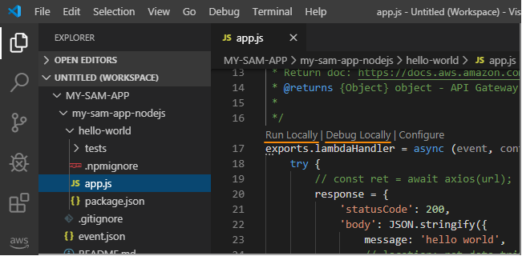

# AWS Toolkit for Visual Studio Code

The *AWS Toolkit for Visual Studio Code* is an extension that enables you to interact with certain services of [Amazon Web Services (AWS)](https://aws.amazon.com/what-is-aws/) from within the Visual Studio Code editor.

The following screenshots show important parts of the Toolkit.

### Fundamental UI Components

### AWS Commands in the Command Palette

___

# Contents

* [Features](#features)
* [Setup](#additional-setup-steps)
* [AWS Commands](#aws-commands)
* [Usage](#usage)
* [Get Help](#get-help)

{ [Return to Top](#top) }
___

# Features

You can use the AWS Toolkit for Visual Studio Code as follows:

* Develop serverless applications locally, and then deploy them to an AWS account (see [Usage](#usage))
* Manage certain supported AWS resources in an AWS account (see [Usage](#usage)).

  This includes:
  * Listing and deleting AWS CloudFormation stacks
  * Listing and invoking AWS Lambda functions

  For example:

  

{ [Return to Contents](#contents) } or { [Return to Top](#top) }
___

# Setup

After you install the AWS Toolkit for Visual Studio Code, to access most of its features, you must complete the additional steps defined in the [Getting Started](https://docs.aws.amazon.com/console/toolkit-for-vscode/getting-started) topic of the _AWS Toolkit for Visual Studio Code User Guide_. These additional steps include the following:

1. Create an AWS account (see the [Prerequisites](https://docs.aws.amazon.com/console/toolkit-for-vscode/setup-toolkit#setup-prereq) in the user guide and also these [additional details](https://aws.amazon.com/premiumsupport/knowledge-center/create-and-activate-aws-account/))
1. Create and configure a set of AWS credentials (see **Step 1** of [Managing AWS Resources](#managing-aws-resources))
1. Connect the Toolkit to AWS using those credentials (see **Step 2** of [Managing AWS Resources](#managing-aws-resources))

To use this Toolkit to develop [serverless applications with AWS](https://aws.amazon.com/serverless/), you must also do the following on the local machine where the Toolkit is installed:

1. Install the AWS Command Line Interface (AWS CLI)
1. Install and start Docker (also see this general information about [Docker](https://docs.docker.com/install/))
1. Install the AWS SAM CLI

See [Installing the AWS SAM CLI](https://docs.aws.amazon.com/serverless-application-model/latest/developerguide/serverless-sam-cli-install.html) for complete setup instructions for these three components.

{ [Return to Contents](#contents) } or { [Return to Top](#top) }
___

# AWS Commands

The AWS Toolkit for Visual Studio Code has several features that you can access through the [Command Palette](#open-command-palette) (select **View**, then **Command Palette**):

| AWS Command | Description |
| :---------- | :---------- |
| **AWS: Create Credentials Profile** | Creates an AWS credentials profile. For more information, see **Step 1** in [Managing AWS Resources](#managing-aws-resources). |
| **AWS: Connect to AWS** | Connects the Toolkit to an AWS account. For more information, see **Step 2** in [Managing AWS Resources](#managing-aws-resources). |
| **AWS: Create New SAM Application** | Generates a set of code files for a new AWS serverless application. For more information, see [Create a Serverless Application](#create-serverless-application). |
| **AWS: Deploy SAM Application** | Deploys a local serverless application to an AWS account. For more information, see [Deploy a Serverless Application](#deploy-serverless-application). |
| **AWS: Detect SAM CLI** | Checks whether the Toolkit can communicate correctly with the AWS SAM CLI that is installed. |
| **AWS: Focus on Explorer View** | Opens the **AWS: Explorer** Side Bar, which we will simply call [_the **AWS Explorer**_](#ui-components), and then moves the focus there. |
| **AWS: Hide region from the Explorer** | Hides an AWS Region from the **AWS Explorer**. |
| **AWS: Show region in the Explorer** | Displays an AWS Region in the **AWS Explorer**. |
| **AWS: Sign out** | Disconnects the Toolkit from the currently-connected AWS account. |
| **AWS: View AWS Toolkit Logs** | Displays log files that contain general Toolkit diagnostic information. |
| **AWS: View Quick Start** | Open this quick-start guide. |
| **AWS: View Documentation** | Opens the [user guide](https://docs.aws.amazon.com/console/toolkit-for-vscode/welcome) for the Toolkit. |
| **AWS: View Source on GitHub** | Opens the [GitHub repository](https://github.com/aws/aws-toolkit-vscode) for the Toolkit. |
| **AWS: Report an Issue** | In the [GitHub repository](https://github.com/aws/aws-toolkit-vscode) for the Toolkit, opens the page to [create a new issue](https://github.com/aws/aws-toolkit-vscode/issues/new/choose). |

{ [Return to Contents](#contents) } or { [Return to Top](#top) }
___

# Usage

* [Managing AWS Resources](#managing-aws-resources)
* [Developing Serverless Applications](#developing-serverless-applications)

{ [Return to Contents](#contents) } or { [Return to Top](#top) }

## Usage: Managing AWS Resources

### **Step 1**: Set Up a Credentials Profile
(*Note*: If you already have an AWS credentials profile, skip ahead to "**Step 2: Connect to an AWS Account**".)

For complete instructions, see [Setting Up Your AWS Credentials](https://docs.aws.amazon.com/console/toolkit-for-vscode/setup-credentials) in the _AWS Toolkit for Visual Studio Code User Guide_.

   In summary:
1. On the menu bar, choose **View, Command Palette**.
1. Begin typing: "**AWS: Create Credentials Profile**" and choose that command when you see it.
1. Follow the on-screen instructions to add an AWS credentials profile to your environment. 

`________________`

### **Step 2**: Connect to an AWS Account

For complete instructions, see [Connect to AWS](https://docs.aws.amazon.com/console/toolkit-for-vscode/connect) in the _AWS Toolkit for Visual Studio Code User Guide_ .

In summary:
1. On the menu bar, choose **View, Command Palette**.
1. Begin typing "**AWS: Connect to AWS**" and choose that command when you see it.
1. In the list of AWS credentials profiles, choose the profile that you want to use.

`________________`

### **Step 3**: Work with Available AWS Resources

For complete information, see [Working with AWS Services](https://docs.aws.amazon.com/console/toolkit-for-vscode/working-with-aws) in the _AWS Toolkit for Visual Studio Code User Guide_ .

1. If the **AWS Explorer** isn't showing, open it by choosing the **AWS** icon in the Activity Bar:
   
2. If you have existing resources in your AWS account but they aren't being displayed in the **AWS Explorer** (and assuming that your credentials and a connection have been set up properly), choose the **Refresh** icon in the **AWS Explorer** to show them. 
3. Expand the AWS Region that contains the resource that you want to manage.

   (**Note**: To show or hide AWS regions, choose **View, Command Palette** on the menu bar, and then choose **AWS: Show region in the Explorer** or **AWS: Hide region from the Explorer**.)
4. Expand the supported AWS service that contains the resource that you want to manage.

   (**Note**: Not all services are currently supported.)
5. If applicable, expand the parent resource that contains the child resource that you want to manage.
6. Open the context menu of the resource you want to manage and choose one of the available actions.

   (**Note**: Not all service actions are currently supported.)

{ [Return to Usage](#usage) }

## Usage: Developing Serverless Applications

You can use the AWS Toolkit for Visual Studio Code to create, run, debug, and deploy serverless applications.

* [Create a Serverless Application](#create-serverless-application)
* [Run or Debug a Serverless Application](#run-debug-serverless-application)
* [Deploy a Serverless Application](#deploy-serverless-application)

{ [Return to Usage](#usage) }

### **Step 1**: Create a Serverless Application

For complete instructions, see [Creating a Serverless Application](https://docs.aws.amazon.com/console/toolkit-for-vscode/create-sam) in the _AWS Toolkit for Visual Studio Code User Guide_.

In summary:
1. On the menu bar, choose **View, Command Palette**.
1. Begin typing "**AWS: Create new SAM Application**" and choose that command when you see it.

   

1. Follow the on-screen instructions to finish creating the SAM application, including:

   1. Choosing the application runtime.
   1. Selecting or creating a workspace folder for the project.
   1. Entering a name for the application

   The Toolkit produces the application code and files, adds them to the location you specified, and opens the `template.yaml` file in the editor.

   

{ [Return to Developing](#developing-serverless-applications) } or { [Return to Usage](#usage) }

`________________`

### **Step 2**: Run or Debug the Serverless Application

For complete instructions, see [Run and Debug Your Serverless Application](https://docs.aws.amazon.com/console/toolkit-for-vscode/create-sam#run-debug-sam-app) in the _AWS Toolkit for Visual Studio Code User Guide_.

In summary:
1. Select the **AWS** icon in the Activity Bar, , to ensure that the AWS Toolkit for Visual Studio Code is running.
1. Select the Project icon in the Activity Bar, , go to the `hello-world` directory, and open `app.js`.
1. Select the **Run Locally** CodeLens. (Or, if needed, first select the **Configure** link from the Codelenses, enter event data in `templates.json`, save, and _then_ select the **Run Locally** CodeLens.)

   

1. Note the run status and results in the **OUTPUT** panel.

   

#### Additional Information
After you choose the **AWS** icon in the Activity Bar, CodeLenses appear in serverless-application code files above certain functions. The functions that have these Codelenses are those that use AWS Lambda-function handler syntax. A _handler_ is a function that Lambda calls to start execution of a Lambda function. These CodeLenses enable you to locally run or debug the corresponding serverless application. CodeLens actions in the Toolkit include:

* **Configure**, for specifying function configurations such as an event payload and environment variable overrides.
* **Run Locally**, for running the function _without_ debugging.
* **Debug Locally**, for running the function _with_ debugging.

(For general information about running and debugging in VS Code, see [Debugging](https://code.visualstudio.com/docs/editor/debugging) on the VS Code website.)

For information about how to work with remote versions of Lambda functions, see [Interacting with Remote Lambda Functions](https://docs.aws.amazon.com/console/toolkit-for-vscode/remote-lambda) in the _AWS Toolkit for Visual Studio Code User Guide_.

{ [Return to Developing](#developing-serverless-applications) } or { [Return to Usage](#usage) }

`________________`

### **Step 3**: Deploy the Serverless Application

(_Note_: This procedure uses an Amazon S3 bucket in your AWS account. You can create a bucket ahead of time (see [How Do I Create an S3 Bucket](https://docs.aws.amazon.com/AmazonS3/latest/user-guide/create-bucket.html) in the _Amazon Simple Storage Service Console User Guide_) or run an AWS CLI command that the Toolkit will give you during the procedure, then restart the procedure.)

For complete instructions, see [Deploying a Serverless Application](https://docs.aws.amazon.com/console/toolkit-for-vscode/deploy-serverless-app) in the _AWS Toolkit for Visual Studio Code User Guide_.

In summary:

1. On the menu bar, choose **View, Command Palette**.
1. Begin typing "**AWS: Deploy SAM Application**" and choose that command when you see it.

   
1. Follow the on-screen instructions to finish deploying the serverless application, including:
    
   1. Choosing the SAM template file that corresponds with the serverless application you want to deploy.
   1. Choosing the AWS Region you want to deploy to.
   1. Specifying the name of an Amazon S3 bucket in the AWS account that the Toolkit will use for packaging and deploying the serverless application. The bucket must exist within the AWS Region that you chose in the previous step.
   1. Specifying a name for the AWS CloudFormation stack to which the serverless application will be deployed.

1. Note the status and results in the **OUTPUT** panel. The serverless application is deployed to an AWS CloudFormation stack. If the stack already exists, it is updated; otherwise, a new stack is created. Within a few minutes, the Toolkit displays a deployment success or failure message.

   

1. In the **AWS Explorer**, expand the AWS Region that contains the stack, then expand **CloudFormation**. Expand the stack that you want to manage and open the context menu of its resources.

   For example:

   

{ [Return to Developing](#developing-serverless-applications) } or { [Return to Usage](#usage) }
___

# Get Help

For additional details on how to use the AWS Toolkit for Visual Studio Code, see the [user guide](https://docs.aws.amazon.com/console/toolkit-for-vscode/welcome).

To report issues with the AWS Toolkit for Visual Studio Code or to propose Toolkit code changes, see the [aws/aws-toolkit-vscode](https://github.com/aws/aws-toolkit-vscode) repository on GitHub.

You can also [contact AWS](https://aws.amazon.com/contact-us/) directly.

{ [Return to Contents](#contents) } or { [Return to Top](#top) }
