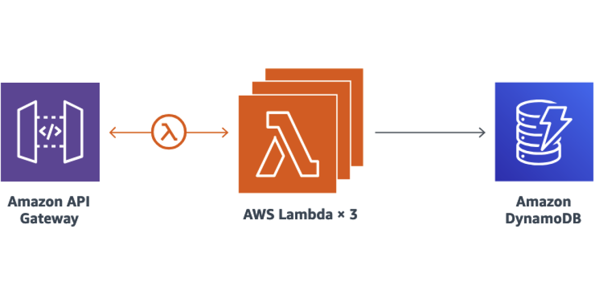
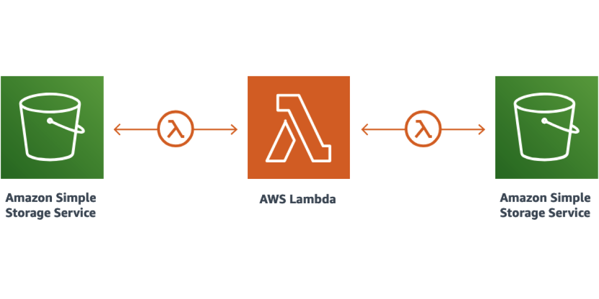
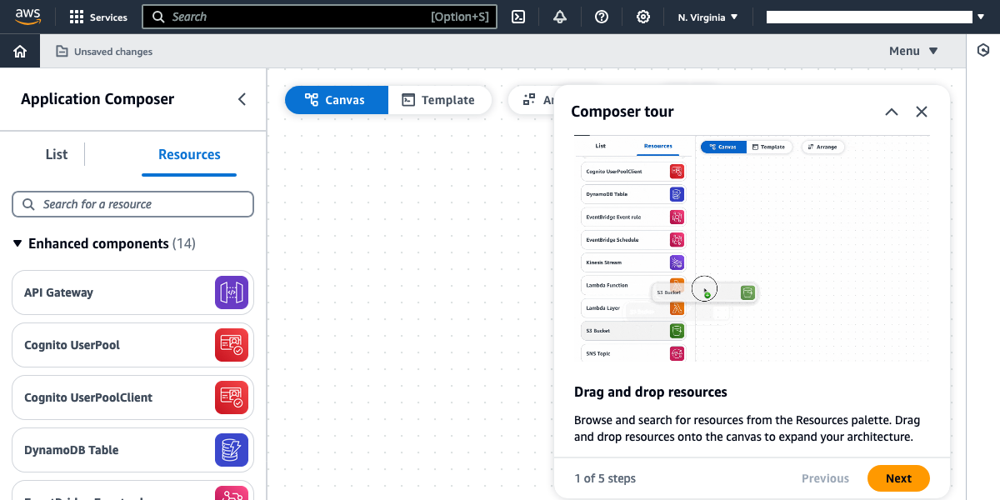
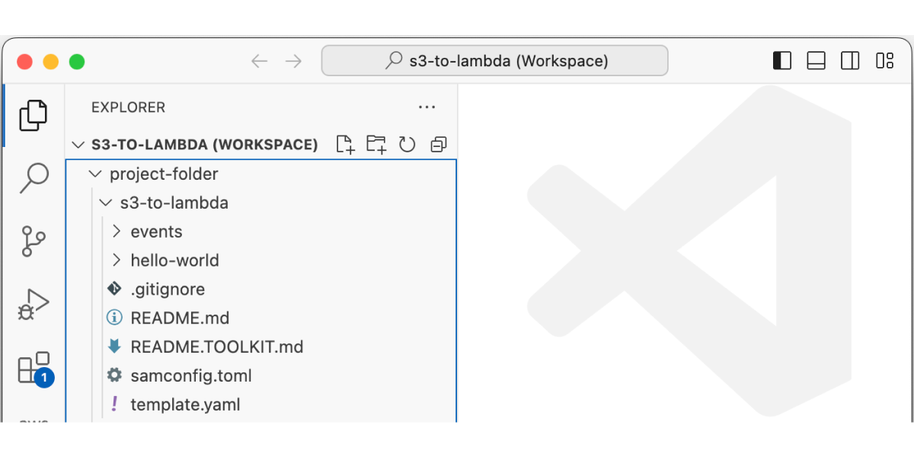

<checklist>
	

		<checkbox when-checked="command:aws.toolkit.lambda.setWalkthroughToAPI" checked-on="aws.toolkit.lambda.walkthroughSelected == 'API'">
			
			Rest API
		</checkbox>
		<checkbox when-checked="command:aws.toolkit.lambda.setWalkthroughToS3" checked-on="aws.toolkit.lambda.walkthroughSelected == 'S3'">
			
			File processing
		</checkbox>
	

	

		<checkbox when-checked="command:aws.toolkit.lambda.setWalkthroughToVisual" checked-on="aws.toolkit.lambda.walkthroughSelected == 'Visual'">
			
			New template with visual builder
		</checkbox>
		<checkbox when-checked="command:aws.toolkit.lambda.setWalkthroughToCustomTemplate" checked-on="aws.toolkit.lambda.walkthroughSelected == 'CustomTemplate'">
			
			Current workspace template
		</checkbox>
	

</checklist>
<checkbox class="theme-picker-link" when-checked="command:aws.toolkit.lambda.createServerlessLandProject" checked-on="false">
	See more application example...
</checkbox>
