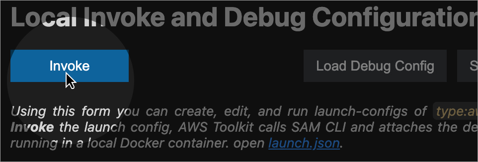

<h2 id="build-your-code">Build your code</h2>
Compile your code and install dependencies with SAM CLI so you can invoke it locally.

<h2 id="select-function-to-invoke">Select function to invoke</h2>
Find the function you want to invoke in Application Builder and use the icon to open the invoke and debug view.

<h2 id="invoke-your-function">Invoke your function</h2>
Configure a payload to use for invoking your function.

<h2 id="view-your-execution-results">View your execution results</h2>
The VS Code panel will display the results of your invocation.

