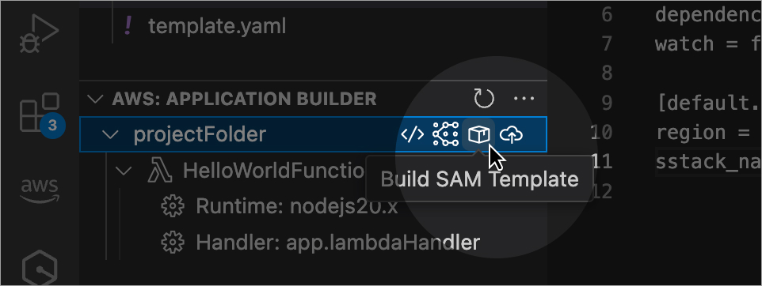
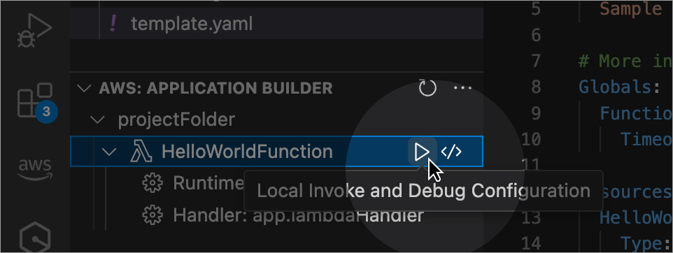
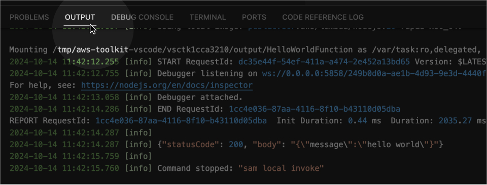

<h2 id="build-your-code">Build your code</h2>

 
<h2 id="select-function-to-invoke">Select function to invoke</h2>

 
<h2 id="invoke-your-function">Invoke your function</h2>

 
<h2 id="view-your-execution-results">View your execution results</h2>

