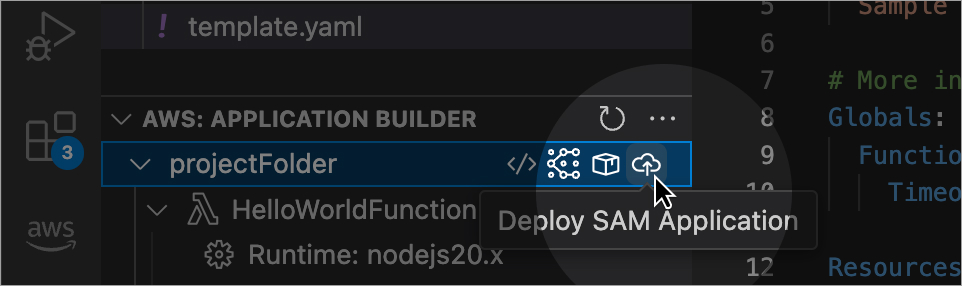
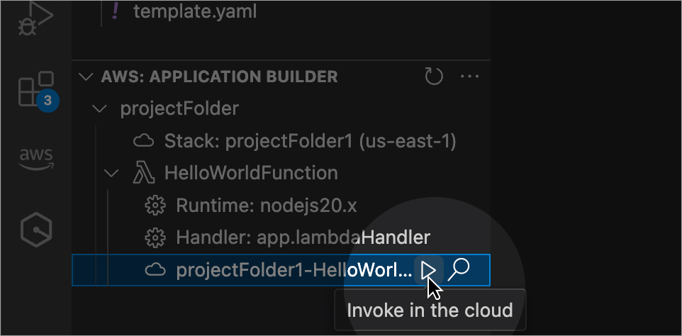
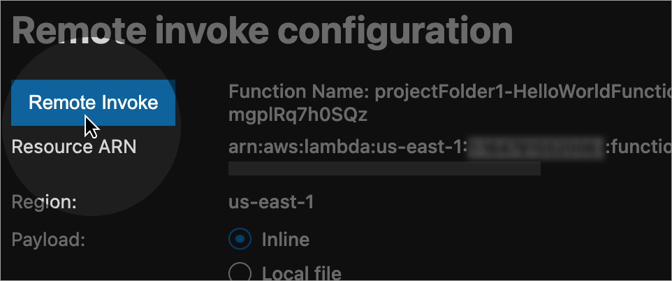
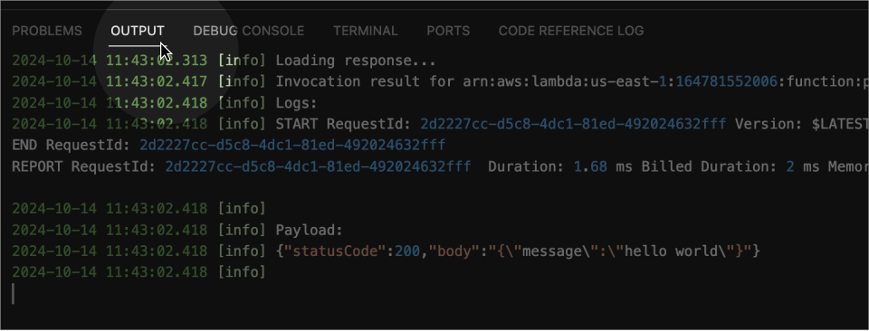

<h2 id="deploy-your-application">Deploy your application</h2>

 
<h2 id="select-deployed-function-to-invoke">Select deployed function to invoke</h2>

 
<h2 id="invoke-your-function-with-a-payload">Invoke your function with a payload</h2>

 
<h2 id="view-your-execution-result-in-the-output-panel">View your execution result in the output panel</h2>

