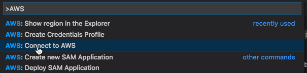
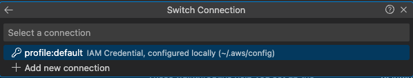
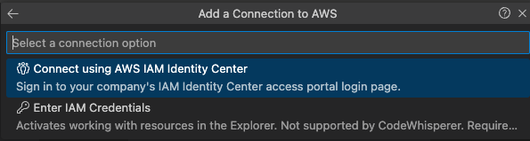
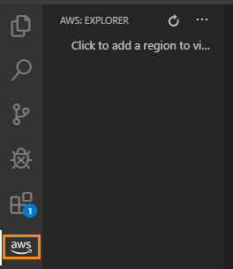
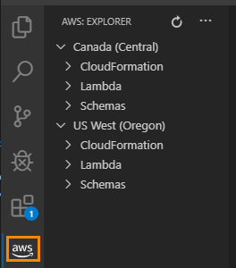

# Connect to AWS

To interact with Amazon Web Services \(AWS\) through the AWS Toolkit for Visual Studio Code, you must establish a connection to AWS\.

## How to connect

Choose the most appropriate method based on your requirements.

-   [AWS access keys](https://docs.aws.amazon.com/toolkit-for-vscode/latest/userguide/obtain-credentials.html)
-   [IAM Identity Center](https://docs.aws.amazon.com/toolkit-for-vscode/latest/userguide/sso-credentials.html)
-   [External credentials](https://docs.aws.amazon.com/toolkit-for-vscode/latest/userguide/external-credential-process.html)

## Connect to AWS through the Toolkit for VS Code

1. [Click here](command:aws.toolkit.login) to open the configuration wizard to connect to AWS.

    > This command can also be accessed through the [Command Palette](https://docs.aws.amazon.com/toolkit-for-vscode/latest/userguide/toolkit-navigation.html#command-locations) by choosing **AWS: >Connect to AWS**\.
    >
    > 

2. Choose a connection from the list\.

    

    If you don't have a connection set up, you are prompted to set one up\. Choose **Enter IAM Credentials** in order to view resources in the AWS Explorer. SSO connections cannot be used to view resources in the AWS Explorer at this time.

    

    > **Note**
    >
    > If you want to provide an external credential process instead of using AWS\-supported credentials, exit the wizard and see [Using an external credential process](https://docs.aws.amazon.com/toolkit-for-vscode/latest/userguide/external-credential-process.html) instead\.

3. Open the **AWS: Explorer** Side Bar, which we call the **_AWS Explorer_**, to verify the connection\. You will see either a list of AWS Regions \(if you have made any Regions visible in the **AWS Explorer**\) or a message to add Regions to the **AWS Explorer**\.

    Before adding to the **AWS Explorer**, you see the following\.

    

    After adding Regions to the **AWS Explorer**, you see something like the following\.

    
