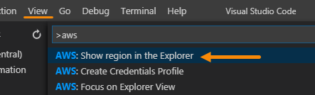
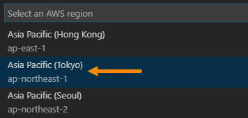
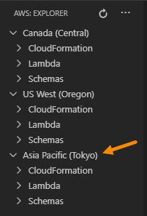
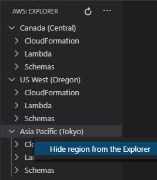

# Change AWS Regions

When you set up your credentials, the AWS Toolkit for Visual Studio Code automatically selects and shows the default AWS Region for those credentials in the **AWS Explorer**\. This walkthrough describes how to change the list of Regions that is shown in the **AWS Explorer**\.

## Add a Region to the AWS Explorer

1. [Click here](command:aws.toolkit.showRegion) to select a Region to add or remove.

    > This command can also be accessed through the [Command Palette](https://docs.aws.amazon.com/toolkit-for-vscode/latest/userguide/toolkit-navigation.html#command-locations) by choosing **AWS: Show or Hide Regions**\.
    >
    > 

2. Choose one or more regions to add to the **AWS Explorer**\.

    

3. Verify that the regions appear in the **AWS Explorer**\.

    

## Hide a Region from the AWS Explorer

You can hide a region by using the same command, **AWS: Show or Hide Regions**\. Unselect one or more regions in the menu, then choose OK.

