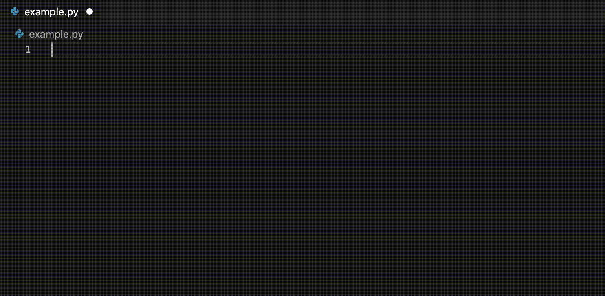

## Using Amazon CodeWhisperer

CodeWhisperer uses machine learning to generate code suggestions from the existing code and comments in your IDE. Supported languages include **Java, Python, JavaScript, C# , TypeScript, C, C++, Go, Rust, PHP, Scala, Kotlin, Ruby, Shell and SQL**.

---

**Navigating with the tab and arrow keys**

As you enter your code, CodeWhisperer will offer inline code suggestions. Use **TAB to accept** a suggestion. CodeWhisperer may provide multiple suggestions to choose from. Use **[left arrow] and [right arrow] to navigate** between suggestions.

If you don’t like the suggestions you see, keep typing (or hit ESC). The suggestions will disappear, and CodeWhisperer will generate new ones at a later point based on the additional context.

---

**Requesting suggestions manually**

You can request suggestions at any time. Use **Option-C** on Mac or **ALT-C** on Windows. After you receive suggestions, use TAB to accept and arrow keys to navigate.

---

**Customizing keyboard shortcuts**

You can change CodeWhisperer keyboard shortcuts in [Keyboard Shortcuts Editor](https://code.visualstudio.com/docs/getstarted/keybindings). To open Keyboard Shortcuts Editor, go to Settings, and click on Keyboard shortcuts.

---

**Getting the best recommendations**

For best results, follow these practices.

-   Give CodeWhisperer something to work with. The more code your file contains, the more context CodeWhisperer has for generating recommendations.
-   Write descriptive comments. “Function to upload a file to S3” will get better results than “Upload a file”.
-   Specify the libraries you prefer by using import statements.
-   Use descriptive names for variable and functions. A function called “upload_file_to_S3” will get better results than a function called “file_upload”.
-   Break down complex tasks into simpler tasks.

---

**Further reading**

To learn more about working with CodeWhisperer and VS Code, see [CodeWhisperer for VS Code](https://docs.aws.amazon.com/toolkit-for-vscode/latest/userguide/codewhisperer.html).

---

**Providing feedback**

CodeWhisperer is in preview. Let us know what you think by sharing feedback (using the AWS Toolkit feedback button) or by reaching out to [codewhisperer@amazon.com](mailto:codewhisperer@amazon.com).
