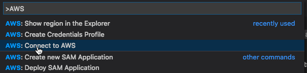

# Connect to AWS

To interact with Amazon Web Services \(AWS\) through the AWS Toolkit for Visual Studio Code, you must establish a connection to AWS\.

## Prerequisties

-   An AWS account. This account enables you to use AWS services. To get an AWS account, on the [AWS home page](https://aws.amazon.com), choose `Create an AWS Account`.
-   [AWS credentials](https://docs.aws.amazon.com/toolkit-for-vscode/latest/userguide/obtain-credentials.html). You can obtain credentials through AWS or an external credential process that isn't directly supported by AWS.

## Connect to AWS through the Toolkit for VS Code

1. [Click here](command:aws.login) to open the configuration wizard to connect to AWS.

    > This command can also be accessed through the [Command Palette](https://docs.aws.amazon.com/toolkit-for-vscode/latest/userguide/toolkit-navigation.html#command-locations) by choosing **AWS: >Connect to AWS**\.
    >
    > 

2. Choose a profile from the list\.

    

    If you don't have a credentials profile set up, you are prompted to set one up\. Look for a pop\-up in the lower\-right corner of the editor\. Choose **Yes**, and then follow the setup wizard to enter a profile name, your access key ID, and your secret access key\.

    

    > **Note**
    >
    > If you want to provide an external credential process instead of using AWS\-supported credentials, choose **No** and see [Using an external credential process](https://docs.aws.amazon.com/toolkit-for-vscode/latest/userguide/external-credential-process.html) instead\.

3. Open the **AWS: Explorer** Side Bar, which we call the **_AWS Explorer_**, to verify the connection\. You will see either a list of AWS Regions \(if you have made any Regions visible in the **AWS Explorer**\) or a message to add Regions to the **AWS Explorer**\.

    Before adding to the **AWS Explorer**, you see the following\.

    

    After adding Regions to the **AWS Explorer**, you see something like the following\.

    
