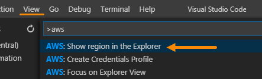
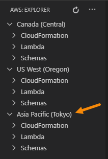

# Change AWS Regions

When you set up your credentials, the AWS Toolkit for Visual Studio Code automatically selects and shows the default AWS Region for those credentials in the **AWS Explorer**\. This walkthrough describes how to change the list of Regions that is shown in the **AWS Explorer**\.

## Add a Region to the AWS Explorer

1. [Click here](command:aws.showRegion) to select a Region to add.

    > This command can also be accessed through the [Command Palette](https://docs.aws.amazon.com/toolkit-for-vscode/latest/userguide/toolkit-navigation.html#command-locations) by choosing **AWS: Show Region in the Explorer**\.
    >
    > 

2. Choose the Region that you want to add to the **AWS Explorer**\.

    

    > **Note**
    >
    > The list contains only those Regions that are available to add to the **AWS Explorer**\. Regions you've already added don't appear in the list\.

3. Verify that the Region now appears in the **AWS Explorer**\.

    

## Hide a Region from the AWS Explorer

You can hide a Region by right clicking it in the AWS Explorer and selecting **Hide Region from the Explorer**.

