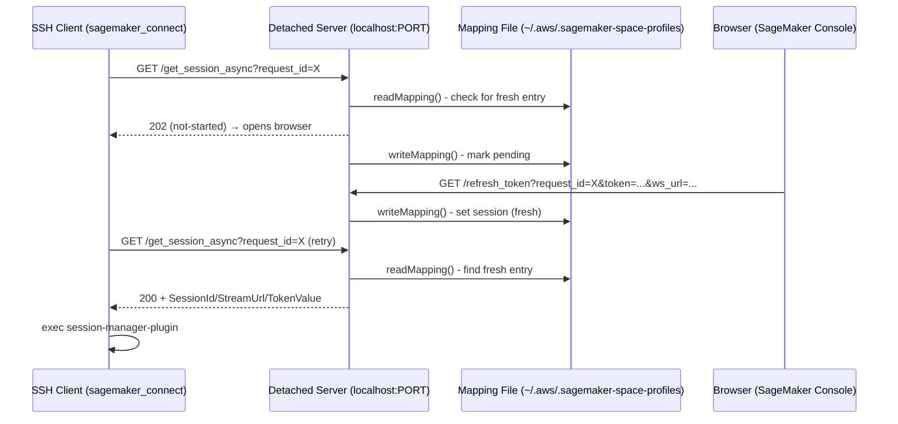

# SageMaker Deeplink Reconnection Failure Analysis

## Executive Summary

The SageMaker deeplink reconnection flow has **8 distinct failure modes**, most of which result in silent failures or unrecoverable states. The architecture relies on a file-backed session store (`~/.aws/.sagemaker-space-profiles`) polled by a bash script, with a browser-based OAuth-style callback writing session tokens back. The core issues are: no TTL/cleanup for `pending` entries, read-then-write race conditions on the mapping file, a hard 40s polling ceiling, and no mechanism to survive a server port change.

## Architecture Overview



---

## Failure Scenario Analysis

### 1. Browser callback arrives AFTER the 40s polling timeout

**Polling budget:** `sagemaker_connect` lines 46-70: `max_retries=8`, `retry_interval=5` → **40 seconds max**.

**Code path:**

```
sagemaker_connect:46   local max_retries=8
sagemaker_connect:47   local retry_interval=5
sagemaker_connect:49   while (( attempt <= max_retries )); do
sagemaker_connect:56       elif [[ "$http_status" -eq 202 || "$http_status" -eq 204 ]]; then
sagemaker_connect:57           sleep $retry_interval
sagemaker_connect:58           ((attempt++))
sagemaker_connect:65   echo "Error: Timed out after $max_retries attempts..."
sagemaker_connect:66   exit 1
```

**What happens:**
1. `getSessionAsync.ts:82-83` — server returns `202` and calls `store.markPending()` on the first poll.
2. The bash script polls 8 times (getting `204` for pending status from `getSessionAsync.ts:44-47`).
3. After 40s, `sagemaker_connect:65-66` — script exits with error code 1.
4. The browser callback (`refreshToken.ts:37`) eventually calls `store.setSession()` which writes a `fresh` entry.
5. **The `fresh` entry is orphaned** — no consumer will ever read it. It persists in the mapping file forever.

**Impact:** SSH connection fails. The `fresh` session token leaks into the mapping file permanently. On next reconnect, a *new* `request_id` is generated (`sagemaker_connect:43`: `date +%s%3N`), so the orphaned entry is never found.

---

### 2. Detached server restarts between disconnect and reconnect (port changes)

**Code path:**

```
sagemaker_connect:96-102  — reads port from $SAGEMAKER_LOCAL_SERVER_FILE_PATH
    LOCAL_ENDPOINT_PORT=$(jq -r '.port' "$SAGEMAKER_LOCAL_SERVER_FILE_PATH")
```

```
getSessionAsync.ts:72-76  — reads port from same file at callback-URL construction time:
    const serverInfo = await readServerInfo()
    ...`http://localhost:${serverInfo.port}/refresh_token`
```

**What happens:**
1. Server starts on port A, writes port A to the server info file.
2. Server crashes/restarts, gets port B, overwrites the server info file with port B.
3. `sagemaker_connect:96-102` reads port B (correct — it reads at connect time).
4. But if a previous reconnection was in-flight:
   - The browser callback URL was constructed with port A (`getSessionAsync.ts:76`).
   - Browser sends callback to `localhost:A` — **connection refused**. The `pending` entry is never resolved.
5. Even for new connections: the mapping file entries from the old server instance remain. `initial-connection` entries with status `consumed` or `fresh` from the old session are stale.

**Impact:** Any in-flight reconnection permanently stalls. The `pending` entry is never cleaned up (see scenario 4). The browser shows a success page but the SSH tunnel never establishes.

---

### 3. Multiple simultaneous reconnection attempts (SSH retries)

**Code path:**

```
sagemaker_connect:43   local request_id=$(date +%s%3N)
```

Each SSH retry spawns a new `sagemaker_connect` process with a **different `request_id`** (millisecond timestamp).

```
getSessionAsync.ts:49-52  — status check for specific request_id:
    const status = await store.getStatus(connectionIdentifier, requestId)
    if (status === 'pending') { res.writeHead(204) }
    else if (status === 'not-started') { ... opens browser }
```

**What happens:**
1. SSH retry #1: `request_id=1682345001000` → status is `not-started` → opens browser → marks pending.
2. SSH retry #2 (concurrent): `request_id=1682345001050` → status is `not-started` → opens browser **again** → marks pending.
3. SSH retry #3: `request_id=1682345001100` → same pattern.

Each attempt:
- Opens a **new browser tab** (`getSessionAsync.ts:78`: `await open(url)`).
- Creates a **separate `pending` entry** in the mapping file (`sessionStore.ts:79-88`).
- The browser callback writes back with the specific `request_id` it was given.

**Race condition on mapping file:**

```
sessionStore.ts:79   async markPending(connectionId, requestId) {
sessionStore.ts:80       const mapping = await readMapping()    // READ
sessionStore.ts:88       entry.requests[requestId] = { ... }
sessionStore.ts:91       await writeMapping(mapping)            // WRITE
```

Multiple concurrent `markPending` calls each do read-modify-write. The `WriteQueue` (`writeQueue.ts`) serializes *writes* but NOT *reads*. Two calls can both read the same state, then write sequentially — **the second write overwrites the first's pending entry**.

**Detailed race:**
```
Time 0: Request A reads mapping {requests: {}}
Time 1: Request B reads mapping {requests: {}}
Time 2: Request A writes mapping {requests: {A: pending}}  (via WriteQueue)
Time 3: Request B writes mapping {requests: {B: pending}}  (via WriteQueue — OVERWRITES A's entry)
```

Result: Request A's `pending` entry is lost. When the browser callback for A arrives, `setSession` will fail with `No mapping found` or silently create a new entry that nobody polls for.

**Impact:** Multiple browser tabs open. Mapping file entries can be lost due to read-modify-write races. Only the last SSH retry has a chance of succeeding. All others leave orphaned `pending` entries (or lose them entirely).

---

### 4. `pending` state never cleaned up if browser callback never arrives

**Code path — where `pending` is created:**

```
sessionStore.ts:79-91   markPending() — creates entry with status: 'pending'
```

**Code path — where `pending` could be cleaned up:**

```
sessionStore.ts:93-104   cleanupExpiredConnection() — deletes ENTIRE connectionId entry
                          Only called from getSessionAsync.ts:57-63 for SMUS connections
```

**There is NO cleanup path for `pending` entries.** Searching the entire codebase:

- `markPending` sets `status: 'pending'` — `sessionStore.ts:87`
- `markConsumed` sets `status: 'consumed'` — `sessionStore.ts:72`
- `setSession` sets `status: 'fresh'` (or provided status) — `sessionStore.ts:112`
- `cleanupExpiredConnection` deletes the whole connection — `sessionStore.ts:98`
- **No TTL, no expiry check, no periodic cleanup, no `pending` → timeout transition.**

**What happens:**
1. `getSessionAsync.ts:82-83` marks entry as `pending`.
2. Browser never calls back (user closes tab, network error, browser blocks popup).
3. The `pending` entry persists in `~/.aws/.sagemaker-space-profiles` **forever**.
4. On next reconnect attempt with a *new* `request_id`, `getStatus()` returns `not-started` for the new ID (correct), but the old `pending` entry remains as dead weight.
5. Over time, the mapping file accumulates unbounded `pending` entries.

**Impact:** Mapping file grows unboundedly. No functional impact on *new* connections (they use new `request_id`s), but the file becomes increasingly large and slow to parse.

---

### 5. `initial-connection` consumed but no new `request_id` entry exists

**Code path:**

```
sessionStore.ts:24-42   getFreshEntry():
    L33: const initialEntry = requests['initial-connection']
    L34: if (initialEntry?.status === 'fresh') {
    L35:     await this.markConsumed(connectionId, 'initial-connection')
    L36:     return initialEntry
    L37: }
    L39: const asyncEntry = requests[requestId]
    L40: if (asyncEntry?.status === 'fresh') {
    L41:     delete requests[requestId]
    L42:     await writeMapping(mapping)
    L43:     return asyncEntry
    L44: }
    L46: return undefined
```

```
getSessionAsync.ts:30-83:
    L30: const freshEntry = await store.getFreshEntry(connectionIdentifier, requestId)
    L32: if (freshEntry) { ... return 200 }
    L40: // freshEntry is undefined, fall through
    L42: const status = await store.getStatus(connectionIdentifier, requestId)
    L43: if (status === 'pending') { return 204 }
    L44: else if (status === 'not-started') { ... open browser }
```

**What happens:**
1. First connection succeeds: `initial-connection` is `fresh` → consumed on first poll.
2. SSH disconnects, SSH client retries with `sagemaker_connect`.
3. New `request_id` generated (`sagemaker_connect:43`).
4. `getFreshEntry()`:
   - `initial-connection` status is `consumed` → skip (L34 fails).
   - `requests[new_request_id]` doesn't exist → `asyncEntry` is `undefined` (L39).
   - Returns `undefined` (L46).
5. `getStatus()`:
   - `entry.requests?.[requestId]?.status` → `undefined` (no entry for new request_id).
   - Returns `'not-started'` (L56: `status ?? 'not-started'`).
6. Falls into the `not-started` branch → opens browser for re-auth.

**This is actually the intended reconnection flow.** The `consumed` initial-connection correctly forces a re-authentication via browser. **No bug here**, but the naming is confusing — `not-started` is a synthetic status derived from absence, not an explicit state.

---

### 6. Race condition between connect script polling and browser callback writing

**Code path — polling side (every 5s):**

```
sagemaker_connect:49-63   curl → GET /get_session_async
    → getSessionAsync.ts:30   store.getFreshEntry()
        → sessionStore.ts:25  readMapping()          // FILE READ
        → sessionStore.ts:35  this.markConsumed()    // FILE READ + WRITE
```

**Code path — browser callback (any time):**

```
refreshToken.ts:37   store.setSession()
    → sessionStore.ts:106  readMapping()              // FILE READ
    → sessionStore.ts:115  writeMapping(mapping)      // FILE WRITE
```

**The race:**

```
Time 0: Poll reads mapping: {requests: {R1: {status: 'pending'}}}
Time 1: Browser callback reads mapping: {requests: {R1: {status: 'pending'}}}
Time 2: Browser callback writes: {requests: {R1: {status: 'fresh', token: 'abc'}}}
Time 3: Poll's getFreshEntry() sees the in-memory snapshot from Time 0
        → R1 is still 'pending' in its copy → returns undefined
        → Returns 204 to bash script
Time 4: Next poll (5s later) reads fresh mapping → finds 'fresh' → returns 200
```

This is a **benign race** — it causes one wasted poll cycle (5s delay). The `WriteQueue` serializes writes within the same process, but the *read* at Time 0 is not protected. However, since the bash script retries every 5s, this only adds a single retry delay.

**Worse race — `getFreshEntry` consuming while `setSession` writes:**

```
Time 0: getFreshEntry reads mapping (initial-connection is 'fresh')
Time 1: setSession reads mapping (initial-connection is 'fresh')
Time 2: getFreshEntry calls markConsumed → writes {initial-connection: 'consumed'}
Time 3: setSession writes {R1: 'fresh'} BUT its base snapshot still has
         {initial-connection: 'fresh'} → overwrites consumed back to fresh!
```

The `WriteQueue` is a **module-level singleton** (`utils.ts:11`), so writes within the same server process are serialized. But the reads are NOT queued. `setSession` at Time 1 reads stale data, then when its write executes after Time 2, it **reverts the consumed status back to fresh**.

**Impact:** `initial-connection` could be served twice (once as fresh, then reverted to fresh and served again). This means the same SSM session token could be used by two SSH connections simultaneously, causing undefined behavior in session-manager-plugin.

---

### 7. Mapping file corrupted or partially written

**Code path — write mechanism:**

```
utils.ts:107-118   writeMapping():
    L112: const uniqueTempPath = `${tempFilePath}.${process.pid}.${Date.now()}`
    L114: await fs.writeFile(uniqueTempPath, json)
    L115: await fs.rename(uniqueTempPath, mappingFilePath)
```

**Atomic rename protects against partial writes** — `fs.rename` on the same filesystem is atomic on Linux/macOS. The temp file has a unique name per PID+timestamp, preventing conflicts.

**However, `readMapping` has NO error recovery:**

```
utils.ts:86-93   readMapping():
    L88: const content = await fs.readFile(mappingFilePath, 'utf-8')
    L90: return JSON.parse(content)
    L91: catch (err) {
    L92:     throw new Error(`Failed to read mapping file: ...`)
```

**What happens if corruption occurs:**
1. If `fs.rename` fails mid-operation (disk full, permissions): the temp file exists but the mapping file is unchanged → **safe, old data preserved**.
2. If the mapping file is externally modified (user edits, another tool): `JSON.parse` throws → `readMapping` throws → every `SessionStore` method throws → `getSessionAsync.ts:85` catches and returns `500`.
3. The bash script receives a non-200/202/204 status → `sagemaker_connect:60-63` exits with error.

**Impact:** Any mapping file corruption is **unrecoverable without manual intervention**. The server returns 500 on every request until the file is fixed. There is no fallback, no auto-repair, no backup.

**Edge case — bash script reads server info file while it's being written:**

```
sagemaker_connect:97   LOCAL_ENDPOINT_PORT=$(jq -r '.port' "$SAGEMAKER_LOCAL_SERVER_FILE_PATH")
```

The server info file write is NOT atomic (not checked, but `readServerInfo` in `utils.ts` does a simple `fs.readFile`). If `jq` reads a partially-written file, it could get invalid JSON → `jq` outputs `null` → `sagemaker_connect:98-100` catches this and exits.

---

### 8. Detached server not running when connect script executes

**Code path:**

```
sagemaker_connect:96-102:
    L96: if [ -z "$SAGEMAKER_LOCAL_SERVER_FILE_PATH" ]; then
    L97:     echo "[Error] SAGEMAKER_LOCAL_SERVER_FILE_PATH is not set"
    L98:     exit 1
    L100: if [ ! -f "$SAGEMAKER_LOCAL_SERVER_FILE_PATH" ]; then
    L101:     echo "[Error] File not found..."
    L102:     exit 1
    L105: LOCAL_ENDPOINT_PORT=$(jq -r '.port' "$SAGEMAKER_LOCAL_SERVER_FILE_PATH")
```

**What happens:**
1. **Server info file doesn't exist** (`-f` check): Script exits at line 101-102. ✓ Handled.
2. **Server info file exists but server is dead** (stale file): Script reads port from file, then:
   ```
   sagemaker_connect:50   response=$(curl -s -w "%{http_code}" -o "$temp_file" "$url_to_get_session_info")
   ```
   `curl` to `localhost:PORT` gets **connection refused** → `http_status` is `000` (curl failure) → falls through to:
   ```
   sagemaker_connect:53   if [[ "$http_status" -ne 200 ]]; then
   sagemaker_connect:55       exit 1
   ```
   Exits with a generic "Failed to get SSM session info. HTTP status: 000" error.

3. **Server info file exists, port is occupied by a different process**: The script sends HTTP requests to an unrelated service. The response will likely be non-200 → exits with error. But if the other service happens to return 200 with valid-looking JSON, the script would attempt to use garbage session data with `session-manager-plugin`.

**Impact:** Scenarios 1-2 are handled (with poor error messages). Scenario 3 is a **security concern** — session credentials could be sent to an unrelated local service, and garbage data could be fed to session-manager-plugin.

---

## Summary of Bugs by Severity

| # | Scenario | Severity | Root Cause |
|---|----------|----------|------------|
| 6 | Read-modify-write race reverts `consumed` → `fresh` | **Critical** | Reads not serialized with writes |
| 1 | 40s timeout orphans fresh entries forever | **High** | No TTL on session entries |
| 2 | Server restart orphans in-flight callbacks | **High** | Callback URL embeds ephemeral port |
| 3 | Concurrent SSH retries overwrite each other's entries | **High** | Read-modify-write without locking |
| 4 | `pending` entries never cleaned up | **Medium** | No TTL/expiry mechanism |
| 7 | Corrupted mapping file is unrecoverable | **Medium** | No error recovery/backup |
| 8 | Stale server info file → port collision risk | **Low** | No server liveness check |
| 5 | `consumed` initial-connection + no new entry | **None** | Working as intended |

## Recommended Fixes

1. **Serialize reads with writes** — extend `WriteQueue` to be a full read-write lock, or use file-level `flock`.
2. **Add TTL to `pending` entries** — store a `createdAt` timestamp; clean up entries older than 60s on each read.
3. **Use a stable callback mechanism** — instead of embedding `localhost:PORT` in the callback URL, use a well-known path (Unix socket or fixed port).
4. **Deduplicate reconnection attempts** — use a single `request_id` per connection identifier (not per attempt), or debounce browser opens.
5. **Add mapping file backup/recovery** — write a `.bak` before overwriting; fall back to backup on parse failure.
6. **Validate server liveness** — add a `/health` endpoint check before proceeding with session requests.
