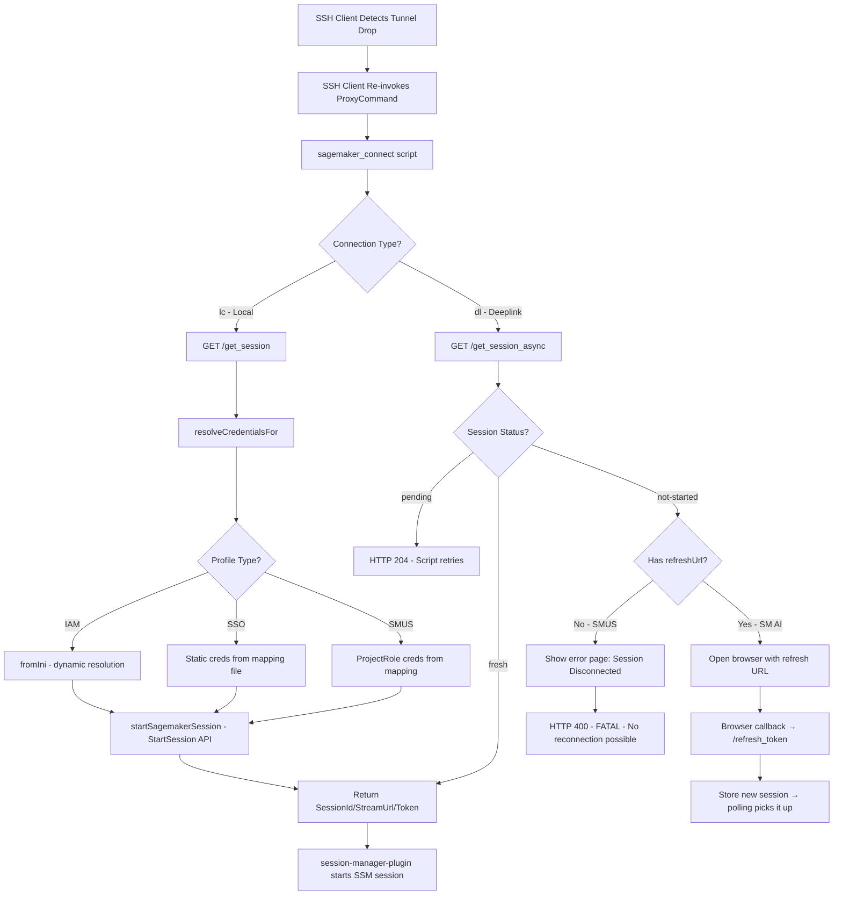
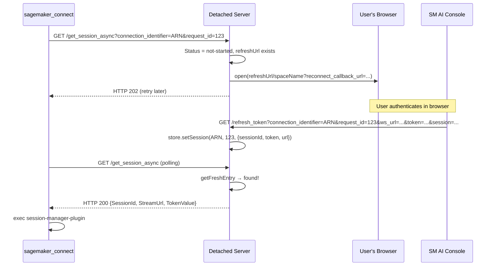
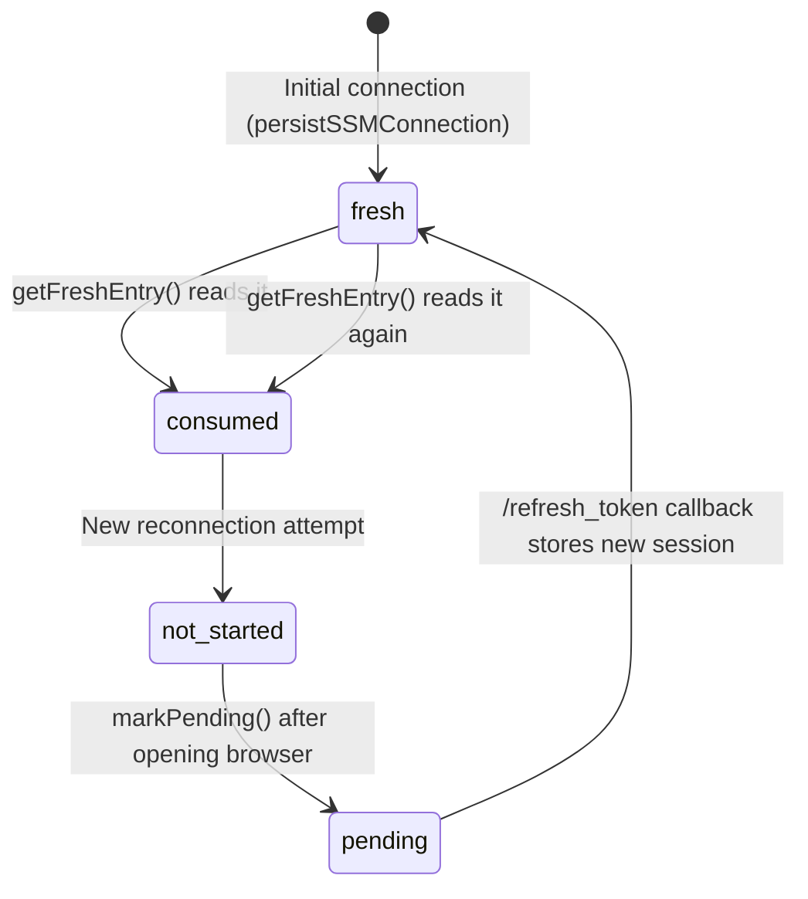

# SageMaker Remote Session Reconnection Flow Analysis

## Executive Summary

When an SSH tunnel drops during a SageMaker remote session, the reconnection behavior differs fundamentally between **local connections (`sm_lc`)** and **deeplink connections (`sm_dl`)**. The SSH ProxyCommand (`sagemaker_connect` script) is re-invoked by the SSH client, which calls the **detached server** running on localhost. For local connections, the server calls `StartSession` with credentials from a mapping file. For deeplink connections, it uses an async polling flow that opens the user's browser for re-authentication. **SMUS deeplink sessions cannot reconnect at all** — they show a terminal error page.

---

## Architecture Overview



---

## 1. What Triggers Reconnection

When the SSH tunnel drops, the **SSH client itself** triggers reconnection by re-executing the `ProxyCommand` defined in `~/.ssh/config`.

### SSH Config Section
**File:** `packages/core/src/shared/sshConfig.ts` (lines 155-163)
```
Host sm_*
    ForwardAgent yes
    AddKeysToAgent yes
    StrictHostKeyChecking accept-new
    ProxyCommand '/path/to/sagemaker_connect' '%n'
```

The `%n` token passes the original hostname (e.g., `sm_lc_arn_._aws_._sagemaker_._us-east-1_._123456789_._space__domainId__spaceName`).

### Hostname Parsing
**File:** `packages/core/resources/sagemaker_connect` (lines 89-96)
```bash
if [[ "$HOSTNAME" =~ ^sm[^_]*_([^_]+)_(arn_._aws.*)$ ]]; then
    CREDS_TYPE="${BASH_REMATCH[1]}"    # "lc" or "dl"
    AWS_RESOURCE_ARN="${BASH_REMATCH[2]}"
fi
```

The script extracts:
- `CREDS_TYPE`: `lc` (local connection) or `dl` (deeplink)
- `AWS_RESOURCE_ARN`: The space ARN (with `__` → `/` and `_._` → `:` substitution)

---

## 2. Detached Server — The Reconnection Hub

**File:** `packages/core/src/awsService/sagemaker/detached-server/server.ts`

The detached server is a standalone Node.js HTTP server spawned as a background process. It survives VS Code restarts and only exits when no IDE windows are detected (checked every 30 minutes).

### Routes (lines 30-40)
```typescript
switch (parsedUrl.pathname) {
    case '/get_session':        return handleGetSession(req, res)
    case '/get_session_async':  return handleGetSessionAsync(req, res)
    case '/refresh_token':      return handleRefreshToken(req, res)
}
```

### Server Lifecycle
**File:** `packages/core/src/awsService/sagemaker/model.ts` (lines 230-268)

`startLocalServer()` is called during `prepareDevEnvConnection()`. It:
1. Kills any existing server via PID in `sagemaker-local-server-info.json`
2. Spawns a new detached process: `node server.js`
3. Passes `SAGEMAKER_LOCAL_SERVER_FILE_PATH` env var
4. Waits up to 10s for the info file to appear

---

## 3. Local Connection (`sm_lc`) — `/get_session` Route

**File:** `packages/core/src/awsService/sagemaker/detached-server/routes/getSession.ts`

This is the **synchronous** reconnection path for local connections.

### Full Flow (lines 19-78)

```typescript
export async function handleGetSession(req, res) {
    // 1. Rate limiting: max 8 retries per 10-minute window
    const count = (attemptCount.get(connectionIdentifier) ?? 0) + 1
    if (count > maxRetries) {  // maxRetries = 8
        res.writeHead(429)
        res.end('Too many retry attempts. Please reconnect manually.')
        return
    }

    // 2. Resolve credentials from mapping file
    credentials = await resolveCredentialsFor(connectionIdentifier)

    // 3. Call SageMaker StartSession API
    const session = await startSagemakerSession({ region, connectionIdentifier, credentials })

    // 4. Return session info to sagemaker_connect script
    res.writeHead(200)
    res.end(JSON.stringify({
        SessionId: session.SessionId,
        StreamUrl: session.StreamUrl,
        TokenValue: session.TokenValue,
    }))
}
```

**Key behavior:** The detached server **does create a new SSM session** on every reconnection attempt by calling the SageMaker `StartSession` API.

### Retry Strategy for StartSession
**File:** `packages/core/src/awsService/sagemaker/detached-server/utils.ts` (lines 26-28)
```typescript
// Backoff: 1500ms, 2250ms, 3375ms (3 retries)
const startSessionRetryStrategy = new ConfiguredRetryStrategy(3, (attempt) => 1000 * 1.5 ** attempt)
```

---

## 4. Credential Resolution

**File:** `packages/core/src/awsService/sagemaker/detached-server/credentials.ts`

### `resolveCredentialsFor(connectionIdentifier)` (lines 22-80)

Reads `~/.aws/.sagemaker-space-profiles` and resolves credentials based on profile type:

| Profile Type | Resolution Method | Can Auto-Refresh? |
|---|---|---|
| `iam` with `profileName` | `fromIni({ profile: name })` — dynamic, reads `~/.aws/credentials` | ✅ Yes — reads fresh creds each time |
| `sso` with static keys | Returns `{ accessKeyId, secretAccessKey, sessionToken }` from mapping | ❌ No — stale after ~1h unless refresher runs |
| `sso`/`iam` with `smusProjectId` | Reads from `mapping.smusProjects[projectId]` | ❌ No — stale unless `ProjectRoleCredentialsProvider` refreshes |

### How Fresh Credentials Get Into the Mapping File

#### SSO Connections — `SsoCredentialRefresher`
**File:** `packages/core/src/awsService/sagemaker/credentialMapping.ts` (lines 42-130)

```typescript
export class SsoCredentialRefresher {
    // Checks every 60s, refreshes when < 5 min until expiry
    private async refreshIfNeeded() {
        if (expiration - now > this.safetyBufferMs) return  // still fresh
        
        const freshCreds = await getCredentialsFromStore(this.credentialsId, ...)
        await setSpaceSsoProfile(this.spaceArn, freshCreds.accessKeyId, ...)
    }
}
```

Started in `persistLocalCredentials()` (line 175) when the connection type is SSO. **This runs in the VS Code extension process**, not the detached server.

#### SMUS Connections — `ProjectRoleCredentialsProvider`
**File:** `packages/core/src/awsService/sagemaker/credentialMapping.ts` (lines 195-203)

```typescript
export async function persistSmusProjectCreds(spaceArn, node) {
    const projectAuthProvider = await authProvider.getProjectCredentialProvider(projectId)
    await projectAuthProvider.getCredentials()
    await setSmusSpaceProfile(spaceArn, projectId, isSmusSsoConnection(...) ? 'sso' : 'iam')
    projectAuthProvider.startProactiveCredentialRefresh()  // keeps mapping file fresh
}
```

#### IAM Connections
No refresher needed — `fromIni()` dynamically reads `~/.aws/credentials` on each call.

---

## 5. Deeplink Connection (`sm_dl`) — `/get_session_async` Route

**File:** `packages/core/src/awsService/sagemaker/detached-server/routes/getSessionAsync.ts`

This is the **asynchronous** reconnection path for deeplink connections.

### Full Flow (lines 16-95)

```typescript
export async function handleGetSessionAsync(req, res) {
    const store = new SessionStore()
    
    // 1. Check if a fresh session already exists
    const freshEntry = await store.getFreshEntry(connectionIdentifier, requestId)
    if (freshEntry) {
        res.writeHead(200)  // Return immediately
        return
    }

    // 2. Check current status
    const status = await store.getStatus(connectionIdentifier, requestId)
    
    if (status === 'pending') {
        res.writeHead(204)  // Tell script to keep polling
        return
    }
    
    if (status === 'not-started') {
        const refreshUrl = await store.getRefreshUrl(connectionIdentifier)
        
        // 3a. SMUS connections: NO refreshUrl → FATAL ERROR
        if (refreshUrl === undefined) {
            await store.cleanupExpiredConnection(connectionIdentifier)
            await openErrorPage(SmusDeeplinkSessionExpiredError.title, ...)
            res.writeHead(400)  // Terminal failure
            return
        }
        
        // 3b. SM AI connections: Open browser for re-auth
        const url = `${refreshUrl}/${spaceName}?remote_access_token_refresh=true` +
            `&reconnect_identifier=${connectionIdentifier}` +
            `&reconnect_request_id=${requestId}` +
            `&reconnect_callback_url=http://localhost:${port}/refresh_token`
        await open(url)  // Opens user's browser
        
        res.writeHead(202)  // Tell script to keep polling
        await store.markPending(connectionIdentifier, requestId)
    }
}
```

### The Browser Re-Auth Flow (SM AI only)



### The `/refresh_token` Callback
**File:** `packages/core/src/awsService/sagemaker/detached-server/routes/refreshToken.ts`

Receives the new session info from the browser callback and stores it:
```typescript
await store.setSession(connectionIdentifier, requestId, { sessionId, token, url: wsUrl })
```

### Script-Side Polling
**File:** `packages/core/resources/sagemaker_connect` (lines 42-76)

```bash
_get_ssm_session_info_async() {
    local max_retries=8
    local retry_interval=5
    while (( attempt <= max_retries )); do
        # curl GET /get_session_async
        if [[ "$http_status" -eq 200 ]]; then
            export SSM_SESSION_JSON="$session_json"
            return 0
        elif [[ "$http_status" -eq 202 || "$http_status" -eq 204 ]]; then
            sleep $retry_interval  # Wait 5s between polls
            ((attempt++))
        else
            exit 1  # Fatal error (400, 500)
        fi
    done
    exit 1  # Timeout after 8 * 5s = 40s
}
```

---

## 6. Session Store — State Machine

**File:** `packages/core/src/awsService/sagemaker/detached-server/sessionStore.ts`

The `SessionStore` manages deeplink session state in the mapping file:



### Data Structure
**File:** `packages/core/src/awsService/sagemaker/types.ts`
```typescript
interface SpaceMappings {
    localCredential?: { [spaceArn: string]: LocalCredentialProfile }
    deepLink?: { [spaceArn: string]: DeeplinkSession }
    smusProjects?: { [projectId: string]: { accessKey, secret, token } }
}

interface DeeplinkSession {
    requests: Record<string, SsmConnectionInfo>
    refreshUrl?: string  // undefined for SMUS → means no reconnection possible
}
```

---

## 7. Kiro-Specific Path (sagemaker-ssh-kiro)

**File:** `packages/sagemaker-ssh-kiro/src/authResolver.ts`

In Kiro, the `SageMakerSshKiroResolver` handles the SSH connection differently — it spawns `sagemaker_connect` directly as a child process and creates an SSH connection over the process's stdio streams.

### Reconnection Behavior (lines 82-100)

```typescript
resolve(authority, context) {
    // context.resolveAttempt increments on each retry
    this.logger.info(`Resolving SSH remote authority (attempt #${context.resolveAttempt})`)
    
    // Spawns sagemaker_connect as ProxyCommand
    this.proxyCommandProcess = cp.spawn(command, proxyArgs, options)
    
    // Waits for SSM ready signal
    await waitForStreamOutput(this.proxyCommandProcess.stdout, (data) => {
        return output.includes('Starting session with SessionId:') || 
               output.includes('SSH-2.0-Go')
    })
    
    // On failure at attempt 1: show Close/Retry dialog
    if (context.resolveAttempt === 1) {
        // Shows modal error with "Close Remote" / "Retry" options
    }
    // On subsequent failures: throws NotAvailable to stop retries
    throw vscode.RemoteAuthorityResolverError.NotAvailable(...)
}
```

**Key difference:** Kiro's resolver does NOT automatically retry. On first failure it shows a dialog; on subsequent failures it gives up. The VS Code Remote SSH extension has its own retry logic that re-invokes `resolve()`.

---

## 8. Comparison: `sm_dl` vs `sm_lc` Reconnection

| Aspect | Local (`sm_lc`) | Deeplink (`sm_dl`) |
|---|---|---|
| **Route** | `/get_session` (sync) | `/get_session_async` (polling) |
| **Creates new SSM session?** | ✅ Yes — calls `StartSession` API | ❌ No — needs browser re-auth |
| **Credential source** | Mapping file (`resolveCredentialsFor`) | Pre-stored session in mapping file |
| **Auto-reconnect possible?** | ✅ Yes — if creds are fresh | ⚠️ Only for SM AI (browser flow) |
| **SMUS reconnection?** | ✅ Yes — if `ProjectRoleCredentialsProvider` is refreshing | ❌ **FATAL** — shows error page |
| **Rate limit** | 8 attempts per 10-min window | 8 polls × 5s = 40s timeout |
| **User interaction needed?** | No (if creds valid) | Yes (browser auth for SM AI) |

---

## 9. What Causes Reconnection to Fail

### For Local Connections (`sm_lc`)

1. **Expired SSO credentials** — The `SsoCredentialRefresher` runs in the VS Code extension process. If VS Code is closed/crashed, the refresher stops and the mapping file goes stale after ~1 hour.
   - **File:** `credentialMapping.ts:108-130` — refresher checks every 60s, refreshes when < 5 min to expiry

2. **Expired SMUS ProjectRole credentials** — Same issue: `ProjectRoleCredentialsProvider.startProactiveCredentialRefresh()` runs in VS Code.

3. **Rate limit hit** — After 8 failed attempts in 10 minutes, returns HTTP 429.
   - **File:** `getSession.ts:30-36`

4. **`StartSession` API failure** — `ExpiredTokenException`, `AccessDeniedException`, `InternalFailure`, etc.
   - **File:** `errorPage.ts` — maps exception types to user-facing error pages

5. **Detached server not running** — If the server process died and no IDE window restarted it.

### For Deeplink Connections (`sm_dl`)

1. **SMUS connections: Always fail** — `refreshUrl` is `undefined` for SMUS deeplinks. The `handleGetSessionAsync` function immediately returns HTTP 400 with `SMUS_SESSION_DISCONNECTED`.
   - **File:** `getSessionAsync.ts:56-75`
   - **Root cause:** `persistSSMConnection()` in `credentialMapping.ts:225` explicitly sets `refreshUrl = undefined` when `isSMUS = true`

2. **SM AI browser flow timeout** — The script polls 8 times at 5-second intervals (40s total). If the user doesn't complete browser auth in time, the script exits.

3. **SM AI browser flow failure** — The refresh URL may be invalid if the space was restarted or the domain changed.

---

## 10. Key File Reference

| File | Purpose |
|---|---|
| `packages/core/resources/sagemaker_connect` | SSH ProxyCommand script — parses hostname, calls detached server |
| `packages/core/src/awsService/sagemaker/detached-server/server.ts` | Detached HTTP server — routes requests |
| `packages/core/src/awsService/sagemaker/detached-server/routes/getSession.ts` | Sync reconnection for `sm_lc` |
| `packages/core/src/awsService/sagemaker/detached-server/routes/getSessionAsync.ts` | Async reconnection for `sm_dl` |
| `packages/core/src/awsService/sagemaker/detached-server/routes/refreshToken.ts` | Browser callback for deeplink re-auth |
| `packages/core/src/awsService/sagemaker/detached-server/credentials.ts` | `resolveCredentialsFor()` — reads mapping file |
| `packages/core/src/awsService/sagemaker/detached-server/sessionStore.ts` | Deeplink session state machine |
| `packages/core/src/awsService/sagemaker/detached-server/utils.ts` | `startSagemakerSession()`, `readMapping()`, `parseArn()` |
| `packages/core/src/awsService/sagemaker/credentialMapping.ts` | Writes creds to mapping file, `SsoCredentialRefresher` |
| `packages/core/src/awsService/sagemaker/model.ts` | `prepareDevEnvConnection()`, `startLocalServer()` |
| `packages/core/src/awsService/sagemaker/commands.ts` | `deeplinkConnect()` entry point |
| `packages/core/src/awsService/sagemaker/uriHandlers.ts` | SM AI deeplink URI handler |
| `packages/core/src/sagemakerunifiedstudio/uriHandlers.ts` | SMUS deeplink URI handler |
| `packages/core/src/awsService/sagemaker/types.ts` | `SpaceMappings`, `SsmConnectionInfo`, `DeeplinkSession` |
| `packages/core/src/awsService/sagemaker/constants.ts` | `SmusDeeplinkSessionExpiredError` |
| `packages/core/src/awsService/sagemaker/detached-server/errorPage.ts` | Error page HTML generation |
| `packages/sagemaker-ssh-kiro/src/authResolver.ts` | Kiro's `RemoteAuthorityResolver` |
